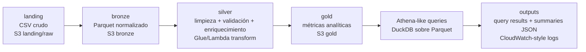

# 20 - AWS-style Banking Data Lake

## Pipeline End-to-End en AWS

<p align="center">
  
</p>

> Imagen referencial utilizada para representar una arquitectura cloud AWS-style.

## 1. Objetivo

Implementar una simulación local de un pipeline end-to-end tipo AWS Data Lake para datos bancarios, usando Python, DuckDB y Parquet.

El proyecto organiza datos en capas landing, bronze, silver y gold. No usa AWS real, credenciales, `boto3` ni recursos cloud, por lo que no genera costos.

## 2. Valor del proyecto

El proyecto permite convertir datos operacionales crudos en información confiable para análisis, separando datos problemáticos y generando capas listas para consulta.

Su valor está en demostrar diseño cloud-style, arquitectura de datos, calidad, trazabilidad, consultas analíticas y control de costos sin afirmar un despliegue real en AWS.

## 3. Problema y enfoque

- **Situación:** un banco recibe datos operacionales crudos que pueden incluir duplicados, nulos, fechas inválidas, montos faltantes, tipos inconsistentes y referencias inválidas.
- **Tarea:** convertir esos datos en capas ordenadas y consultables, separando registros problemáticos y generando métricas útiles para análisis.
- **Enfoque:** simular localmente una arquitectura AWS-style con carpetas tipo S3, transformaciones tipo Glue/Lambda en Python, consultas Athena-like con DuckDB y evidencia de ejecución en JSON.

## 4. Arquitectura tipo AWS

El flujo local representa S3, Glue/Lambda, Athena y logs estilo CloudWatch sin desplegar servicios reales en AWS.



## 5. Estructura del proyecto

```text
20-aws-style-banking-data-lake/
|-- app/
|   |-- generate_banking_landing_data.py
|   |-- build_data_lake.py
|   |-- run_athena_like_queries.py
|   `-- run_pipeline.py
|-- data_lake/
|   |-- landing/
|   |-- bronze/
|   |-- silver/
|   `-- gold/
|-- docs/
|   |-- aws_architecture_mapping.md
|   |-- cost_control.md
|   `-- iam_least_privilege.md
|-- queries/
|   `-- athena_like_queries.sql
|-- output/
|   `-- .gitkeep
|-- README.md
|-- requirements.txt
`-- .gitignore
```

| Carpeta | Rol |
| --- | --- |
| `app/` | Scripts Python del pipeline. |
| `data_lake/` | Capas locales que simulan S3 landing, bronze, silver y gold. |
| `queries/` | SQL usado por DuckDB para simular consultas Athena-like. |
| `output/` | Summaries y resultados generados localmente, ignorados por Git. |
| `docs/` | Documentación de arquitectura AWS equivalente, costos e IAM. |

### Componentes principales

- `generate_banking_landing_data.py`: genera datos bancarios crudos con errores controlados para probar reglas de calidad.
- `build_data_lake.py`: componente central del proyecto. Cumple el rol tipo Glue/Lambda porque construye bronze, silver y gold, aplica validaciones, enriquece datos, particiona Parquet y genera estimación conceptual de costos.
- `run_athena_like_queries.py`: ejecuta consultas SQL con DuckDB sobre los Parquet generados, simulando Athena.
- `run_pipeline.py`: orquesta el flujo completo y consolida la evidencia de ejecución en `output/pipeline_summary.json`.

## 6. Flujo del pipeline

```text
CSV crudos -> landing -> bronze Parquet -> silver limpio + cuarentena -> gold analítico -> queries DuckDB -> summaries JSON
```

1. **Landing:** genera CSV bancarios crudos con datos messy controlados.
2. **Bronze:** convierte landing a Parquet, normaliza columnas y conserva una estructura cercana al raw.
3. **Silver:** limpia, valida y enriquece transacciones con clientes, cuentas y sucursales; los registros críticos inválidos se separan en cuarentena.
4. **Gold:** produce datasets analíticos por canal, tipo de transacción, mes, cliente y sucursal.
5. **Athena-like queries:** ejecuta SQL con DuckDB sobre los Parquet generados, sin usar Athena real.
6. **Output:** genera resultados de queries y summaries JSON con estado final, conteos, checks de calidad, rutas generadas y notas de costos.

Los CSV, Parquet y summaries generados están ignorados por Git para evitar subir datos locales o artefactos de ejecución.

## 7. Resultados de la implementación

- **Situación:** el proyecto necesitaba demostrar una arquitectura Data Lake end-to-end sin depender de infraestructura cloud real.
- **Tarea:** generar datos bancarios crudos, procesarlos por capas, ejecutar consultas analíticas y dejar evidencia clara de calidad y ejecución.
- **Acciones:** se implementó un pipeline local con generación de landing, construcción bronze/silver/gold, cuarentena de registros inválidos, queries DuckDB y summaries JSON.
- **Resultados validados en Codespaces:**

| Resultado | Valor |
| --- | --- |
| `final_status` | `PASSED` |
| Transacciones en landing | 1257 |
| `enriched_transactions` en silver | 1135 |
| Registros en cuarentena | 120 |
| Datasets gold generados | 5 |
| Queries Athena-like ejecutadas | 5 PASSED |

Checks de calidad registrados:

- duplicados removidos;
- `transaction_id` faltante;
- fechas inválidas;
- montos faltantes;
- referencias inválidas de cuenta;
- tipos de transacción desconocidos;
- registros críticos enviados a cuarentena.

Estos resultados corresponden a una ejecución local y no implican uso real de AWS, grandes volúmenes ni costos reales de nube.

## 8. Equivalencia local vs AWS

| Local | AWS equivalente | Rol |
| --- | --- | --- |
| `data_lake/landing/` | S3 landing/raw | Ingesta cruda en CSV |
| `data_lake/bronze/` | S3 bronze | Datos normalizados en Parquet |
| `data_lake/silver/` | S3 silver + Glue/Lambda | Datos limpios, enriquecidos y particionados |
| `data_lake/gold/` | S3 gold | Métricas analíticas |
| `DuckDB` | Athena | SQL sobre Parquet |
| `output/pipeline_summary.json` | CloudWatch-style log | Trazabilidad de ejecución |
| `docs/iam_least_privilege.md` | IAM design | Permisos mínimos conceptuales |
| `docs/cost_control.md` | AWS cost controls | Buenas prácticas de costos |

Para migrarlo a AWS real, el diseño podría llevarse a un bucket S3 con prefixes `landing/`, `bronze/`, `silver/` y `gold/`, Glue Crawler/Data Catalog, Glue Job o Lambda para transformar, Athena para consultar, IAM least privilege, billing alerts y lifecycle policies. Esa migración no está implementada en este proyecto.

## 9. Aprendizajes técnicos del proyecto

Esta sección funciona como material de estudio personal para defender el proyecto técnicamente. Resume los conceptos, archivos y decisiones que conviene explicar con claridad.

### 9.1 Conceptos clave

| Concepto | Qué significa en este proyecto |
| --- | --- |
| Landing | Zona local donde se generan CSV crudos que simulan una ingesta bancaria inicial. |
| Bronze | Capa Parquet cercana al raw, con columnas normalizadas y metadata técnica de carga. |
| Silver | Capa limpia, validada, enriquecida y particionada para análisis confiable. |
| Gold | Capa analítica con métricas agregadas por canal, tipo, mes, cliente y sucursal. |
| Parquet | Formato columnar usado para reducir datos escaneados y mejorar consultas analíticas. |
| Particionamiento | Organización de transacciones silver por `year/month` para simular pruning por fecha. |
| Cuarentena | Separación de registros críticos inválidos para trazabilidad sin contaminar silver. |
| Data Quality Checks | Validaciones de duplicados, fechas, montos, IDs, cuentas y tipos de transacción. |
| Glue/Lambda equivalente | Rol conceptual implementado por `build_data_lake.py` para transformar capas. |
| Athena-like queries | Consultas SQL ejecutadas con DuckDB sobre archivos Parquet locales. |
| CloudWatch-style summary | JSON de ejecución con estado final, conteos, checks, rutas y notas de costos. |
| IAM least privilege | Diseño documental de permisos mínimos para una migración futura a AWS real. |
| Control de costos | Uso conceptual de Parquet, particiones, límites de escaneo y alertas de billing. |

### 9.2 Archivos más importantes

| Archivo | Rol principal | Qué aprendí |
| --- | --- | --- |
| `generate_banking_landing_data.py` | Genera datos bancarios crudos y controladamente imperfectos. | Diseñar datos de prueba realistas permite validar reglas de calidad antes de tener datos reales. |
| `build_data_lake.py` | Construye bronze, silver, gold, cuarentena y estimación de costos. | El componente central de un pipeline debe organizar transformaciones, calidad, particiones y evidencia. |
| `run_athena_like_queries.py` | Ejecuta consultas SQL con DuckDB sobre Parquet. | Separar SQL del código Python mejora mantenibilidad y simula mejor un patrón Athena. |
| `run_pipeline.py` | Orquesta el flujo completo y escribe el summary final. | Un pipeline profesional debe tener una entrada clara, logging, manejo de errores y salida trazable. |
| `athena_like_queries.sql` | Contiene las consultas analíticas finales. | Las queries deben responder preguntas de negocio sin depender de `SELECT *` ni de infraestructura cloud real. |

### 9.3 Funciones y códigos destacables

`generate_banking_landing_data.py`

| Función | Por qué importa |
| --- | --- |
| `reset_landing_csvs()` | Limpia CSV generados previamente para que cada ejecución sea reproducible. |
| `write_csv()` | Centraliza la escritura de archivos landing con estructura consistente. |
| `random_date()` | Genera fechas de ejemplo para simular actividad bancaria distribuida. |
| `build_branches()` | Crea sucursales base para enriquecer clientes y métricas posteriores. |
| `build_customers()` | Genera clientes asociados a sucursales, incluyendo variaciones controladas. |
| `build_accounts()` | Crea cuentas bancarias vinculadas a clientes. |
| `build_transactions()` | Es clave porque genera datos messy: duplicados, fechas inválidas, montos faltantes, cuentas inválidas, tipos inconsistentes e IDs vacíos. |
| `generate_landing_data()` | Coordina la generación de todos los CSV landing y devuelve conteos/rutas. |

`build_data_lake.py`

| Función | Por qué importa |
| --- | --- |
| `load_landing_csvs()` | Lee los CSV crudos desde landing para iniciar el procesamiento. |
| `clear_generated_children()` | Limpia artefactos generados sin borrar archivos base como `.gitkeep`. |
| `normalize_text()` | Estandariza texto para reducir inconsistencias de formato. |
| `normalize_key()` | Normaliza claves de negocio usadas en joins y validaciones. |
| `write_single_parquet()` | Escribe datasets Parquet no particionados de forma controlada. |
| `write_partitioned_parquet()` | Escribe Parquet particionado, especialmente útil para silver por `year/month`. |
| `build_bronze_layer()` | Convierte landing a bronze manteniendo cercanía con el raw y agregando metadata. |
| `clean_branches()` | Limpia la dimensión de sucursales. |
| `clean_customers()` | Valida y normaliza clientes contra sucursales válidas. |
| `clean_accounts()` | Valida cuentas contra clientes válidos. |
| `normalize_transactions()` | Aplica reglas críticas de limpieza, normalización y cuarentena de transacciones. |
| `build_silver_layer()` | Construye datos limpios, enriquecidos y particionados para análisis. |
| `build_gold_layer()` | Genera agregados analíticos listos para consulta. |
| `write_cost_estimation()` | Calcula una estimación conceptual local de bytes y reducción por Parquet. |
| `build_data_lake()` | Orquesta bronze, silver, gold, quality checks, costos y rutas generadas. |

`build_data_lake.py` es el archivo central del proyecto porque cumple el rol tipo Glue/Lambda: transforma datos entre capas, aplica validaciones, produce datasets analíticos y genera evidencia técnica de ejecución.

`run_athena_like_queries.py`

| Función | Por qué importa |
| --- | --- |
| `parse_named_queries()` | Lee queries nombradas desde SQL para mantenerlas fuera del código Python. |
| `run_queries()` | Ejecuta las consultas con DuckDB sobre Parquet y guarda resultados/summaries. |
| `main()` | Permite ejecutar el módulo de consultas como script independiente. |

Este archivo separa SQL del código Python y ejecuta consultas DuckDB sobre Parquet, representando el rol conceptual de Athena sin usar AWS real.

`run_pipeline.py`

| Función | Por qué importa |
| --- | --- |
| `configure_logging()` | Configura logs básicos para seguir la ejecución. |
| `write_summary()` | Escribe el summary final de ejecución. |
| `aws_equivalent_services()` | Documenta la equivalencia conceptual entre componentes locales y servicios AWS. |
| `cost_control_notes()` | Resume decisiones de control de costos relevantes para una migración futura. |
| `failed_summary()` | Genera evidencia estructurada si el pipeline falla. |
| `main()` | Orquesta el flujo end-to-end del proyecto. |

`main()` orquesta el flujo completo:

```text
generate_landing_data()
-> build_data_lake()
-> run_queries()
-> write_summary()
```

### 9.4 Qué debo saber explicar técnicamente

- Por qué existen landing, bronze, silver y gold.
- Por qué uso Parquet en vez de dejar todo como CSV.
- Por qué particiono transacciones por `year/month`.
- Qué hace la cuarentena y por qué no conviene mezclar registros inválidos con silver.
- Qué representa DuckDB dentro de una simulación Athena-like.
- Qué representa `build_data_lake.py` como equivalente local de Glue/Lambda.
- Qué representa `run_pipeline.py` como orquestador end-to-end.
- Por qué `data_lake/` y `output/` aparecen casi vacíos en GitHub: los datos generados, Parquet y summaries se crean localmente y están ignorados por Git.

### 9.5 Aprendizaje principal

Un Data Engineer no solo construye pipelines que corren. También diseña arquitectura, capas de datos, reglas de calidad, control de costos, permisos mínimos y evidencia de ejecución para que el proceso sea entendible, auditable y defendible técnicamente.

### 9.6 Resumen técnico corto

```text
generate_banking_landing_data.py crea datos crudos.
build_data_lake.py transforma esos datos en capas bronze, silver y gold.
run_athena_like_queries.py consulta los Parquet con SQL usando DuckDB.
run_pipeline.py orquesta todo el flujo y genera evidencia de ejecución.
```
