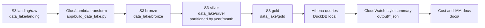

# Proyecto 20 - AWS-Style Banking Data Lake

## Objetivo

Construir un pipeline end-to-end tipo AWS Data Lake para datos bancarios, ejecutado 100% en local.

El proyecto simula una arquitectura cloud profesional sin crear recursos reales de AWS, sin usar credenciales, sin `boto3` y sin generar costos.

## Card asociada

```text
Pipeline End-to-End en AWS
```

## Aclaracion importante

Este proyecto es una simulacion local. No despliega S3, Glue, Lambda, Athena ni CloudWatch reales.

Se usa:

```text
Python
DuckDB
Pandas
PyArrow
Parquet
carpetas locales simulando S3
JSON de metadata, calidad y costos
```

## Valor de negocio

Un banco necesita transformar archivos operacionales crudos en datos confiables para analisis de canales, tipos de transaccion, clientes, sucursales y volumen mensual.

Este proyecto demuestra como disenar una arquitectura Data Lake simple y defendible:

```text
CSV bancario messy
    -> landing/raw
    -> bronze Parquet
    -> silver limpio, validado y enriquecido
    -> gold analitico
    -> consultas tipo Athena
    -> resumen CloudWatch-style
    -> estimacion conceptual de costos
```

## Arquitectura tipo AWS



## Equivalencia local vs AWS

| Local | Equivalente AWS |
| --- | --- |
| `data_lake/landing/` | S3 landing/raw |
| `data_lake/bronze/` | S3 bronze |
| `data_lake/silver/` | S3 silver |
| `data_lake/gold/` | S3 gold analytics |
| `app/build_data_lake.py` | Glue Job / Lambda transform |
| `queries/athena_like_queries.sql` | Athena SQL |
| `app/run_athena_like_queries.py` | Athena query execution simulado con DuckDB |
| `output/pipeline_summary.json` | CloudWatch-style execution summary |
| `docs/iam_least_privilege.md` | IAM least privilege design |
| `docs/cost_control.md` | Cost control design |

## Estructura

```text
20-aws-style-banking-data-lake/
|-- app/
|   |-- generate_banking_landing_data.py
|   |-- build_data_lake.py
|   |-- run_athena_like_queries.py
|   `-- run_pipeline.py
|-- data_lake/
|   |-- landing/
|   |-- bronze/
|   |-- silver/
|   `-- gold/
|-- docs/
|   |-- aws_architecture_mapping.md
|   |-- cost_control.md
|   `-- iam_least_privilege.md
|-- queries/
|   `-- athena_like_queries.sql
|-- output/
|   `-- .gitkeep
|-- README.md
|-- requirements.txt
`-- .gitignore
```

## Flujo del pipeline

### 1. Landing

`generate_banking_landing_data.py` genera CSV bancarios crudos en `data_lake/landing/`.

Incluye datos messy controlados:

- duplicados;
- nulos;
- fechas invalidas;
- montos nulos;
- tipos de transaccion inconsistentes;
- referencias invalidas.

### 2. Bronze

`build_data_lake.py` lee landing, normaliza metadata tecnica y escribe Parquet en `data_lake/bronze/`.

Bronze conserva una estructura cercana al raw y agrega:

- archivo fuente;
- timestamp de carga;
- sistema origen simulado.

### 3. Silver

Silver limpia y enriquece las transacciones:

- castea fechas y montos;
- remueve duplicados;
- filtra registros invalidos criticos;
- guarda registros invalidos en cuarentena;
- une transacciones con cuentas, clientes y sucursales;
- genera `risk_flag`;
- particiona transacciones por `year/month`.

### 4. Gold

Gold genera datasets analiticos:

- transacciones por canal;
- transacciones por tipo;
- monto total por mes;
- clientes top por monto transaccional;
- sucursales con mayor volumen.

### 5. Athena-like queries

`run_athena_like_queries.py` usa DuckDB para consultar Parquet como si fueran tablas externas de Athena.

Las queries viven en:

```text
queries/athena_like_queries.sql
```

## Como ejecutar

Desde la carpeta del proyecto:

```bash
cd 20-aws-style-banking-data-lake
python3 -m venv .venv
source .venv/bin/activate
pip install -r requirements.txt
python3 app/run_pipeline.py
```

Validaciones recomendadas:

```bash
python3 -m py_compile app/generate_banking_landing_data.py app/build_data_lake.py app/run_athena_like_queries.py app/run_pipeline.py
cat output/pipeline_summary.json
cat output/cost_estimation.json
cat output/query_summary.json
find data_lake -maxdepth 4 -type f | head -40
git status --short
```

## Outputs generados

```text
data_lake/landing/*.csv
data_lake/bronze/**/*.parquet
data_lake/silver/**/*.parquet
data_lake/gold/**/*.parquet
output/athena_like_query_results.csv
output/query_summary.json
output/cost_estimation.json
output/pipeline_summary.json
```

Los datos generados estan ignorados por Git para evitar subir CSV o Parquet locales.

## Validaciones de calidad

El pipeline registra:

- duplicados removidos;
- transaction_id faltante;
- fechas invalidas;
- montos faltantes;
- referencias invalidas de cuenta;
- tipos de transaccion desconocidos;
- registros criticos enviados a cuarentena.

El resumen queda en:

```text
output/pipeline_summary.json
```

## Documentacion de costos

`output/cost_estimation.json` mide bytes locales de CSV y Parquet para explicar el concepto de datos escaneados.

No es una factura real de AWS.

Mas detalle:

```text
docs/cost_control.md
```

## Como migrarlo a AWS real

1. Crear bucket S3 con prefixes `landing/`, `bronze/`, `silver/` y `gold/`.
2. Reemplazar el generador local por carga real desde sistema origen.
3. Ejecutar transformaciones con Glue Job o Lambda.
4. Registrar tablas con Glue Data Catalog.
5. Consultar gold y silver con Athena.
6. Configurar CloudWatch Logs y metricas.
7. Aplicar IAM least privilege.
8. Configurar budgets, billing alerts y lifecycle policies.

La guia detallada esta en:

```text
docs/aws_architecture_mapping.md
docs/iam_least_privilege.md
```

## Como contarlo en entrevista

### Hook

Construí una simulacion local de un Data Lake bancario estilo AWS, con capas landing, bronze, silver y gold, Parquet particionado, consultas tipo Athena con DuckDB y evidencia de ejecucion en JSON.

### Situacion

Queria demostrar arquitectura cloud sin incurrir en costos ni depender de credenciales antes de una entrevista.

### Tarea

Disenar un pipeline end-to-end que representara S3, Glue/Lambda, Athena, CloudWatch, control de costos e IAM, pero ejecutado de forma local y reproducible.

### Acciones

- Genere CSV bancarios messy en landing.
- Converti raw a bronze Parquet.
- Limpie y enriqueci transacciones en silver.
- Particione transacciones por `year/month`.
- Cree datasets gold para metricas bancarias.
- Ejecute queries SQL con DuckDB sobre Parquet.
- Genere resumenes JSON de pipeline, queries y costos.
- Documente equivalencia AWS, control de costos e IAM least privilege.

### Resultado

El proyecto demuestra criterio de arquitectura Data Lake, calidad de datos, Parquet, particionamiento, SQL analitico y control de costos, sin afirmar despliegue real en AWS.

## Que no afirmar

- No decir que se desplego en AWS real.
- No decir que uso Glue, Athena, S3 o CloudWatch reales.
- No decir que proceso 10GB reales.
- No decir que costo menos de USD 5 real.
- No decir que uso `boto3` o credenciales AWS.

## Decisiones tecnicas

- Simulacion local para evitar costos y mantener reproducibilidad.
- DuckDB para ejecutar SQL sobre Parquet sin Athena real.
- Parquet con Snappy para representar formato columnar de Data Lake.
- Particionamiento por `year/month` para explicar partition pruning.
- JSON para trazabilidad de ejecucion, calidad y costos.
- `.gitignore` para no versionar datos generados.

## Posibles mejoras

- Agregar tests unitarios para reglas de calidad.
- Crear tablas externas reales en Athena en una cuenta sandbox.
- Incorporar Glue Data Catalog real.
- Agregar orquestacion con Airflow o Step Functions.
- Simular incremental loads por fecha de proceso.
