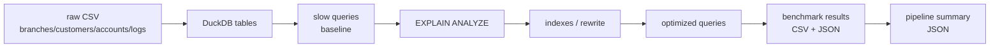

# 21 - SQL Query Optimization Banking

## Optimizacion de Queries SQL

## 1. Valor del proyecto

Este proyecto demuestra como mejorar consultas analiticas sobre datos bancarios comparando queries baseline vs queries optimizadas con evidencia reproducible.

El valor de negocio esta en mostrar que una query no solo debe entregar resultados correctos. Tambien debe ser clara, eficiente, mantenible y defendible con mediciones. En un entorno bancario, consultas lentas pueden afectar dashboards operativos, monitoreo de errores, analisis de canales y experiencia de usuarios internos.

## 2. Problema y enfoque

En entornos de datos, no basta con que una query funcione. Tambien debe ser clara, eficiente y mantenible. Consultas mal disenadas pueden generar dashboards lentos, costos altos y mala experiencia para usuarios de negocio.

El enfoque del proyecto fue construir un laboratorio local con datos bancarios, ejecutar queries lentas, analizarlas con `EXPLAIN` / `EXPLAIN ANALYZE`, optimizarlas y medir los cambios. Las optimizaciones se enfocan en seleccionar columnas necesarias, filtrar mejor, reescribir subqueries correlacionadas, crear indices estrategicos y usar tablas preagregadas para consultas analiticas repetitivas.

## 3. Objetivo

Implementar un laboratorio local de optimizacion SQL usando DuckDB, Python y datos bancarios generados localmente.

El proyecto no usa cloud real, credenciales, `boto3` ni servicios externos, por lo que no genera costos.

## 4. Arquitectura del proyecto



```text
raw CSV -> DuckDB table -> slow queries -> EXPLAIN ANALYZE -> indexes / rewrite -> optimized queries -> benchmark results -> summary JSON
```

## 5. Estructura del proyecto

```text
21-sql-query-optimization-banking/
|-- app/
|   |-- generate_banking_logs.py
|   |-- setup_database.py
|   |-- run_explain_analysis.py
|   |-- run_benchmark.py
|   `-- run_pipeline.py
|-- data/
|   `-- raw/
|       `-- .gitkeep
|-- db/
|   `-- .gitkeep
|-- queries/
|   |-- 01_slow_queries.sql
|   |-- 02_indexes.sql
|   |-- 03_optimized_queries.sql
|   `-- 04_explain_analyze.sql
|-- output/
|   `-- .gitkeep
|-- docs/
|   |-- explain_reading_guide.md
|   `-- interview_guide.md
|-- README.md
|-- requirements.txt
`-- .gitignore
```

| Carpeta | Rol |
| --- | --- |
| `app/` | Scripts Python para generar datos, crear base DuckDB, ejecutar EXPLAIN, benchmarks y pipeline. |
| `data/raw/` | CSV generados localmente e ignorados por Git. |
| `db/` | Base DuckDB local ignorada por Git. |
| `queries/` | Queries baseline, indices, queries optimizadas y ejemplos de EXPLAIN. |
| `output/` | Evidencia generada por el pipeline e ignorada por Git. |
| `docs/` | Guias tecnicas para leer planes y defender el proyecto en entrevista. |

### Componentes principales

- `generate_banking_logs.py`: genera datos bancarios sinteticos y reproducibles.
- `setup_database.py`: crea `db/optimization_lab.duckdb` y tablas analiticas.
- `run_explain_analysis.py`: ejecuta `EXPLAIN ANALYZE` y documenta planes.
- `run_benchmark.py`: mide queries baseline vs optimizadas con varias iteraciones.
- `run_pipeline.py`: orquesta el flujo completo y genera `pipeline_summary.json`.
- `01_slow_queries.sql`: contiene queries baseline intencionalmente menos eficientes.
- `02_indexes.sql`: contiene indices estrategicos visibles.
- `03_optimized_queries.sql`: contiene reescrituras y consultas optimizadas.
- `04_explain_analyze.sql`: contiene ejemplos ejecutables de `EXPLAIN` y `EXPLAIN ANALYZE`.

## 6. Flujo del pipeline

```text
CSV -> DuckDB -> slow queries -> EXPLAIN -> indexes/rewrite -> optimized queries -> benchmark CSV/JSON
```

1. Generacion de datos.
2. Carga en DuckDB.
3. Queries baseline.
4. `EXPLAIN` / `EXPLAIN ANALYZE`.
5. Indices y reescritura.
6. Queries optimizadas.
7. Benchmark.
8. Outputs.

## 7. Resultados de la implementacion

- **Situacion:** el portfolio necesitaba un proyecto avanzado enfocado en performance SQL y lectura de planes, no en cloud.
- **Tarea:** construir un laboratorio reproducible para comparar queries baseline vs optimizadas sobre datos bancarios.
- **Acciones:** se generaron datos locales, se creo una base DuckDB, se documentaron planes con `EXPLAIN ANALYZE`, se aplicaron indices, se reescribieron queries y se midieron tiempos.
- **Resultados validados:** el pipeline ejecuto correctamente y genero evidencia local en `output/`.

| Resultado | Valor |
| --- | --- |
| `final_status` | `PASSED` |
| Filas en `transaction_logs` | 150000 |
| Queries baseline ejecutadas | 4 |
| Queries optimizadas ejecutadas | 4 |
| Queries con benchmark exitoso | 8 |
| `explain_analysis.md` generado | Si |
| `query_benchmark_summary.json` generado | Si |
| Mejor mejora medida | 6.317x en `channel_metrics` |

Resultados de benchmark medidos localmente:

| Comparacion | Baseline seconds | Optimized seconds | Mejora medida |
| --- | ---: | ---: | ---: |
| `endpoint_errors` | 0.018904 | 0.007615 | 2.482x |
| `correlated_avg_response_time` | 0.010665 | 0.008527 | 1.251x |
| `channel_metrics` | 0.007669 | 0.001214 | 6.317x |
| `customer_error_lookup` | 0.009378 | 0.010766 | 0.871x |

La mejora de al menos 5x se logro solamente en `channel_metrics`, donde la version optimizada consulta una tabla preagregada. Las otras mejoras fueron menores y `customer_error_lookup` no mejoro en esta corrida local. Esto se documenta asi porque DuckDB optimiza agresivamente consultas pequenas/medianas y porque el objetivo principal es demostrar metodologia de optimizacion, no prometer factores artificiales.

## 8. Conceptos tecnicos aplicados

| Concepto | Aplicacion en el proyecto |
| --- | --- |
| EXPLAIN | Permite revisar el plan estimado o representacion del trabajo de la query. |
| EXPLAIN ANALYZE | Ejecuta la query y devuelve evidencia del plan con informacion de ejecucion. |
| Seq Scan | Lectura secuencial que puede aparecer en queries analiticas o filtros no resueltos por indice. |
| Index Scan | Acceso por indice cuando el optimizador lo considera conveniente. |
| Hash Join | Estrategia comun para joins por igualdad. |
| Nested Loop | Operacion que debe revisarse cuando hay muchas filas. |
| Indexing | Creacion de indices sobre columnas usadas en filtros y joins selectivos. |
| Correlated subquery | Patron baseline que se reescribe como agregacion + join. |
| Query rewrite | Cambio de estructura SQL para reducir trabajo y mejorar mantenibilidad. |
| Pre-aggregation | Tablas resumidas para evitar recalcular metricas desde logs completos. |
| Benchmark | Medicion con `perf_counter()` y varias iteraciones por query. |
| DuckDB | Motor SQL local usado para tablas, indices, planes y analitica. |

## 9. Aprendizajes tecnicos del proyecto

Esta seccion resume los conceptos, archivos y decisiones tecnicas que conviene saber defender al explicar el proyecto. Usala como material de estudio personal y como apoyo para entrevistas tecnicas.

### 9.1 Conceptos clave

| Concepto | Que significa en este proyecto |
| --- | --- |
| Baseline query | Consulta funcional pero escrita de forma menos eficiente o menos mantenible. |
| Optimized query | Version reescrita para seleccionar menos columnas, filtrar mejor o usar preagregaciones. |
| EXPLAIN ANALYZE | Evidencia del plan de ejecucion usada para documentar operaciones reales mostradas por DuckDB. |
| Indice selectivo | Indice creado sobre columnas usadas en filtros o joins frecuentes. |
| Preagregacion | Tabla analitica que evita recalcular metricas desde `transaction_logs` en cada consulta. |
| Benchmark local | Medicion reproducible, no promesa teorica de mejora. |

### 9.2 Archivos mas importantes

| Archivo | Rol principal | Que aprendi |
| --- | --- | --- |
| `generate_banking_logs.py` | Genera datos bancarios independientes y reproducibles. | Un buen laboratorio de performance necesita datos controlados y suficientemente grandes. |
| `setup_database.py` | Crea tablas DuckDB y preagregaciones. | Separar carga, modelado y optimizacion hace mas visible cada decision. |
| `run_explain_analysis.py` | Genera `explain_analysis.md`. | Leer planes obliga a justificar las optimizaciones con evidencia. |
| `run_benchmark.py` | Mide baseline vs optimized. | Las mejoras deben medirse, no suponerse. |
| `queries/02_indexes.sql` | Declara indices estrategicos. | Indexar todo no es una estrategia; hay que entender filtros y cardinalidad. |

### 9.3 Funciones y codigos destacables

`generate_banking_logs.py`

| Funcion o bloque | Por que importa |
| --- | --- |
| `generate_banking_logs()` | Orquesta la generacion de entidades bancarias y logs transaccionales. |
| `build_transaction_logs()` | Crea el dataset principal con endpoints, estados, canales, tipos, montos y fechas realistas. |
| `reset_raw_csvs()` | Permite repetir el pipeline sin mezclar archivos generados previos. |

`setup_database.py`

| Funcion o bloque | Por que importa |
| --- | --- |
| `setup_database()` | Crea la base DuckDB y materializa tablas del laboratorio. |
| `endpoint_daily_metrics` | Preagregacion para analisis por endpoint y dia. |
| `channel_transaction_metrics` | Preagregacion usada para comparar contra un full scan agrupado. |

`run_explain_analysis.py`

| Funcion o bloque | Por que importa |
| --- | --- |
| `parse_named_queries()` | Permite separar SQL del codigo Python usando comentarios `-- name:`. |
| `detected_operations()` | Extrae operaciones relevantes solo si aparecen en el plan. |
| `run_explain_analysis()` | Genera documentacion reproducible de planes baseline y optimizados. |

`run_benchmark.py`

| Funcion o bloque | Por que importa |
| --- | --- |
| `run_single_query()` | Ejecuta cada query varias veces y calcula duracion promedio. |
| `calculate_improvements()` | Calcula factores de mejora solo desde tiempos medidos. |
| `run_benchmark()` | Produce CSV y JSON trazables con resultados de performance. |

### 9.4 Que debo saber explicar tecnicamente

- Por que el proyecto genera sus propios datos y no depende de outputs ignorados de proyectos anteriores.
- Por que `SELECT *` puede aumentar trabajo innecesario.
- Como leer operaciones basicas en un plan de DuckDB.
- Cuando un indice puede ayudar y cuando una agregacion full scan puede no beneficiarse.
- Por que una subquery correlacionada puede reescribirse como CTE + join.
- Por que una tabla preagregada puede mejorar dashboards repetitivos.
- Por que las mejoras del README deben venir de benchmarks reales.

### 9.5 Aprendizaje principal

Un Data Engineer no solo escribe SQL que funciona; tambien debe saber leer planes de ejecucion, detectar cuellos de botella, optimizar queries, medir resultados y documentar decisiones.

### 9.6 Resumen tecnico corto

```text
generate_banking_logs.py genera datos bancarios reproducibles.
setup_database.py carga CSV en DuckDB y crea preagregaciones.
queries/01_slow_queries.sql define consultas baseline.
queries/03_optimized_queries.sql define consultas optimizadas comparables.
run_explain_analysis.py documenta planes con EXPLAIN ANALYZE.
run_benchmark.py mide tiempos reales y calcula mejoras.
run_pipeline.py orquesta todo y escribe pipeline_summary.json.
```

## Como ejecutar

Desde la carpeta del proyecto:

```bash
cd 21-sql-query-optimization-banking
python3 -m venv .venv
source .venv/bin/activate
pip install --upgrade pip
pip install -r requirements.txt
python3 -m py_compile app/generate_banking_logs.py app/setup_database.py app/run_explain_analysis.py app/run_benchmark.py app/run_pipeline.py
python3 app/run_pipeline.py
```

Validaciones recomendadas:

```bash
cat output/pipeline_summary.json
cat output/query_benchmark_summary.json
sed -n '1,200p' output/explain_analysis.md
git status --short
```
