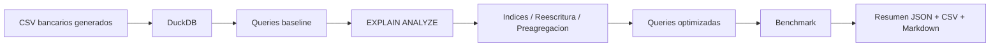

# 21 - Optimizacion de Queries SQL

## 1. Valor del proyecto

Este proyecto conecta arquitectura, analisis SQL y medicion de performance en un laboratorio local de optimizacion de queries. El pipeline genera 150.000 logs transaccionales bancarios, los carga en DuckDB, ejecuta 4 queries baseline y 4 versiones optimizadas, analiza planes con `EXPLAIN ANALYZE` y mide cada caso con benchmark reproducible. El resultado final demuestra una metodologia concreta de Data Engineering: identificar cuellos de botella, aplicar reescritura, indices o preagregaciones, volver a medir y documentar el impacto real. En la ejecucion validada, al menos una optimizacion supero el umbral de 5x definido por la autoevaluacion del proyecto, con una mejora medida de **6.317x**.

## 2. Arquitectura del proyecto y flujo del pipeline

El flujo conecta la generacion de datos con la evidencia final de performance. Primero crea datasets bancarios sinteticos, luego construye la base analitica en DuckDB, ejecuta queries baseline, analiza planes, aplica optimizaciones y compara resultados con metricas locales.



Flujo ejecutado:

1. Generacion local de `branches.csv`, `customers.csv`, `accounts.csv` y `transaction_logs.csv`.
2. Carga de los CSV en `db/optimization_lab.duckdb`.
3. Creacion de tablas preagregadas para comparacion analitica.
4. Ejecucion de 4 queries baseline.
5. Analisis de planes con `EXPLAIN ANALYZE`.
6. Aplicacion de indices desde `queries/02_indexes.sql`.
7. Ejecucion de 4 queries optimizadas.
8. Benchmark con 3 iteraciones por query.
9. Escritura de evidencia en `output/`.

## 3. Problema

El problema no era escribir SQL que funcionara, sino demostrar si una consulta podia hacerse mas eficiente con evidencia. Para eso, el proyecto toma queries baseline sobre datos bancarios y las evalua contra la autoevaluacion de la card: lograr al menos una mejora mayor a 5x, saber cuando usar indices, leer `EXPLAIN ANALYZE` y documentar cada optimizacion. Esto evita conclusiones vagas como "la query es lenta" y obliga a justificar cada mejora con medicion real.

## 4. Objetivo

Analizar y optimizar consultas SQL sobre datos bancarios para reducir tiempos de ejecucion en casos medibles, manteniendo trazabilidad completa del antes y despues.

El laboratorio local usa Python y DuckDB para:

- generar datos bancarios reproducibles;
- comparar queries baseline vs optimizadas;
- leer planes con `EXPLAIN ANALYZE`;
- aplicar indices visibles y justificados;
- reescribir consultas ineficientes;
- medir tiempos reales;
- documentar resultados sin inventar metricas.

El proyecto no usa cloud real, credenciales, `boto3` ni servicios externos, por lo que no genera costos.

## 5. Implementacion

La implementacion se diseno como un pipeline reproducible: primero genera datos, luego crea la base analitica, ejecuta queries baseline, aplica optimizaciones y finalmente compara resultados con metricas reales.

| Componente | Rol |
| --- | --- |
| `app/generate_banking_logs.py` | Genera datos sinteticos reproducibles para sucursales, clientes, cuentas y logs transaccionales. |
| `app/setup_database.py` | Crea la base DuckDB, carga los CSV y materializa tablas preagregadas. |
| `queries/01_slow_queries.sql` | Define 4 queries baseline intencionalmente menos eficientes. |
| `queries/02_indexes.sql` | Declara indices sobre columnas usadas en filtros y joins. |
| `queries/03_optimized_queries.sql` | Define 4 queries optimizadas comparables. |
| `app/run_explain_analysis.py` | Ejecuta `EXPLAIN ANALYZE` y genera `output/explain_analysis.md`. |
| `app/run_benchmark.py` | Ejecuta benchmarks con 3 iteraciones por query y genera CSV/JSON. |
| `app/run_pipeline.py` | Orquesta el flujo completo y escribe `output/pipeline_summary.json`. |

## 6. Resultados

La ejecucion validada termino en estado `PASSED`, con 150.000 logs procesados, 8 queries ejecutadas sin errores y 3 iteraciones por query. La mejor mejora medida supero 5x, cumpliendo la autoevaluacion del proyecto. Tambien se observan casos con mejoras marginales, lo que refuerza que optimizar requiere medir y no asumir.

| Metrica | Valor |
| --- | ---: |
| `final_status` | `PASSED` |
| Logs transaccionales generados | 150000 |
| Branches generadas | 12 |
| Customers generados | 5000 |
| Accounts generadas | 7500 |
| Queries baseline ejecutadas | 4 |
| Queries optimizadas ejecutadas | 4 |
| Iteraciones por query | 3 |
| Queries con benchmark exitoso | 8 |
| Mejor mejora medida | 6.317x |

Comparacion baseline vs optimizada:

| Caso | Baseline seconds | Optimized seconds | Mejora medida | Lectura |
| --- | ---: | ---: | ---: | --- |
| `endpoint_errors` | 0.018904 | 0.007615 | 2.482x | Mejoro al evitar `SELECT *` y seleccionar columnas explicitas. |
| `correlated_avg_response_time` | 0.010665 | 0.008527 | 1.251x | Mejoro levemente al reescribir la subquery correlacionada como CTE + join. |
| `channel_metrics` | 0.007669 | 0.001214 | 6.317x | Mejoro por usar una tabla preagregada en vez de recalcular sobre logs completos. |
| `customer_error_lookup` | 0.009378 | 0.010766 | 0.871x | No mejoro en esta ejecucion local; DuckDB resolvio bien la version baseline. |

La mejora mas clara aparece en `channel_metrics`, donde la preagregacion evita recalcular metricas desde la tabla completa. La reescritura de la subquery correlacionada mejora de forma menor, y `customer_error_lookup` no mejora en esta ejecucion. Las mediciones son locales y pueden variar, por eso el proyecto documenta cada caso sin generalizar resultados.

## 7. Estructura del proyecto

```text
21-sql-query-optimization-banking/
|-- app/
|   |-- generate_banking_logs.py
|   |-- setup_database.py
|   |-- run_explain_analysis.py
|   |-- run_benchmark.py
|   `-- run_pipeline.py
|-- data/
|   `-- raw/
|       `-- .gitkeep
|-- db/
|   `-- .gitkeep
|-- docs/
|   |-- explain_reading_guide.md
|   |-- interview_guide.md
|   `-- technical_notes.md
|-- output/
|   `-- .gitkeep
|-- queries/
|   |-- 01_slow_queries.sql
|   |-- 02_indexes.sql
|   |-- 03_optimized_queries.sql
|   `-- 04_explain_analyze.sql
|-- README.md
|-- requirements.txt
`-- .gitignore
```

Los CSV, la base DuckDB y los outputs generados estan ignorados por Git. El repositorio versiona el codigo, las queries, la documentacion y los `.gitkeep` necesarios.

## 8. Evidencia generada

El pipeline genera evidencia local en `output/`:

| Archivo | Contenido |
| --- | --- |
| `output/pipeline_summary.json` | Estado final, conteos de entrada, rutas generadas y resumen de benchmark. |
| `output/query_benchmark_results.csv` | Resultado por query, tipo, duracion promedio, filas e iteraciones. |
| `output/query_benchmark_summary.json` | Comparacion baseline vs optimizada y factores de mejora medidos. |
| `output/explain_analysis.md` | Planes `EXPLAIN ANALYZE` e interpretacion breve por query. |

## 9. Material de estudio

La explicacion extendida de conceptos tecnicos, aprendizajes, decisiones defendibles y preguntas de entrevista esta en:

- `docs/technical_notes.md`
- `docs/explain_reading_guide.md`
- `docs/interview_guide.md`
