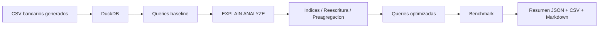

# 21 - Optimizacion de Queries SQL

## 1. Valor del proyecto

Este proyecto construye un laboratorio local para optimizar consultas SQL sobre datos bancarios. El pipeline genera 150.000 logs transaccionales, los carga en DuckDB, ejecuta 4 queries baseline y 4 queries optimizadas, analiza los planes con `EXPLAIN ANALYZE` y mide cada caso con benchmark reproducible.

El valor esta en demostrar una habilidad clave de Data Engineering: no solo escribir SQL que funciona, sino medir su rendimiento, entender por que una consulta es lenta, aplicar una mejora concreta y validar el impacto con datos. En la ejecucion validada, al menos una optimizacion supero el umbral de 5x definido por la autoevaluacion del proyecto.

## 2. Arquitectura del proyecto y flujo del pipeline

La arquitectura separa el proceso en etapas simples: generacion de datos, carga analitica, ejecucion de consultas baseline, analisis del plan, optimizacion y medicion final. Todo el flujo queda orquestado desde un pipeline Python y los resultados se guardan como evidencia local.



Flujo ejecutado:

1. Generacion local de `branches.csv`, `customers.csv`, `accounts.csv` y `transaction_logs.csv`.
2. Carga de los CSV en `db/optimization_lab.duckdb`.
3. Creacion de tablas preagregadas para comparacion analitica.
4. Ejecucion de 4 queries baseline.
5. Analisis de planes con `EXPLAIN ANALYZE`.
6. Aplicacion de indices desde `queries/02_indexes.sql`.
7. Ejecucion de 4 queries optimizadas.
8. Benchmark con 3 iteraciones por query.
9. Escritura de evidencia en `output/`.

## 3. Problema

El problema es que una consulta SQL puede entregar el resultado correcto y aun asi ser mala para un entorno analitico. Si una query escanea mas datos de los necesarios, recalcula metricas repetidas o usa subqueries poco eficientes, puede volver lentos los reportes, dashboards y procesos de analisis.

Por eso este proyecto no evalua solo si la query funciona. Evalua si la consulta mejora con evidencia: si logra al menos una mejora mayor a 5x, si el uso de indices tiene sentido, si el plan de ejecucion se puede interpretar con `EXPLAIN ANALYZE` y si cada optimizacion queda documentada. La idea es evitar conclusiones vagas como "esta query es lenta" y reemplazarlas por mediciones concretas.

## 4. Objetivo

Analizar y optimizar consultas SQL sobre datos bancarios para reducir tiempos de ejecucion en casos medibles, manteniendo trazabilidad completa del antes y despues.

El objetivo concreto fue ejecutar 4 queries baseline, construir 4 versiones optimizadas, medir cada par con 3 iteraciones y calcular el factor de mejora real usando DuckDB.

## 5. Implementacion

La implementacion se diseno como un flujo reproducible de optimizacion. Primero se generan datos bancarios, luego se cargan en DuckDB, se ejecutan consultas baseline, se analizan sus planes, se aplican mejoras y finalmente se comparan los tiempos medidos.

- Genere 150.000 logs transaccionales bancarios.
- Cargue las tablas `branches`, `customers`, `accounts` y `transaction_logs` en DuckDB.
- Construi tablas preagregadas para evitar recalcular metricas completas en cada consulta: `endpoint_daily_metrics`, `channel_transaction_metrics` y `customer_error_metrics`.
- Defini 4 queries baseline: `slow_endpoint_errors`, `slow_correlated_avg_response_time`, `slow_channel_metrics_full_scan` y `slow_customer_error_lookup`.
- Defini 4 queries optimizadas: `optimized_endpoint_errors`, `optimized_correlated_avg_response_time`, `optimized_channel_metrics_preaggregated` y `optimized_customer_error_lookup`.
- Ejecute `EXPLAIN ANALYZE` para revisar como DuckDB resolvia cada consulta.
- Aplique mejoras mediante seleccion explicita de columnas, reescritura de subqueries, filtros mas claros, preagregaciones e indices estrategicos.
- Medi cada consulta con 3 iteraciones y guarde los resultados del benchmark.

## 6. Resultados

La ejecucion termino correctamente. El pipeline proceso 150.000 logs, ejecuto 8 queries sin errores y midio cada consulta con 3 iteraciones. La mejor optimizacion supero 5x, cumpliendo la autoevaluacion de la card.

| Metrica | Valor |
| --- | ---: |
| `final_status` | `PASSED` |
| Logs transaccionales generados | 150000 |
| Branches generadas | 12 |
| Customers generados | 5000 |
| Accounts generadas | 7500 |
| Queries baseline ejecutadas | 4 |
| Queries optimizadas ejecutadas | 4 |
| Iteraciones por query | 3 |
| Queries con benchmark exitoso | 8 |
| Mejor mejora medida | 6.317x |

El resultado mas importante fue `channel_metrics`: al reemplazar una agregacion completa sobre `transaction_logs` por una tabla preagregada, la consulta paso de recalcular toda la metrica a leer un resultado analitico ya preparado. Ese caso explica por que en Data Engineering muchas veces el diseno de tablas analiticas es mas importante que intentar optimizar una query aislada.

| Caso | Baseline | Optimizada | Mejora medida |
| --- | ---: | ---: | ---: |
| `endpoint_errors` | 0.018904 | 0.007615 | 2.482x |
| `correlated_avg_response_time` | 0.010665 | 0.008527 | 1.251x |
| `channel_metrics` | 0.007669 | 0.001214 | 6.317x |
| `customer_error_lookup` | 0.009378 | 0.010766 | 0.871x |

- La mejor mejora vino de usar preagregacion en `channel_metrics`.
- La reescritura de subquery correlacionada tambien redujo tiempo de ejecucion.
- Los casos con mejora baja muestran que no toda optimizacion tiene impacto relevante.
- Las mediciones pueden variar entre ejecuciones locales, por lo que el proyecto prioriza metodo y evidencia sobre promesas fijas.

## 7. Estructura del proyecto

```text
21-sql-query-optimization-banking/
|-- app/
|   |-- generate_banking_logs.py
|   |-- setup_database.py
|   |-- run_explain_analysis.py
|   |-- run_benchmark.py
|   `-- run_pipeline.py
|-- data/
|   `-- raw/
|       `-- .gitkeep
|-- db/
|   `-- .gitkeep
|-- docs/
|   |-- explain_reading_guide.md
|   |-- interview_guide.md
|   `-- technical_notes.md
|-- output/
|   `-- .gitkeep
|-- queries/
|   |-- 01_slow_queries.sql
|   |-- 02_indexes.sql
|   |-- 03_optimized_queries.sql
|   `-- 04_explain_analyze.sql
|-- README.md
|-- requirements.txt
`-- .gitignore
```

Los CSV, la base DuckDB y los outputs generados estan ignorados por Git. El repositorio versiona el codigo, las queries, la documentacion y los `.gitkeep` necesarios.
