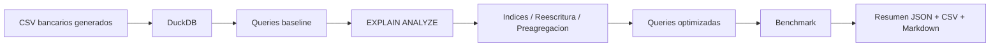

# 21 - Optimizacion de Queries SQL

## 1. Valor del proyecto

Este proyecto muestra como pasar de escribir SQL que simplemente funciona a optimizar consultas con evidencia. Construi un laboratorio local sobre datos bancarios que genera 150.000 logs transaccionales, carga la informacion en DuckDB, ejecuta 4 queries baseline y 4 queries optimizadas, analiza planes con `EXPLAIN ANALYZE` y mide cada caso con benchmark reproducible. El valor esta en demostrar una habilidad clave de Data Engineering: identificar cuellos de botella, aplicar mejoras concretas y validar el impacto con datos reales de ejecucion; en la validacion del proyecto, al menos una optimizacion supero el umbral de 5x definido por la autoevaluacion.

## 2. Arquitectura del proyecto y flujo del pipeline

La arquitectura separa el proceso en etapas simples: generacion de datos, carga analitica, ejecucion de consultas baseline, analisis del plan, optimizacion y medicion final. Todo el flujo queda orquestado desde un pipeline Python y los resultados se guardan como evidencia local.



Flujo ejecutado:

1. Generacion local de `branches.csv`, `customers.csv`, `accounts.csv` y `transaction_logs.csv`.
2. Carga de los CSV en `db/optimization_lab.duckdb`.
3. Creacion de tablas preagregadas para comparacion analitica.
4. Ejecucion de 4 queries baseline.
5. Analisis de planes con `EXPLAIN ANALYZE`.
6. Aplicacion de indices desde `queries/02_indexes.sql`.
7. Ejecucion de 4 queries optimizadas.
8. Benchmark con 3 iteraciones por query.
9. Escritura de evidencia en `output/`.

## 3. Problema

El problema es que una query puede entregar el resultado correcto y aun asi ser ineficiente. En un entorno analitico, eso puede traducirse en reportes lentos, dashboards pesados o procesos que recalculan informacion innecesariamente. Por eso este proyecto evalua cada consulta con una logica simple: medir el tiempo base, leer el plan con `EXPLAIN ANALYZE`, aplicar una mejora concreta y volver a medir. La autoevaluacion se enfoca en comprobar si existe al menos una mejora mayor a 5x, entender cuando usar indices, interpretar el plan de ejecucion y documentar cada optimizacion.

## 4. Objetivo

Analizar y optimizar consultas SQL sobre datos bancarios para reducir tiempos de ejecucion en casos medibles, manteniendo trazabilidad completa del antes y despues.

El objetivo concreto fue:

- ejecutar 4 queries baseline;
- construir 4 versiones optimizadas;
- medir cada par con 3 iteraciones;
- calcular el factor de mejora real usando DuckDB.

## 5. Implementacion

La implementacion se organizo como un flujo reproducible: generar datos, cargar DuckDB, ejecutar queries baseline, aplicar optimizaciones y comparar resultados medidos.

| Etapa | Accion realizada | Evidencia |
| --- | --- | --- |
| Generacion de datos | Se generaron 150.000 logs transaccionales bancarios | `data/raw/transaction_logs.csv` |
| Carga analitica | Se cargaron `branches`, `customers`, `accounts` y `transaction_logs` en DuckDB | `db/optimization_lab.duckdb` |
| Preagregaciones | Se construyeron tablas analiticas para evitar recalcular metricas completas | `endpoint_daily_metrics`, `channel_transaction_metrics`, `customer_error_metrics` |
| Queries baseline | Se definieron 4 consultas iniciales para medir el rendimiento base | `queries/01_slow_queries.sql` |
| Optimizacion | Se aplicaron reescrituras, filtros mas claros, columnas explicitas, preagregaciones e indices estrategicos | `queries/02_indexes.sql` y `queries/03_optimized_queries.sql` |
| Analisis de planes | Se ejecuto `EXPLAIN ANALYZE` para revisar como DuckDB resolvia cada consulta | `output/explain_analysis.md` |
| Benchmark | Se midio cada query con 3 iteraciones y se calculo el factor de mejora | `output/query_benchmark_summary.json` |

## 6. Resultados

La ejecucion validada termino correctamente: el pipeline proceso 150.000 logs, ejecuto 8 queries sin errores y midio cada consulta con 3 iteraciones.

| Metrica | Resultado |
| --- | ---: |
| Estado final | PASSED |
| Logs procesados | 150.000 |
| Queries baseline | 4 |
| Queries optimizadas | 4 |
| Queries ejecutadas sin error | 8 |
| Iteraciones por query | 3 |
| Mejor mejora medida | 6.317x |

| Caso | Baseline | Optimizada | Mejora medida |
| --- | ---: | ---: | ---: |
| endpoint_errors | 0.018904 | 0.007615 | 2.482x |
| correlated_avg_response_time | 0.010665 | 0.008527 | 1.251x |
| channel_metrics | 0.007669 | 0.001214 | 6.317x |
| customer_error_lookup | 0.009378 | 0.010766 | 0.871x |

- La mejor mejora vino de `channel_metrics`, donde la preagregacion evito recalcular metricas sobre la tabla completa.
- La reescritura de subquery correlacionada tambien redujo el tiempo de ejecucion.
- Las mejoras marginales muestran que no toda optimizacion tiene impacto relevante; por eso el benchmark es parte central del proyecto.

## 7. Estructura del proyecto

```text
21-sql-query-optimization-banking/
|-- app/
|   |-- generate_banking_logs.py
|   |-- setup_database.py
|   |-- run_explain_analysis.py
|   |-- run_benchmark.py
|   `-- run_pipeline.py
|-- data/
|   `-- raw/
|       `-- .gitkeep
|-- db/
|   `-- .gitkeep
|-- docs/
|   |-- explain_reading_guide.md
|   |-- interview_guide.md
|   `-- technical_notes.md
|-- output/
|   `-- .gitkeep
|-- queries/
|   |-- 01_slow_queries.sql
|   |-- 02_indexes.sql
|   |-- 03_optimized_queries.sql
|   `-- 04_explain_analyze.sql
|-- README.md
|-- requirements.txt
`-- .gitignore
```

Los CSV, la base DuckDB y los outputs generados estan ignorados por Git. El repositorio versiona el codigo, las queries, la documentacion y los `.gitkeep` necesarios.
