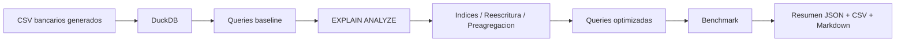

# 21 - Optimizacion de Queries SQL

## 1. Valor del proyecto

Este proyecto demuestra como optimizar consultas SQL sobre datos bancarios usando `EXPLAIN ANALYZE`, reescritura de queries, preagregaciones e indices estrategicos.

El laboratorio genera 150.000 logs transaccionales, ejecuta 4 queries baseline y 4 queries optimizadas, compara tiempos reales y documenta el impacto de cada cambio. En la ejecucion validada, la mayor mejora medida fue de **6.317x** usando una tabla preagregada para metricas por canal.

El valor principal no esta en prometer una mejora fija, sino en demostrar una metodologia defendible: medir, analizar el plan, optimizar, volver a medir y documentar el resultado.

## 2. Arquitectura del proyecto y flujo del pipeline

El pipeline genera datos bancarios sinteticos, los carga en DuckDB, ejecuta queries baseline, analiza los planes con `EXPLAIN ANALYZE`, aplica indices y reescrituras, ejecuta queries optimizadas, mide tiempos con benchmark y genera evidencia en JSON, CSV y Markdown.



Flujo ejecutado:

1. Generacion local de `branches.csv`, `customers.csv`, `accounts.csv` y `transaction_logs.csv`.
2. Carga de los CSV en `db/optimization_lab.duckdb`.
3. Creacion de tablas preagregadas para comparacion analitica.
4. Ejecucion de 4 queries baseline.
5. Analisis de planes con `EXPLAIN ANALYZE`.
6. Aplicacion de indices desde `queries/02_indexes.sql`.
7. Ejecucion de 4 queries optimizadas.
8. Benchmark con 3 iteraciones por query.
9. Escritura de evidencia en `output/`.

## 3. Problema

En entornos de datos, una query correcta no siempre es suficiente. Una consulta puede devolver el resultado esperado y aun asi ser dificil de mantener, leer mas datos de los necesarios o recalcular metricas que podrian estar preagregadas.

Este proyecto simula un caso bancario donde se analizan logs transaccionales por endpoint, canal, tipo de transaccion, cliente y errores. El objetivo es practicar como detectar oportunidades de optimizacion sin asumir mejoras teoricas.

## 4. Objetivo

Construir un laboratorio local de optimizacion SQL con Python y DuckDB que permita:

- generar datos bancarios reproducibles;
- comparar queries baseline vs optimizadas;
- leer planes con `EXPLAIN ANALYZE`;
- aplicar indices visibles y justificados;
- reescribir consultas ineficientes;
- medir tiempos reales;
- documentar resultados sin inventar metricas.

El proyecto no usa cloud real, credenciales, `boto3` ni servicios externos, por lo que no genera costos.

## 5. Implementacion

| Componente | Rol |
| --- | --- |
| `app/generate_banking_logs.py` | Genera datos sinteticos reproducibles para sucursales, clientes, cuentas y logs transaccionales. |
| `app/setup_database.py` | Crea la base DuckDB, carga los CSV y materializa tablas preagregadas. |
| `queries/01_slow_queries.sql` | Define 4 queries baseline intencionalmente menos eficientes. |
| `queries/02_indexes.sql` | Declara indices sobre columnas usadas en filtros y joins. |
| `queries/03_optimized_queries.sql` | Define 4 queries optimizadas comparables. |
| `app/run_explain_analysis.py` | Ejecuta `EXPLAIN ANALYZE` y genera `output/explain_analysis.md`. |
| `app/run_benchmark.py` | Ejecuta benchmarks con 3 iteraciones por query y genera CSV/JSON. |
| `app/run_pipeline.py` | Orquesta el flujo completo y escribe `output/pipeline_summary.json`. |

## 6. Resultados medidos

Resultados de la ejecucion validada:

| Metrica | Valor |
| --- | ---: |
| `final_status` | `PASSED` |
| Logs transaccionales generados | 150000 |
| Branches generadas | 12 |
| Customers generados | 5000 |
| Accounts generadas | 7500 |
| Queries baseline ejecutadas | 4 |
| Queries optimizadas ejecutadas | 4 |
| Iteraciones por query | 3 |
| Queries con benchmark exitoso | 8 |
| Mejor mejora medida | 6.317x |

Comparacion baseline vs optimizada:

| Caso | Baseline seconds | Optimized seconds | Mejora medida | Lectura |
| --- | ---: | ---: | ---: | --- |
| `endpoint_errors` | 0.018904 | 0.007615 | 2.482x | Mejoro al evitar `SELECT *` y seleccionar columnas explicitas. |
| `correlated_avg_response_time` | 0.010665 | 0.008527 | 1.251x | Mejoro levemente al reescribir la subquery correlacionada como CTE + join. |
| `channel_metrics` | 0.007669 | 0.001214 | 6.317x | Mejoro por usar una tabla preagregada en vez de recalcular sobre logs completos. |
| `customer_error_lookup` | 0.009378 | 0.010766 | 0.871x | No mejoro en esta ejecucion local; DuckDB resolvio bien la version baseline. |

La mejora de al menos 5x se logro solo en `channel_metrics`. Las demas diferencias fueron menores y una query no mejoro. Esa es una parte importante del aprendizaje: optimizar requiere medir, no asumir.

## 7. Estructura del proyecto

```text
21-sql-query-optimization-banking/
|-- app/
|   |-- generate_banking_logs.py
|   |-- setup_database.py
|   |-- run_explain_analysis.py
|   |-- run_benchmark.py
|   `-- run_pipeline.py
|-- data/
|   `-- raw/
|       `-- .gitkeep
|-- db/
|   `-- .gitkeep
|-- docs/
|   |-- explain_reading_guide.md
|   |-- interview_guide.md
|   `-- technical_notes.md
|-- output/
|   `-- .gitkeep
|-- queries/
|   |-- 01_slow_queries.sql
|   |-- 02_indexes.sql
|   |-- 03_optimized_queries.sql
|   `-- 04_explain_analyze.sql
|-- README.md
|-- requirements.txt
`-- .gitignore
```

Los CSV, la base DuckDB y los outputs generados estan ignorados por Git. El repositorio versiona el codigo, las queries, la documentacion y los `.gitkeep` necesarios.

## 8. Como ejecutar

Desde la carpeta del proyecto:

```bash
cd 21-sql-query-optimization-banking
python3 -m venv .venv
source .venv/bin/activate
pip install --upgrade pip
pip install -r requirements.txt
python3 app/run_pipeline.py
```

Validaciones utiles:

```bash
cat output/pipeline_summary.json
cat output/query_benchmark_summary.json
sed -n '1,120p' output/explain_analysis.md
git status --short
```

## 9. Material de estudio

La explicacion extendida de conceptos tecnicos, aprendizajes, decisiones defendibles y preguntas de entrevista esta en:

- `docs/technical_notes.md`
- `docs/explain_reading_guide.md`
- `docs/interview_guide.md`
