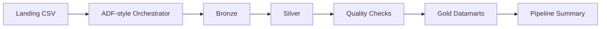

# 22 - Pipeline Azure ADF y Databricks Medallion

## 1. Valor del proyecto

Este proyecto muestra como disenar un pipeline Azure Data Engineering end-to-end sin depender de infraestructura cloud real. Construi un laboratorio local para datos de seguros que genera 1.000 registros sinteticos, simula orquestacion ADF-style, organiza datos en carpetas Azure Data Lake-style, aplica transformaciones Databricks-style entre capas landing, bronze, silver y gold, ejecuta 8 controles de calidad y publica 5 datamarts analiticos en Parquet. El valor esta en demostrar criterio de arquitectura Medallion, trazabilidad por ejecucion, validaciones antes de Gold y documentacion segura para una futura migracion a Azure, sin usar credenciales, secretos ni generar costos cloud.

## 2. Arquitectura del proyecto y flujo del pipeline

La arquitectura representa localmente un patron Azure Data Factory + Databricks + ADLS Medallion. `adf_orchestrator.py` coordina las actividades, las carpetas `data/landing`, `data/bronze`, `data/silver` y `data/gold` representan zonas de un Data Lake, y los scripts Python simulan notebooks de transformacion que dejan evidencia en archivos JSON y CSV.



Flujo ejecutado:

1. Generacion local de `customers.csv`, `policies.csv`, `claims.csv` y `payments.csv`.
2. Ingesta desde landing hacia bronze con metadata tecnica de trazabilidad.
3. Limpieza, normalizacion de tipos, fechas, duplicados y nulos criticos en silver.
4. Ejecucion de controles de calidad sobre claves, montos, satisfaccion e integridad referencial.
5. Publicacion de datamarts Gold en Parquet.
6. Escritura de evidencia en `output/pipeline_summary.json` y archivos de calidad.

## 3. Problema

El problema es que un pipeline de datos no consiste solo en mover archivos entre carpetas. En un entorno Azure, los datos necesitan separacion por capas, trazabilidad de ingesta, validaciones antes de publicar resultados y salidas analiticas confiables para reporting o consumo por negocio. Sin una arquitectura landing/bronze/silver/gold, errores del origen como claves faltantes, montos invalidos o referencias rotas pueden llegar a datamarts y dashboards. Este proyecto resuelve ese escenario en local para demostrar el patron tecnico sin afirmar despliegue real en Azure.

## 4. Objetivo

Construir un laboratorio local estilo Azure Data Factory y Databricks para procesar datos de seguros bajo arquitectura Medallion, manteniendo evidencia reproducible de cada etapa.

El objetivo concreto fue:

- generar datasets sinteticos de clientes, polizas, siniestros y pagos;
- simular una orquestacion ADF-style con actividades, dependencias, duraciones y estado final;
- construir capas landing, bronze, silver y gold usando carpetas Azure Data Lake-style;
- aplicar transformaciones Databricks-style sin crear clusters ni recursos cloud;
- ejecutar validaciones de calidad antes de publicar Gold;
- crear 5 datamarts analiticos finales en Parquet;
- documentar equivalencias Azure, control de costos y pasos seguros para una posible evolucion futura.

## 5. Implementacion

La implementacion se organizo como un flujo reproducible: generar datos, ingerir a bronze, limpiar en silver, validar calidad, publicar Gold y consolidar evidencia de ejecucion.

| Etapa | Accion realizada | Evidencia |
| --- | --- | --- |
| Generacion de datos | Se generaron 5 archivos CSV sinteticos para un dominio de seguros | `data/landing/*.csv` |
| Landing to Bronze | Se cargaron CSV y se agrego `ingestion_timestamp`, `source_file` y `pipeline_run_id` | `data/bronze/*.parquet` |
| Bronze to Silver | Se normalizaron columnas, tipos, fechas, duplicados y nulos criticos | `data/silver/*.parquet` |
| Quality Checks | Se validaron claves, montos, satisfaccion e integridad referencial | `output/data_quality_summary.json` y `output/data_quality_results.csv` |
| Silver to Gold | Se construyeron datamarts analiticos en Parquet | `data/gold/*.parquet` |
| Orquestacion ADF-style | Se registraron actividades, dependencias, estado, errores y duracion | `output/pipeline_summary.json` |
| Resumen del pipeline | Se consolido el estado final, `pipeline_run_id`, actividades, dependencias, duracion y errores | `output/pipeline_summary.json` |

## 6. Resultados

La ejecucion validada termino correctamente: el pipeline proceso 1.000 registros de entrada, genero capas bronze, silver y gold, ejecuto 8 controles de calidad sin fallas y publico 5 datamarts analiticos.

| Metrica | Resultado |
| --- | ---: |
| Estado final | PASSED |
| Customers | 100 |
| Policies | 200 |
| Claims | 300 |
| Payments | 400 |
| Filas procesadas | 1.000 |
| Quality checks | 8/8 PASSED |
| Datamarts Gold | 5 |

| Datamart Gold | Filas | Proposito |
| --- | ---: | --- |
| `dim_customer` | 100 | Dimension de clientes con segmento y region |
| `fact_policy` | 200 | Polizas enriquecidas con cliente, producto, prima y estado |
| `claims_by_product` | 4 | Siniestros agregados por producto |
| `premium_by_segment` | 3 | Primas y cantidad de polizas por segmento |
| `payment_risk` | 2 | Pagos agregados por estado de pago |

- Bronze conserva datos cercanos al origen y agrega metadata tecnica para auditar la ingesta.
- Silver entrega datasets limpios, tipados y deduplicados para validacion y consumo analitico.
- Gold publica datamarts con foco de negocio, listos para exploracion local o una futura capa BI.
- La evidencia ADF-style permite explicar dependencias, duraciones, conteos y estado final sin usar Azure real.

## Documentacion complementaria

- [Como presentar el proyecto en una entrevista](docs/interview_project_guide.md)
- [Aprendizajes, conceptos y definiciones](docs/learnings_and_concepts.md)
- [Diseno del pipeline ADF-style](docs/adf_pipeline_design.md)
- [Correspondencia con arquitectura Azure](docs/azure_architecture_mapping.md)

## 7. Estructura del proyecto

```text
22-azure-adf-databricks-medallion/
|-- app/
|   |-- generate_source_data.py
|   |-- adf_orchestrator.py
|   |-- landing_to_bronze.py
|   |-- bronze_to_silver.py
|   |-- silver_to_gold.py
|   |-- quality_checks.py
|   `-- run_pipeline.py
|-- data/
|   |-- landing/
|   |-- bronze/
|   |-- silver/
|   `-- gold/
|-- docs/
|   |-- azure_architecture_mapping.md
|   |-- adf_pipeline_design.md
|   |-- databricks_delta_notes.md
|   |-- free_azure_account_checklist.md
|   |-- cost_control_and_cleanup.md
|   |-- interview_project_guide.md
|   `-- learnings_and_concepts.md
|-- output/
|   `-- .gitkeep
|-- README.md
|-- requirements.txt
`-- .gitignore
```

Los CSV, Parquet, summaries JSON/CSV y el entorno `.venv` se regeneran localmente y estan ignorados por Git. El repositorio versiona el codigo, la documentacion, los requisitos y los `.gitkeep` necesarios para conservar la estructura.
