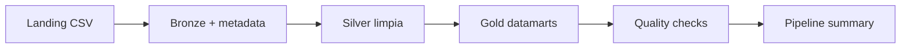

# 22 - Pipeline Azure ADF y Databricks Medallion

## 1. Valor del proyecto

Este proyecto muestra cómo diseñar un pipeline Azure Data Engineering end-to-end sin depender de infraestructura cloud real. Construí un laboratorio local para datos de seguros que genera 1.000 registros sintéticos, simula orquestación ADF-style, organiza datos en capas Medallion, ejecuta 8 controles de calidad y publica 5 datamarts analíticos en Parquet. Demuestra arquitectura, trazabilidad y modelado para consumo sin usar credenciales, secretos ni generar costos cloud.

## 2. Arquitectura del proyecto y flujo del pipeline

La arquitectura representa localmente un patrón Azure Data Factory + Databricks + ADLS. `adf_orchestrator.py` coordina actividades; las carpetas Landing, Bronze, Silver y Gold representan zonas del Data Lake; y los scripts Python representan transformaciones que dejan evidencia en JSON y CSV.



Flujo ejecutado:

1. Generación de `customers.csv`, `policies.csv`, `claims.csv` y `payments.csv`.
2. Ingesta a Bronze con metadata de trazabilidad.
3. Limpieza y normalización en Silver.
4. Construcción de cinco datamarts Gold.
5. Ejecución de ocho controles de calidad.
6. Escritura de evidencia en `output/pipeline_summary.json` y archivos de calidad.

## 3. Problema

Mover archivos no basta para producir información confiable. Los datos necesitan separación por capas, trazabilidad, validaciones y salidas orientadas al negocio. Sin ese diseño, errores del origen pueden llegar a datamarts y dashboards.

## 4. Objetivo

Construir un laboratorio local estilo Azure Data Factory y Databricks que:

- procese datos sintéticos de clientes, pólizas, siniestros y pagos;
- coordine actividades, dependencias, duración y estado;
- implemente capas Landing, Bronze, Silver y Gold;
- ejecute controles de calidad verificables;
- publique cinco datamarts analíticos;
- pueda evolucionar a Azure real sin afirmar un despliegue cloud inexistente.

## 5. Implementación

| Etapa | Acción realizada | Evidencia |
|---|---|---|
| Generación | Crea cuatro CSV sintéticos de seguros | `data/landing/*.csv` |
| Landing a Bronze | Convierte a Parquet y agrega metadata técnica | `data/bronze/*.parquet` |
| Bronze a Silver | Deduplica y normaliza texto | `data/silver/*.parquet` |
| Silver a Gold | Construye cinco datamarts | `data/gold/*.parquet` |
| Quality checks | Valida claves, relaciones y publicación Gold | `output/data_quality_*` |
| Orquestación | Registra dependencias, estado, errores y duración | `output/pipeline_summary.json` |

## 6. Resultados

| Métrica | Resultado |
|---|---:|
| Estado final | PASSED |
| Customers | 100 |
| Policies | 200 |
| Claims | 300 |
| Payments | 400 |
| Filas de entrada | 1.000 |
| Quality checks | 8/8 PASSED |
| Datamarts Gold | 5 |

| Datamart Gold | Filas | Propósito |
|---|---:|---|
| `dim_customer` | 100 | Clientes por segmento y región |
| `fact_policy` | 200 | Pólizas enriquecidas |
| `claims_by_product` | 4 | Siniestros por producto |
| `premium_by_segment` | 3 | Primas por segmento |
| `payment_risk` | 2 | Pagos por estado de riesgo |

## Documentación complementaria

- [Guía técnica y aprendizajes](docs/learnings_and_concepts.md)
- [Cómo contar el proyecto en una entrevista](docs/interview_project_guide.md)

## 7. Estructura del proyecto

```text
22-azure-adf-databricks-medallion/
|-- app/
|   |-- generate_source_data.py
|   |-- adf_orchestrator.py
|   |-- landing_to_bronze.py
|   |-- bronze_to_silver.py
|   |-- silver_to_gold.py
|   |-- quality_checks.py
|   `-- run_pipeline.py
|-- data/
|   |-- landing/
|   |-- bronze/
|   |-- silver/
|   `-- gold/
|-- docs/
|   |-- learnings_and_concepts.md
|   `-- interview_project_guide.md
|-- output/
|   `-- .gitkeep
|-- README.md
|-- requirements.txt
`-- .gitignore
```

Los datos y outputs se regeneran localmente y están ignorados por Git. El repositorio versiona código, documentación, requisitos y los `.gitkeep` necesarios.
