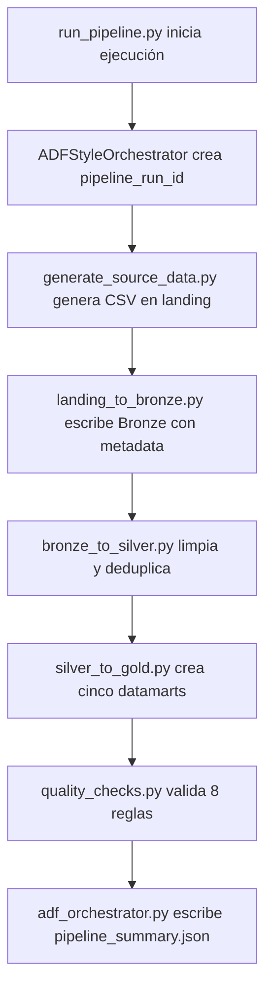

# Aprendizajes, conceptos y definiciones

## 1. Aprendizajes principales

### Arquitectura

Aprendí que una arquitectura Medallion permite separar datos recibidos, datos trazados, datos limpios y datos listos para consumo. En el proyecto aparece en las carpetas `data/landing`, `data/bronze`, `data/silver` y `data/gold`. Importa en Data Engineering porque reduce ambigüedad sobre qué tan confiable es cada dataset.

### Orquestación

Aprendí que orquestar no es transformar datos, sino coordinar actividades y dependencias. Esto aparece en `adf_orchestrator.py` y `run_pipeline.py`, donde se registran estados, errores, duraciones y dependencias. Importa porque un pipeline profesional necesita saber qué etapa falló y qué dependía de ella.

### Transformación

Aprendí a separar transformaciones por responsabilidad: ingesta a Bronze, limpieza a Silver y agregaciones a Gold. Esto aparece en `landing_to_bronze.py`, `bronze_to_silver.py` y `silver_to_gold.py`. Importa porque facilita mantenimiento, pruebas y migración futura a notebooks Databricks.

### Calidad

Aprendí que los controles de calidad deben ser explícitos y trazables. Esto aparece en `quality_checks.py`, que valida unicidad, integridad referencial y existencia de datamarts. Importa porque los datos correctos técnicamente pueden seguir siendo peligrosos si no cumplen reglas mínimas de negocio.

### Modelado para consumo

Aprendí que Gold no debería ser una copia de Silver, sino una capa orientada a preguntas de negocio. Esto aparece en `dim_customer`, `fact_policy`, `claims_by_product`, `premium_by_segment` y `payment_risk`. Importa porque los consumidores analíticos necesitan datasets preparados, no archivos crudos.

### Trazabilidad

Aprendí a agregar metadata técnica desde Bronze: `ingestion_timestamp`, `source_file` y `pipeline_run_id`. Esto aparece en `landing_to_bronze.py`. Importa porque permite auditar de dónde vino un dato y a qué ejecución pertenece.

### Reproducibilidad

Aprendí que un pipeline debe poder ejecutarse localmente con una entrada clara. Esto aparece en `run_pipeline.py`, que ejecuta el flujo completo. Importa porque facilita validación, debugging y conversación técnica en entrevistas.

### Evolución hacia Azure real

Aprendí a distinguir entre lo implementado y lo conceptual. El proyecto implementa Python, pandas, Parquet y carpetas locales; Azure Data Factory, ADLS Gen2, Azure Databricks, Delta Lake, Key Vault y Purview son equivalencias o mejoras futuras. Importa porque en una entrevista es mejor ser preciso que exagerar el alcance.

## 2. Diccionario de conceptos

| Concepto | Definición | Aplicación en el proyecto | Equivalencia Azure |
|---|---|---|---|
| Pipeline | Secuencia automatizada de pasos de datos. | `run_pipeline.py` ejecuta el flujo completo. | Pipeline de Azure Data Factory. |
| ETL | Extraer, transformar y cargar. | El proyecto extrae datos sintéticos, transforma por capas y carga Parquet. | ADF + Databricks + ADLS. |
| ELT | Extraer, cargar y transformar dentro de la plataforma analítica. | Representado parcialmente al cargar primero a landing/Bronze y transformar después. | ADLS + Databricks. |
| Ingesta | Entrada de datos desde una fuente hacia una zona controlada. | `landing_to_bronze.py` lee CSV y escribe Parquet con metadata. | Copy Activity o notebook de ingesta. |
| Orquestación | Coordinación de actividades, dependencias y estados. | `ADFStyleOrchestrator.activity()`. | Azure Data Factory. |
| Actividad | Unidad ejecutable dentro de un pipeline. | `GenerateSourceData`, `LandingToBronze`, `BronzeToSilver`, `SilverToGold`, `QualityChecks`. | Activity de ADF. |
| Dependencia | Relación que define qué actividad debe completarse antes de otra. | `depends_on` en cada actividad registrada. | Dependencias entre actividades en ADF. |
| Trigger | Mecanismo que inicia un pipeline. | No implementado; la ejecución es manual con `run_pipeline.py`. | Schedule, tumbling window o event trigger. |
| Landing | Zona inicial de llegada de datos. | CSV generados en `data/landing/`. | Container o path landing en ADLS Gen2. |
| Bronze | Capa cercana al origen con trazabilidad. | Parquet en `data/bronze/` con metadata de ingesta. | Bronze zone en ADLS/Delta. |
| Silver | Capa limpia y estandarizada. | Parquet deduplicado y normalizado en `data/silver/`. | Silver tables en Databricks. |
| Gold | Capa de consumo analítico. | Cinco datamarts en `data/gold/`. | Gold tables/datamarts. |
| Arquitectura Medallion | Patrón por capas Bronze, Silver y Gold. | Estructura local landing/Bronze/Silver/Gold. | Databricks Lakehouse. |
| Schema enforcement | Rechazo de datos que no cumplen un esquema. | No implementado; sería mejora futura. | Delta Lake constraints/schema enforcement. |
| Schema evolution | Manejo controlado de cambios de columnas. | No implementado; sería mejora futura. | Delta Lake schema evolution. |
| Data quality | Validación de reglas mínimas de datos. | Ocho checks en `quality_checks.py`. | Great Expectations, DLT expectations o notebooks. |
| Validación | Comprobación de una regla. | Unicidad, integridad referencial y existencia de datamarts. | Validation activity o quality gate. |
| Trazabilidad | Capacidad de rastrear ejecución y origen. | `pipeline_run_id`, `source_file`, `ingestion_timestamp`. | ADF run id, logs y metadata. |
| Linaje | Relación entre fuente, transformación y salida. | Documentado por flujo y metadata básica; no hay catálogo de linaje. | Microsoft Purview como mejora futura. |
| Idempotencia | Reejecutar sin duplicar ni corromper resultados. | Reproducibilidad básica; idempotencia robusta no implementada. | Delta MERGE, overwrite controlado, watermarks. |
| Reprocesamiento | Volver a ejecutar datos históricos o fallidos. | Posible manualmente; no hay parámetros de reproceso. | ADF parametrizado + Databricks jobs. |
| Particionamiento | Organización física por columnas como fecha. | No implementado; los Parquet se escriben sin particiones. | Particiones en ADLS/Delta. |
| Datamart | Dataset preparado para análisis específico. | `dim_customer`, `fact_policy`, `claims_by_product`, `premium_by_segment`, `payment_risk`. | Gold datamarts. |
| Métrica | Valor calculado para análisis. | Conteos, sumas de primas, montos de siniestros y pagos. | Métricas en Gold/Power BI. |
| Agregación | Cálculo agrupado sobre datos. | `groupby` en siniestros, primas y pagos. | Spark SQL/DataFrame aggregations. |
| Logging | Registro de eventos de ejecución. | Hay summary JSON; no hay logging estándar con `logging`. | ADF Monitor y Log Analytics. |
| Monitoring | Observabilidad del estado del pipeline. | `pipeline_summary.json` y quality outputs. | ADF Monitor, Log Analytics, alertas. |
| Pipeline summary | Evidencia estructurada de ejecución. | `output/pipeline_summary.json`. | Run history de ADF. |
| Azure Data Factory | Servicio de orquestación cloud. | Representado por `ADFStyleOrchestrator`; no usado realmente. | ADF real. |
| Azure Data Lake Storage | Storage cloud para data lakes. | Representado por carpetas locales `data/`. | ADLS Gen2. |
| Azure Databricks | Plataforma Spark administrada. | Representada conceptualmente por scripts de transformación; no usada realmente. | Databricks Jobs/Notebooks. |
| Delta Lake | Capa transaccional sobre Parquet. | No implementada; el proyecto escribe Parquet. | Delta tables. |
| PySpark | API Python para Spark. | No implementado; pandas es el motor local. | PySpark en Databricks. |
| Key Vault | Gestión segura de secretos. | No implementado porque no hay secretos. | Azure Key Vault. |
| Microsoft Purview | Gobierno, catálogo y linaje. | No implementado; mejora futura. | Purview collections, scans y lineage. |
| CI/CD | Automatización de validación y despliegue. | No implementado. | GitHub Actions/Azure DevOps. |

## 3. Mapa de los archivos app/

### app/generate_source_data.py

- Propósito: crear datos sintéticos locales de seguros.
- Funciones principales: `generate_source_data()`.
- Entradas: no recibe archivos; construye DataFrames desde valores generados en código.
- Transformaciones o acciones: crea clientes, pólizas, siniestros y pagos con pandas.
- Salidas: `customers.csv`, `policies.csv`, `claims.csv` y `payments.csv` en `data/landing/`.
- Validaciones: no ejecuta validaciones formales; retorna conteos por dataset.
- Relación con otros archivos: alimenta `landing_to_bronze.py`.
- Concepto representado: fuente sintética e ingesta inicial.
- Equivalente Azure real: extracción desde sistemas fuente o Copy Activity hacia landing.
- Cómo explicarlo: "Genero datos controlados para poder probar el pipeline sin depender de datos sensibles ni fuentes externas."

### app/landing_to_bronze.py

- Propósito: mover datos desde landing hacia Bronze con trazabilidad.
- Funciones principales: `landing_to_bronze(run_id)`.
- Entradas: CSV en `data/landing/` y `pipeline_run_id`.
- Transformaciones o acciones: lee CSV, agrega `ingestion_timestamp`, `source_file` y `pipeline_run_id`, y escribe Parquet.
- Salidas: Parquet en `data/bronze/`.
- Validaciones: no valida reglas de negocio; conserva conteos por archivo.
- Relación con otros archivos: recibe salida de `generate_source_data.py` y alimenta `bronze_to_silver.py`.
- Concepto representado: ingesta técnica y trazabilidad.
- Equivalente Azure real: actividad de ingesta o notebook que escribe Bronze en ADLS.
- Cómo explicarlo: "Bronze ya no es el archivo crudo: es el dato cercano al origen, pero con metadata técnica para auditoría."

### app/bronze_to_silver.py

- Propósito: limpiar datos Bronze para construir una capa Silver básica.
- Funciones principales: `bronze_to_silver()`.
- Entradas: Parquet en `data/bronze/`.
- Transformaciones o acciones: elimina duplicados, detecta columnas texto y recorta espacios.
- Salidas: Parquet en `data/silver/`.
- Validaciones: no ejecuta quality checks formales; prepara datos para validación posterior.
- Relación con otros archivos: recibe Bronze y alimenta `silver_to_gold.py`.
- Concepto representado: limpieza y estandarización.
- Equivalente Azure real: notebook Databricks Bronze-to-Silver.
- Cómo explicarlo: "Silver reduce ruido técnico y deja datos más consistentes para validaciones y modelos analíticos."

### app/quality_checks.py

- Propósito: validar reglas mínimas de calidad.
- Funciones principales: `run_quality_checks()`.
- Entradas: `customers.parquet`, `policies.parquet`, `claims.parquet`, `payments.parquet` en Silver y archivos Parquet en Gold.
- Transformaciones o acciones: evalúa ocho reglas y arma resultados estructurados.
- Salidas: `output/data_quality_summary.json` y `output/data_quality_results.csv`.
- Validaciones: `customers_not_empty`, IDs únicos, integridad referencial y existencia de cinco datamarts Gold.
- Relación con otros archivos: se ejecuta después de `silver_to_gold.py` porque valida también la publicación Gold.
- Concepto representado: quality gate.
- Equivalente Azure real: expectations en Databricks, DLT, Great Expectations o validaciones coordinadas por ADF.
- Cómo explicarlo: "El pipeline no solo procesa datos; también deja evidencia de que reglas mínimas pasaron."

### app/silver_to_gold.py

- Propósito: construir datamarts de consumo.
- Funciones principales: `silver_to_gold()`.
- Entradas: Parquet en `data/silver/`.
- Transformaciones o acciones: cruza pólizas con clientes, selecciona columnas y calcula agregaciones con `groupby`.
- Salidas: `dim_customer`, `fact_policy`, `claims_by_product`, `premium_by_segment` y `payment_risk` en `data/gold/`.
- Validaciones: usa `validate="many_to_one"` al enriquecer pólizas con clientes.
- Relación con otros archivos: consume Silver y debe ejecutarse antes de `quality_checks.py`.
- Concepto representado: modelado para consumo analítico.
- Equivalente Azure real: notebook o job Databricks Silver-to-Gold.
- Cómo explicarlo: "Gold traduce datos limpios en datasets que responden preguntas de negocio."

### app/adf_orchestrator.py

- Propósito: simular orquestación tipo Azure Data Factory.
- Funciones o clases principales: `ADFStyleOrchestrator`, `activity()`, `write_summary()`.
- Entradas: funciones de pipeline y dependencias declaradas.
- Transformaciones o acciones: ejecuta funciones, mide duración, captura estado y registra errores.
- Salidas: `output/pipeline_summary.json`.
- Validaciones: no valida datos; valida estado operativo de actividades por excepción.
- Relación con otros archivos: es usado por `run_pipeline.py` para envolver cada etapa.
- Concepto representado: orquestación, dependencias y monitoreo básico.
- Equivalente Azure real: pipeline de ADF con activities y run history.
- Cómo explicarlo: "ADF no transforma el dato; coordina qué se ejecuta, en qué orden y con qué estado."

### app/run_pipeline.py

- Propósito: ser el punto de entrada del pipeline.
- Funciones principales: `run_pipeline()`.
- Entradas: ejecución local del script.
- Transformaciones o acciones: instancia el orquestador y ejecuta todas las etapas en orden.
- Salidas: archivos generados en data y output; imprime estado final.
- Validaciones: propaga fallas de cualquier etapa y escribe summary `FAILED` si ocurre una excepción.
- Relación con otros archivos: integra todos los módulos de `app/`.
- Concepto representado: pipeline reproducible end-to-end.
- Equivalente Azure real: ejecución manual o trigger que inicia un pipeline ADF.
- Cómo explicarlo: "Es el comando único que demuestra que el flujo completo puede ejecutarse y dejar evidencia."

## 4. Flujo completo

## 5. Implementación local frente a Azure real

| Implementación local | Servicio o patrón Azure | Qué faltaría en producción |
|---|---|---|
| `run_pipeline.py` ejecutado manualmente | Trigger de ADF | Triggers programados o por evento, parámetros y control por ambiente |
| `ADFStyleOrchestrator` | Azure Data Factory | Linked services, retry policies, alertas y monitoreo administrado |
| Carpetas `data/landing`, `data/bronze`, `data/silver`, `data/gold` | ADLS Gen2 | Containers, permisos RBAC, lifecycle policies y naming por ambiente |
| pandas para transformaciones | Azure Databricks / Spark | Clusters/jobs, PySpark, optimización distribuida y autoscaling |
| Parquet local | Delta Lake conceptual | Transacciones ACID, schema enforcement, time travel y `MERGE` |
| JSON/CSV de calidad | Quality gate administrado | Métricas históricas, alertas, umbrales y dashboards |
| Sin secretos | Key Vault + managed identities | Secret scopes, identidades administradas y rotación |
| Documentación en `docs/` | Gobierno y catálogo | Microsoft Purview, linaje automático y data catalog |
