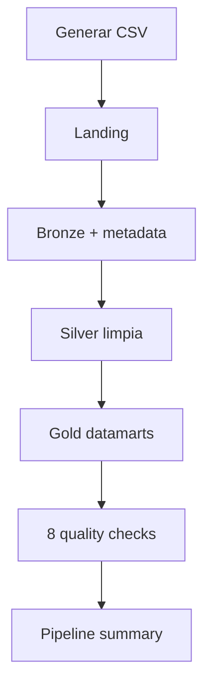

# Guía técnica y aprendizajes del Proyecto 22

## 1. Qué construí

Un pipeline batch local para datos sintéticos de seguros. Procesa clientes, pólizas, siniestros y pagos mediante capas Landing, Bronze, Silver y Gold. Coordina las actividades, registra trazabilidad, ejecuta ocho controles de calidad y publica cinco datamarts.

**Resultado validado:** 1.000 registros de entrada, pipeline `PASSED`, 8/8 controles aprobados y 5 datamarts Gold.

> La implementación usa Python, pandas y Parquet. Azure Data Factory, ADLS Gen2 y Databricks son equivalencias conceptuales; no se desplegaron servicios Azure.

## 2. Flujo concreto

| Etapa | Qué ocurre | Resultado |
|---|---|---|
| Fuente | Se generan 100 clientes, 200 pólizas, 300 siniestros y 400 pagos | 4 CSV en Landing |
| Bronze | Se convierte a Parquet y se agrega metadata de ingesta | Datos trazables |
| Silver | Se eliminan duplicados y se normaliza texto | Datos consistentes |
| Gold | Se realizan cruces, selecciones y agregaciones | 5 datamarts |
| Calidad | Se validan unicidad, relaciones y publicación Gold | 8/8 checks |
| Orquestación | Se registran dependencias, estados, duración y errores | `pipeline_summary.json` |

## 3. Archivos y funciones principales

| Archivo | Función o clase destacada | Responsabilidad | Aprendizaje clave |
|---|---|---|---|
| `generate_source_data.py` | `generate_source_data()` | Genera cuatro datasets sintéticos y los escribe como CSV | Probar un pipeline sin usar datos sensibles |
| `landing_to_bronze.py` | `landing_to_bronze(run_id)` | Lee CSV, agrega `ingestion_timestamp`, `source_file` y `pipeline_run_id`, y escribe Parquet | Ingesta con trazabilidad |
| `bronze_to_silver.py` | `bronze_to_silver()` | Elimina duplicados y recorta espacios en texto | Separar limpieza de ingesta |
| `silver_to_gold.py` | `silver_to_gold()` | Cruza pólizas con clientes y crea cinco datamarts | Modelar datos para consumo |
| `quality_checks.py` | `run_quality_checks()` | Ejecuta ocho reglas y genera evidencia JSON/CSV | La calidad debe ser explícita y medible |
| `adf_orchestrator.py` | `ADFStyleOrchestrator.activity()`, `write_summary()` | Ejecuta actividades y registra dependencias, duración, estado y errores | Orquestar no es transformar |
| `run_pipeline.py` | `run_pipeline()` | Es el punto de entrada que integra todo el flujo | Reproducibilidad end-to-end |

### Código destacable

- `pipeline_run_id`: vincula los datos Bronze con una ejecución específica.
- `depends_on`: deja explícito el orden lógico entre actividades.
- `validate="many_to_one"`: comprueba la relación entre pólizas y clientes durante el cruce.
- `groupby`: construye agregaciones de siniestros, primas y pagos.
- Manejo de excepciones: una falla se registra como `FAILED`, se escribe el resumen y se propaga el error.

## 4. Conceptos esenciales

| Concepto | Definición simple | Aplicación en el proyecto |
|---|---|---|
| Pipeline | Secuencia automatizada de tareas de datos | `run_pipeline.py` ejecuta el flujo completo |
| Ingesta | Entrada de datos a una zona controlada | Landing a Bronze |
| Orquestación | Coordinación de orden, dependencias y estados | `ADFStyleOrchestrator` |
| Landing | Punto inicial de llegada | CSV sin enriquecimiento técnico |
| Bronze | Datos cercanos al origen con trazabilidad | Parquet con metadata de ingesta |
| Silver | Datos limpios y estandarizados | Duplicados eliminados y texto normalizado |
| Gold | Datos preparados para consumo | Cinco datamarts |
| Medallion | Arquitectura que aumenta la calidad por capas | Landing → Bronze → Silver → Gold |
| Data quality | Reglas que verifican si los datos son confiables | Ocho controles |
| Trazabilidad | Capacidad de saber origen y ejecución | `source_file`, timestamp y run ID |
| Integridad referencial | Verificación de relaciones válidas entre entidades | Pólizas→clientes y siniestros→pólizas |
| Datamart | Dataset orientado a una necesidad analítica | Clientes, pólizas, siniestros, primas y pagos |
| Idempotencia | Reejecutar sin duplicar o corromper datos | No está resuelta de forma robusta; es una mejora futura |
| Carga incremental | Procesar solo datos nuevos o modificados | No implementada; podría usar watermark y Delta `MERGE` |

## 5. Decisiones técnicas

- **Medallion:** evita mezclar archivos recibidos, datos limpios y resultados de negocio.
- **Landing separada de Bronze:** Bronze ya incorpora formato Parquet y metadata; Landing conserva la llegada.
- **Gold antes de los checks finales:** el código valida también la existencia de los cinco datamarts. En producción agregaría controles antes y después de Gold.
- **pandas y Parquet:** son suficientes para un laboratorio de 1.000 registros y permiten demostrar el patrón sin infraestructura cloud.
- **Módulos separados:** facilitan probar, mantener y migrar cada etapa de forma independiente.

## 6. Implementación local y equivalente Azure

| Implementación local | Equivalente Azure | Qué faltaría para producción |
|---|---|---|
| `ADFStyleOrchestrator` | Azure Data Factory | Pipelines reales, triggers, retries y alertas |
| Carpetas `data/` | ADLS Gen2 | Containers, RBAC y políticas de ciclo de vida |
| Scripts pandas | Azure Databricks | Jobs/notebooks PySpark y cómputo distribuido |
| Archivos Parquet | Delta Lake | ACID, schema enforcement, time travel y `MERGE` |
| Summary JSON/CSV | ADF Monitor / Log Analytics | Histórico, dashboards y alertas |
| Sin secretos | Key Vault + Managed Identity | Gestión y rotación de credenciales |
| Ejecución manual | CI/CD y ambientes | DEV, QA y PROD parametrizados |

## 7. Aprendizajes principales

- Diseñar capas con responsabilidades claras.
- Diferenciar ingesta, transformación y orquestación.
- Incorporar trazabilidad desde Bronze.
- Convertir Silver en modelos Gold útiles para negocio.
- Validar datos y dejar evidencia de ejecución.
- Explicar con honestidad la diferencia entre un patrón local y un servicio cloud real.
