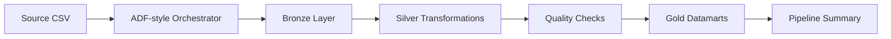

# 22 - Azure Data Factory Medallion Pipeline

## 1. Valor del proyecto

Este proyecto simula un pipeline Azure Data Engineering end-to-end usando una arquitectura Medallion con capas Bronze, Silver y Gold. El flujo genera datos sintéticos de clientes, pólizas, siniestros, pagos e interacciones, los ingesta con Azure Data Factory-style orchestration, aplica Databricks/Spark-style transformations, ejecuta controles de calidad y construye datamarts analíticos listos para consumo. El valor está en demostrar cómo diseñar, mantener y documentar pipelines cloud-style con trazabilidad, validaciones y evidencia de ejecución defendible en entrevistas Azure Data Engineer.

## 2. Arquitectura del proyecto y flujo del pipeline

Este proyecto es una simulación local y honesta: no usa Azure real, no requiere credenciales, no usa secrets y no genera costos. La arquitectura usa términos Azure-style, ADF-style orchestration, Databricks-style transformation, Delta Lake conceptual y Medallion architecture para explicar cómo se mapearía el flujo a un entorno cloud.



| Etapa | Componente | Resultado |
|---|---|---|
| Source | `app/generate_source_data.py` | CSV sintéticos reproducibles en `data/source/` |
| Orquestación | `app/adf_orchestrator.py` | Actividades, dependencias, duraciones y estado final ADF-style |
| Bronze | `app/bronze_ingestion.py` | Copias normalizadas con trazabilidad en Parquet |
| Silver | `app/silver_transformations.py` | Datasets limpios, tipados y enriquecidos |
| Quality | `app/quality_checks.py` | Validaciones automáticas y evidencia de calidad |
| Gold | `app/gold_datamart.py` | Datamarts analíticos finales en Parquet |
| Summary | `output/adf_pipeline_run_summary.json` | Evidencia completa de ejecución del pipeline |

## 3. Problema

El problema es que un pipeline de datos no consiste solo en mover archivos desde una fuente a un destino. En un entorno Azure, los datos deben ser ingeridos, validados, transformados por capas y publicados en estructuras analíticas confiables. Si no existe separación entre Bronze, Silver y Gold, los errores del origen pueden llegar directamente a reportes o datamarts. Este proyecto aborda ese problema simulando un flujo completo con orquestación, trazabilidad, controles de calidad y construcción de salidas analíticas.

## 4. Objetivo

Diseñar e implementar un pipeline local estilo Azure Data Factory para procesar datos de negocio bajo arquitectura Medallion.

El objetivo concreto fue:

- generar datasets sintéticos de clientes, pólizas, siniestros, pagos e interacciones;
- simular una orquestación ADF-style con actividades y dependencias;
- construir capas Bronze, Silver y Gold;
- ejecutar validaciones de calidad;
- crear datamarts analíticos finales;
- generar evidencia reproducible del pipeline.

## 5. Implementacion

| Etapa | Acción realizada | Evidencia |
|---|---|---|
| Generación de datos | Se crearon datasets sintéticos reproducibles para dominio bancario/seguros | `data/source/*.csv` |
| Bronze ingestion | Se ingirieron CSV crudos y se agregaron columnas de trazabilidad | `data/bronze/*.parquet` |
| Silver transformations | Se limpiaron tipos, fechas, duplicados y relaciones entre clientes, pólizas, siniestros y pagos | `data/silver/*.parquet` |
| Quality checks | Se validaron claves, montos, fechas y relaciones entre entidades | `output/data_quality_summary.json` |
| Gold datamarts | Se construyeron datamarts analíticos para clientes, siniestros, pólizas y riesgo de pagos | `data/gold/*.parquet` |
| ADF-style orchestration | Se ejecutaron actividades con dependencias, duración, filas de entrada/salida y estado | `app/adf_orchestrator.py` |
| Pipeline summary | Se generó un resumen final del pipeline con estado `PASSED` | `output/adf_pipeline_run_summary.json` |

## 6. Resultados

La ejecución validada terminó correctamente y generó evidencia local del pipeline completo.

| Métrica | Resultado |
|---|---:|
| Estado final | PASSED |
| Customers generados | 5.000 |
| Policies generadas | 8.000 |
| Claims generados | 20.000 |
| Payments generados | 40.000 |
| Interactions generadas | 30.000 |
| Datamarts Gold | 4 |
| Quality checks | 10/10 |

| Output | Descripción |
|---|---|
| `data/source/customers.csv` | Fuente sintética de clientes |
| `data/source/policies.csv` | Fuente sintética de pólizas |
| `data/source/claims.csv` | Fuente sintética de siniestros |
| `data/source/payments.csv` | Fuente sintética de pagos |
| `data/source/interactions.csv` | Fuente sintética de interacciones |
| `data/bronze/*.parquet` | Capa Bronze con `ingestion_timestamp`, `source_file` y `pipeline_run_id` |
| `data/silver/*.parquet` | Capa Silver con datos limpios, tipados y enriquecidos |
| `data/gold/gold_customer_360.parquet` | Datamart de visión 360 del cliente |
| `data/gold/gold_claims_monthly_summary.parquet` | Datamart mensual de siniestros |
| `data/gold/gold_policy_performance.parquet` | Datamart de performance de pólizas |
| `data/gold/gold_payment_risk_summary.parquet` | Datamart de riesgo de pagos |
| `output/data_quality_summary.json` | Resumen de validaciones de calidad |
| `output/data_quality_results.csv` | Detalle tabular de cada validación |
| `output/adf_pipeline_run_summary.json` | Resumen ADF-style con actividades, dependencias y estado final |

Bronze conserva trazabilidad y mantiene los datos cerca del origen. Silver aplica limpieza, reglas y enriquecimiento para evitar que errores operacionales lleguen directo a consumo analítico. Gold entrega datamarts listos para análisis. El resumen ADF-style permite explicar actividades, dependencias, filas procesadas, duración y estado final del pipeline.

## 7. Estructura del proyecto

```text
22-azure-adf-medallion-pipeline/
|-- app/
|   |-- generate_source_data.py
|   |-- adf_orchestrator.py
|   |-- bronze_ingestion.py
|   |-- silver_transformations.py
|   |-- gold_datamart.py
|   |-- quality_checks.py
|   `-- run_pipeline.py
|-- data/
|   |-- source/
|   |-- bronze/
|   |-- silver/
|   `-- gold/
|-- docs/
|   |-- azure_architecture_mapping.md
|   |-- adf_pipeline_design.md
|   |-- databricks_delta_notes.md
|   `-- ci_cd_notes.md
|-- output/
|-- README.md
|-- requirements.txt
`-- .gitignore
```

| Carpeta | Propósito |
|---|---|
| `app/` | Código Python del pipeline local |
| `data/source/` | CSV sintéticos generados localmente |
| `data/bronze/` | Capa Bronze en Parquet |
| `data/silver/` | Capa Silver en Parquet |
| `data/gold/` | Datamarts Gold en Parquet |
| `docs/` | Documentación Azure-style, ADF-style, Databricks/Delta y CI/CD |
| `output/` | Evidencia de ejecución y calidad |

Los CSV, Parquet y outputs generados están ignorados por Git. El repositorio versiona el código, la documentación, el README, `requirements.txt`, `.gitignore` y los `.gitkeep` necesarios.

### Ejecución local

```bash
python3 -m venv .venv
source .venv/bin/activate
pip install --upgrade pip
pip install -r requirements.txt
python3 -m py_compile app/generate_source_data.py app/adf_orchestrator.py app/bronze_ingestion.py app/silver_transformations.py app/gold_datamart.py app/quality_checks.py app/run_pipeline.py
python3 app/run_pipeline.py
```
