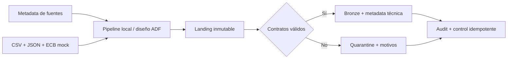

# Proyecto 23 — Azure Banking Multicurrency Data Platform

## Valor del proyecto

Una plataforma bancaria multimoneda debe incorporar archivos y APIs heterogéneos sin perder evidencia del origen, bloquear datos defectuosos y soportar reejecuciones sin duplicar operaciones. Este proyecto demuestra esas capacidades con contratos verificables, orquestación metadata-driven, Landing inmutable, Bronze trazable, cuarentena y auditoría antes de consumir recursos cloud.

Para un rol Data Engineer, el proyecto muestra diseño incremental, separación de capas, calidad de datos, idempotencia por checksum, observabilidad y traducción de un flujo local probado a componentes reales de Azure Data Factory y ADLS Gen2.

## Resumen ejecutivo

La arquitectura objetivo integrará una API histórica del ECB, CSV de transacciones y JSON de clientes/cuentas. Azure Data Factory aterrizará los orígenes en ADLS Gen2; un único driver Databricks coordinará Bronze, Silver, Gold, calidad y snapshots; Azure SQL publicará un modelo estrella para Power BI.

Los Hitos 1 y 2 fijan ese comportamiento sin costo cloud mediante datos sintéticos pequeños y Python estándar. La ejecución actual procesa dos microlotes, detecta el replay exacto, conserva originales en Landing, materializa 22 registros válidos en Bronze y envía tres transacciones deliberadamente inválidas a cuarentena.

## Estado actual

**Hitos 1 y 2 implementados localmente.** Existen contratos, JSON Schemas, fixtures determinísticos, configuración central de fuentes, artefactos ADF Azure-style, pipeline Landing/Bronze, estado de idempotencia, auditoría y pruebas automatizadas.

No se han desplegado ni ejecutado recursos Azure. Los JSON de `adf/` representan un diseño versionado y no son evidencia de Azure Data Factory. El origen ECB sigue siendo un mock local; todos los datos son sintéticos.

## Caso bancario y fuentes

El caso integra transacciones en EUR, USD y GBP con maestros de clientes/cuentas y tasas de cambio. Los fixtures pequeños preservan las relaciones y errores previstos para acelerar el desarrollo; el volumen objetivo posterior será de aproximadamente 5.000 transacciones, 500 clientes y 700 cuentas.

| Fuente | Formato actual | Entidad | Carga | Resultado local |
|---|---|---|---|---|
| Transacciones sintéticas | CSV | `transactions` | Incremental, dos microlotes | 8 aceptadas |
| Replay del microlote 1 | CSV | `transactions` | Incremental | 4 filas `SKIPPED` |
| Clientes sintéticos | JSON | `customers` | Full snapshot | 5 aceptados |
| Cuentas sintéticas | JSON | `accounts` | Full snapshot | 7 aceptadas |
| ECB API mock | JSON | `fx_rates` | Incremental | 2 fechas aceptadas |
| Casos de contrato | CSV | `transactions` | Incremental | 3 en cuarentena |

Los campos y reglas están en [Contratos de datos](contracts/data_contracts.md); los esquemas Draft 2020-12 están en `schemas/`.

## Arquitectura Landing/Bronze



Landing conserva los bytes originales y metadata SHA-256. Bronze preserva los campos válidos, aplana únicamente la colección técnica de cada JSON y agrega `_run_id`, `_ingested_at`, `_source_name`, `_source_file`, `_record_checksum`, `_ingestion_date` y `_landing_path`. No hay conversión monetaria ni reglas Silver en este hito.

El diseño completo está en [Arquitectura](docs/architecture.md).

## Flujo metadata-driven y artefactos ADF

`config/sources.json` define cada fuente mediante nombre, entidad, tipo, path, formato, esquema, habilitación, tipo de carga, destino y clave de negocio. Incorporar otra fuente CSV o JSON compatible no requiere duplicar el bucle principal.

Los artefactos en `adf/` modelan:

- Linked Services parametrizados para HTTP y ADLS Gen2;
- referencia conceptual opcional a Key Vault, sin valores reales;
- datasets parametrizados para metadata, CSV, JSON y Landing;
- pipeline maestro con `Lookup`, `ForEach` y `ExecutePipeline`;
- pipeline reutilizable con `Switch`, `Copy` y control de fallos;
- trigger de ejemplo en estado `Stopped` para conservar ejecución manual.

No contienen contraseñas, tokens, connection strings ni IDs personales o de suscripción.

## Convenciones de rutas

```text
data/output/landing/{source}/{entity}/ingestion_date={date}/run_id={run_id}/
data/output/bronze/{entity}/ingestion_date={date}/source_checksum={prefix}/records.jsonl
data/output/quarantine/{source}/{entity}/ingestion_date={date}/run_id={run_id}/
data/output/audit/ingestion_audit.jsonl
data/output/audit/run_summary_{run_id}.json
data/output/control/processed_files.json
```

Los outputs generados se ignoran en Git. Los fixtures, contratos y esquemas nunca son eliminados por el comando de limpieza.

## Idempotencia, auditoría y cuarentena

La clave `source_name + entity_name + file_sha256` identifica un archivo ya procesado. El replay conserva el mismo checksum aunque tenga otro nombre y queda `SKIPPED`; una segunda ejecución completa tampoco crea archivos ni filas Bronze adicionales. El checksum canónico de cada registro aporta trazabilidad adicional.

Cada fuente registra rutas, conteos, checksum, timestamps, duración, estado y error. Los estados son:

- `SUCCESS`: archivo procesado sin rechazos;
- `PARTIAL`: se conservaron aceptados y/o rechazos de calidad;
- `FAILED`: error técnico recuperable, sin marcar el archivo como procesado;
- `SKIPPED`: checksum ya completado, contabilizado como duplicado.

Los rechazos guardan el registro original y todos sus motivos. La fuente inválida no borra ni sobrescribe las particiones válidas.

## Ejecución local reproducible

No se requieren dependencias externas. Desde la carpeta del proyecto:

```bash
python3 scripts/clean_outputs.py
python3 scripts/run_ingestion.py --run-id demo-h2-run-001 --ingestion-date 2026-07-22
python3 scripts/run_ingestion.py --run-id demo-h2-run-002 --ingestion-date 2026-07-22
python3 scripts/show_audit.py
```

La primera corrida finaliza `PARTIAL` porque los tres rechazos son intencionales. La segunda finaliza `SUCCESS` con todas las fuentes `SKIPPED` y Bronze sin cambios.

Para validar contratos y ejecutar toda la regresión:

```bash
python3 scripts/validate_fixtures.py
PYTHONDONTWRITEBYTECODE=1 python3 -m unittest discover -s tests -v
```

## Resultados locales verificados

| Evidencia | Resultado |
|---|---:|
| Controles de fixtures del Hito 1 | 42/42 `PASSED` |
| Pruebas Hitos 1 y 2 | 17/17 `PASSED` |
| Registros Bronze | 22 |
| Transacciones Bronze únicas | 8 |
| Rechazos en cuarentena | 3 |
| Replay dentro de la primera corrida | 4 filas `SKIPPED` |
| Segunda corrida | 7/7 fuentes `SKIPPED`, 29 filas duplicadas auditadas |
| Artefactos ADF | JSON válido y sin claves de secretos |

Estos resultados corresponden exclusivamente a ejecución local. No demuestran actividad en Databricks Free Edition ni en Azure.

## Seguridad y control de costos

- Solo datos sintéticos y no identificables.
- Sin credenciales, correos, tenant IDs o subscription IDs versionados.
- Key Vault permanece conceptual y fuera del MVP mientras no existan secretos reales.
- Ningún trigger ADF está activo.
- El objetivo operacional futuro es mantener el gasto de demostración bajo USD 10; no es un límite automático garantizado.
- Los recursos Azure se crearán en ventanas controladas y se eliminarán después de capturar evidencia.

## Limitaciones explícitas

- Los artefactos ADF no se han importado, validado ni ejecutado en un Data Factory real.
- Landing y Bronze usan filesystem/JSONL local, no ADLS Gen2 ni Delta Lake.
- No se consulta todavía la API real del ECB.
- No hay Silver, Gold, PySpark, Databricks, Azure SQL ni Power BI implementados.
- La validación local cubre el subconjunto JSON Schema usado por estos contratos, no un motor JSON Schema general.
- Los volúmenes son deliberadamente pequeños y no representan rendimiento productivo.

## Próximo hito

El siguiente hito implementará PySpark y Delta Lake parametrizados en **Databricks Free Edition**, incluyendo capa Silver, controles de calidad, `MERGE` e idempotencia. Las evidencias identificarán expresamente Free Edition; Azure Databricks solo se usará después durante una ventana temporal de validación Azure.
