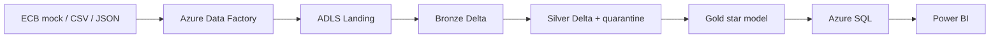

# Proyecto 23 — Azure Banking Multicurrency Data Platform

## Estado actual del proyecto

**Hito 1 implementado localmente.** El repositorio contiene contratos, esquemas, fixtures sintéticos determinísticos, un manifiesto de resultados esperados y validaciones ejecutables con la biblioteca estándar de Python.

En este hito no existen recursos Azure desplegados. Azure Data Factory, ADLS Gen2, Azure Databricks, Azure SQL y Power BI representan la arquitectura objetivo y todavía no deben interpretarse como servicios ejecutados. La API ECB es un mock local y los datos son completamente sintéticos.

## Valor del proyecto

Una plataforma bancaria multimoneda necesita integrar datos heterogéneos sin perder trazabilidad, aplicar reglas de calidad antes del consumo y convertir importes a una moneda analítica común. Este proyecto diseña ese flujo de extremo a extremo y prepara contratos verificables antes de crear infraestructura, reduciendo errores y consumo cloud durante los hitos posteriores.

Para un rol Data Engineer, el proyecto demostrará diseño Medallion, PySpark, Delta Lake, cargas incrementales, idempotencia, calidad, modelado dimensional, orquestación, seguridad, observabilidad y control de costos mediante servicios reales de Azure.

## Resumen ejecutivo

La solución objetivo procesará aproximadamente 5.000 transacciones, 500 clientes y 700 cuentas en EUR, USD y GBP. Dos microlotes y una reejecución del primero permitirán comprobar cargas incrementales e idempotencia. ADF ingerirá una API histórica del ECB, CSV de transacciones y JSON de clientes/cuentas hacia ADLS Gen2. Databricks transformará Landing en Bronze, Silver y Gold con PySpark y Delta Lake. Un modelo estrella se publicará en Azure SQL y será consumido desde Power BI.

El Hito 1 utiliza únicamente fixtures pequeños para fijar el comportamiento esperado sin dependencias externas ni costos cloud.

## Problema bancario

Las transacciones llegan en distintas monedas y formatos, mientras clientes, cuentas y tipos de cambio evolucionan de forma independiente. Sin contratos y controles explícitos pueden aparecer operaciones duplicadas, cuentas inexistentes, montos inválidos o conversiones incompletas que distorsionen los indicadores de negocio.

La plataforma debe entregar una vista reconciliada y auditable para analizar volumen, monto normalizado, estado, canal, comercio, segmento y moneda.

## Fuentes de datos

| Fuente | Formato | Contenido | Estado en Hito 1 |
|---|---|---|---|
| Transacciones bancarias | CSV | Operaciones, moneda, comercio, canal y lote | Fixture local sintético |
| Clientes y cuentas | JSON | Maestros sin atributos identificables | Fixtures locales sintéticos |
| Tipos de cambio ECB | JSON API | Tasas EUR, USD y GBP por fecha | Mock local sintético |

Los contratos completos están en [Contratos de datos](contracts/data_contracts.md) y los esquemas verificables en `schemas/`.

## Arquitectura objetivo



El diseño detallado y la separación entre implementación actual y futura se documentan en [Arquitectura](docs/architecture.md).

## Capas Landing, Bronze, Silver y Gold

- **Landing:** conservará una copia inmutable de cada respuesta o archivo recibido.
- **Bronze:** normalizará técnicamente cada fuente y agregará metadata de ingesta, lote y ejecución.
- **Silver:** aplicará tipado, deduplicación, integridad referencial, reglas de negocio, conversión monetaria y cuarentena.
- **Gold:** publicará dimensiones, hechos, métricas y reconciliaciones preparadas para consumo.

## Estrategia de calidad

Los controles locales verifican presencia de archivos, encabezados, JSON válido, campos obligatorios, unicidad, referencias entre cuentas y clientes, referencias de transacciones, dominios permitidos, fechas, montos, cobertura FX y conteos esperados.

Los casos deliberadamente inválidos se almacenan en `data/fixtures/invalid/`. Una validación correcta exige detectar exactamente sus errores esperados; no se mezclan silenciosamente con los registros válidos.

## Idempotencia

`transactions_batch_001_replay.csv` debe ser idéntico byte a byte al primer microlote. En Delta Lake, la estrategia futura combinará:

- `transaction_id`;
- `source_batch_id`;
- checksum SHA-256 del archivo;
- fecha lógica de procesamiento.

El `MERGE` futuro insertará registros nuevos, actualizará cambios controlados y evitará duplicados al repetir un lote ya procesado.

## Conversión a EUR

EUR será la moneda analítica común. El mock define tasas como unidades de moneda por `1 EUR`. Conceptualmente:

```text
fx_rate_to_eur = 1 / source_rate_per_eur
amount_eur = amount_original * fx_rate_to_eur
```

Para operaciones en EUR, ambas tasas son `1`. Los importes de los fixtures no representan cifras financieras productivas.

## Modelo estrella objetivo

La tabla `fact_transactions` tendrá grano de una transacción e incluirá `amount_original`, `currency_original`, `fx_rate_to_eur` y `amount_eur`.

Dimensiones previstas:

- `dim_date`;
- `dim_customer`;
- `dim_account`;
- `dim_merchant`;
- `dim_channel`;
- `dim_currency`.

El modelo está documentado, pero no implementado ni desplegado en este hito.

## Seguridad y gobierno previstos

- Solo datos sintéticos y no identificables.
- Managed Identities para accesos entre servicios Azure.
- OIDC para GitHub Actions en un hito posterior.
- RBAC con alcance mínimo y endpoints públicos controlados para el PoC.
- Sin Key Vault mientras no existan secretos reales.
- Sin credenciales, correos, tenant IDs o subscription IDs versionados.
- Nombres y etiquetas definidos en [Convenciones Azure](docs/naming_and_tagging.md).

## Control de costos

El objetivo operacional futuro es mantener el gasto total de demostración bajo USD 10; no es un límite automático garantizado. El presupuesto preventivo permanece pendiente de habilitación en Cost Management.

La cuenta gratuita dispone de un límite de gasto, pero el proyecto no dependerá únicamente de esa protección. Se limitarán las corridas, se usará Job Compute temporal, no habrá triggers programados y los recursos se eliminarán después de capturar evidencia. Azure SQL usará la oferta gratuita y su opción de pausa al alcanzar el límite si están disponibles.

## Observabilidad prevista

Cada ejecución futura registrará `pipeline_run_id`, lote, archivo fuente, checksum, timestamps, conteos por capa, registros en cuarentena, resultado de calidad y estado final. Las evidencias distinguirán validaciones locales, Databricks Free Edition y ejecuciones reales de Azure.

## Alcance implementado en el Hito 1

- contratos de CSV y JSON;
- JSON Schemas Draft 2020-12;
- dos microlotes pequeños y un replay exacto;
- clientes, cuentas y tasas sintéticas;
- casos inválidos separados;
- manifiesto con conteos y errores esperados;
- generador determinístico con semilla fija;
- validador y pruebas con Python estándar.

## Resultados locales verificados

| Validación | Resultado |
|---|---:|
| Controles del validador | 42/42 PASSED |
| Pruebas unitarias | 4/4 PASSED |
| Clientes sintéticos | 5 |
| Cuentas sintéticas | 7 |
| Transacciones válidas sin contar replay | 8 |
| Registros inválidos detectados como se esperaba | 3/3 |
| Replay del microlote 1 | Idéntico byte a byte |

Estos resultados corresponden exclusivamente a fixtures locales; no demuestran ejecución en Databricks ni Azure.

## Generación y validación local

No se requieren dependencias externas:

```bash
python3 scripts/generate_fixtures.py
python3 scripts/validate_fixtures.py
PYTHONDONTWRITEBYTECODE=1 python3 -m unittest discover -s tests -v
```

El generador sobrescribe únicamente los fixtures y el manifiesto de este proyecto con contenido determinístico. El validador termina con código distinto de cero ante cualquier incumplimiento inesperado.

## Próximos hitos

- **Hito 2:** código PySpark/Delta modular, SQL, Bicep declarativo y CI sin despliegue.
- **Hito 3:** ejecución de Bronze, Silver, Gold, `MERGE`, calidad e idempotencia en Databricks Free Edition.
- **Hitos 4–8:** recursos Azure mínimos, ingesta ADF, ventana temporal de Azure Databricks, Azure SQL, Power BI, CD con OIDC, evidencia y cleanup.

## Limitaciones actuales

- No se consulta la API real del ECB.
- No existen tablas Delta ni transformaciones PySpark implementadas.
- No se han desplegado ni ejecutado servicios Azure.
- No existe modelo físico en Azure SQL ni reporte Power BI.
- El volumen de fixtures es deliberadamente pequeño.
- El proyecto todavía no representa una plataforma productiva.
