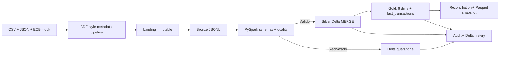

# Proyecto 23 — Azure Banking Multicurrency Data Platform

## Valor del proyecto

Una plataforma bancaria multimoneda necesita integrar archivos y APIs heterogéneos, conservar trazabilidad regulatoria y publicar una métrica común sin perder los importes originales. Este proyecto demuestra esas capacidades mediante contratos, ingesta metadata-driven, arquitectura Medallion, Delta Lake idempotente, calidad explicable y un modelo estrella reconciliado en EUR.

Para un rol Data Engineer, aporta evidencia ejecutable de Python modular, PySpark con esquemas explícitos, tipos decimales, Delta Lake `MERGE`, dimensiones Type 1, claves sustitutas determinísticas, cuarentena, auditoría y traducción de un flujo local probado hacia Azure Data Factory y Databricks.

## Resumen ejecutivo

La arquitectura objetivo integra una API histórica del ECB, CSV de transacciones y JSON de clientes/cuentas. ADF aterrizará las fuentes en ADLS Gen2; un driver Databricks coordinará Bronze, Silver, Gold, calidad y snapshots; Azure SQL servirá un modelo estrella para Power BI.

Los Hitos 1–4 implementan localmente el recorrido hasta Gold. Dos microlotes producen 22 filas Bronze y cuatro tablas Silver. Gold publica seis dimensiones y ocho hechos, convierte EUR/USD/GBP a EUR según la fecha, reconcilia conteos e importes y genera un snapshot Parquet. Una segunda corrida Gold omite 36 filas sin duplicarlas ni reescribir el snapshot.

## Estado actual

**Hitos 1, 2, 3 y 4 implementados y verificados localmente.** Existen contratos, fixtures sintéticos, configuración metadata-driven, artefactos ADF Azure-style, Landing/Bronze, PySpark Bronze→Silver→Gold, tablas Delta, modelo estrella, cuarentena, auditoría, reconciliación y pruebas automatizadas.

No se han creado ni ejecutado recursos Azure o Databricks. Los notebooks son drivers preparados para una validación posterior en **Databricks Free Edition**. La evidencia actual corresponde exclusivamente a **PySpark 4.0.1 y Delta Lake 4.0.1 locales**.

## Fuentes y caso bancario

| Fuente | Formato | Entidad | Resultado de los fixtures |
|---|---|---|---:|
| Transacciones sintéticas | CSV | `transactions` | 8 válidas en dos microlotes |
| Replay del microlote 1 | CSV | `transactions` | 4 filas omitidas en Bronze |
| Clientes sintéticos | JSON | `customers` | 5 |
| Cuentas sintéticas | JSON | `accounts` | 7 |
| ECB API mock | JSON | `fx_rates` | 2 fechas |
| Casos inválidos Hito 2 | CSV | `transactions` | 3 en cuarentena Bronze |

Los datos son completamente sintéticos y no contienen nombres, correos, documentos, credenciales ni identificadores Azure.

## Arquitectura implementada



Los artefactos ADF permanecen como diseño versionado, marcado `DESIGN_ONLY` y `NOT_DEPLOYED`. La ejecución local equivalente genera Landing y Bronze sin afirmar que ADF o ADLS hayan sido utilizados.

La arquitectura detallada está en [docs/architecture.md](docs/architecture.md).

## Transformaciones Silver

| Entidad | Transformaciones | Clave de negocio | Tabla Delta |
|---|---|---|---|
| Clientes | IDs y dominios en mayúsculas, fecha de alta tipada | `customer_id` | `silver_customers` |
| Cuentas | IDs, tipo, moneda, estado y fecha tipados; FK a cliente | `account_id` | `silver_accounts` |
| FX | Fecha tipada y tasas anidadas convertidas a `rate_eur`, `rate_usd`, `rate_gbp` | `effective_date` | `silver_fx_rates` |
| Transacciones | Timestamp, decimal(18,2), IDs, moneda, canal, estado y dominios; FK a cuenta | `transaction_id` | `silver_transactions` |

Silver conserva la metadata Bronze y agrega `_silver_processed_at`, `_silver_run_id`, `_quality_status` y `_source_bronze_path`. No calcula todavía importes EUR ni construye dimensiones Gold.

## Modelo estrella Gold

El grano de `fact_transactions` es una fila por `transaction_id`. Cliente y cuenta se publican desde sus tablas Silver completas; fecha, comercio, canal y moneda se derivan de las transacciones válidas.

| Tabla | Clave natural | Clave sustituta | Filas fixture |
|---|---|---|---:|
| `dim_date` | `full_date` | `date_key` | 2 |
| `dim_customer` | `customer_id` | `customer_key` | 5 |
| `dim_account` | `account_id` | `account_key` | 7 |
| `dim_merchant` | `merchant_id` | `merchant_key` | 7 |
| `dim_channel` | `channel_code` | `channel_key` | 4 |
| `dim_currency` | `currency_code` | `currency_key` | 3 |
| `fact_transactions` | `transaction_id` | `fact_transaction_key` | 8 |

Las dimensiones son Type 1. Sus claves `long` son determinísticas y el pipeline detecta duplicados de clave sustituta. El hecho conserva identificadores de negocio, importe/moneda original, tasa, fecha FX, importe EUR, run Silver, path Silver y metadata Gold.

Las tasas se interpretan como unidades de moneda cotizada por `1 EUR`:

```text
amount_eur = amount_original / fx_rate_to_eur
```

`amount_original` y `amount_eur` usan `decimal(18,2)`; `fx_rate_to_eur` usa `decimal(18,8)`. La tasa EUR es `1.00000000`. Una tasa ausente o no positiva envía la transacción a cuarentena y nunca publica un hecho incompleto.

## Quality gates

- claves obligatorias no nulas;
- formatos `CUS-NNN`, `ACC-NNN`, `TXN-NNNN` y `MER-NNN`;
- fechas y timestamps parseables;
- importes positivos con dos decimales;
- monedas EUR, USD y GBP;
- dominios contractuales de estados, tipos, segmentos, canales y categorías;
- integridad cuenta → cliente y transacción → cuenta;
- tasas FX positivas y EUR igual a `1.0`;
- duplicados por clave de negocio con ganadora determinística;
- checksum Bronze obligatorio y detección de JSON corrupto.

Gold añade estos gates:

- una fila por `transaction_id`;
- referencias a cuenta y cliente Silver;
- cobertura FX por fecha UTC y moneda;
- seis claves foráneas no nulas y sin huérfanos;
- claves naturales y sustitutas únicas;
- conteo Silver = hechos + rechazados;
- suma original aceptada = suma original del hecho.

La cuarentena Delta guarda una fila por regla incumplida con registro original, entidad, clave, regla, motivo, run ID, timestamp y ruta Bronze. Su `_quarantine_id` evita repetir la misma evidencia.

## Delta Lake e idempotencia

Las tablas Silver y Gold son path-based y no se particionan en este volumen pequeño para evitar archivos innecesarios. Silver compara `_record_checksum`; Gold compara `_gold_record_checksum`, calculado solo con contenido analítico y sin metadata volátil:

- nueva clave: inserción;
- checksum cambiado: actualización;
- checksum idéntico: omisión;
- clave duplicada dentro del input: cuarentena.

Si no existen inserciones ni actualizaciones, el pipeline devuelve `SKIPPED` y evita ejecutar un `MERGE` físico. Gold también evita reescribir el snapshot. La suite prueba una actualización controlada y confirma un `MERGE` Delta real.

## Auditoría

`data/output/audit/silver_audit.jsonl` registra por entidad:

- paths Bronze y Silver;
- filas fuente, válidas, rechazadas y duplicadas;
- filas insertadas, actualizadas y omitidas;
- timestamps, duración, estado y error;
- versión, operación y métricas del historial Delta.

Los estados posibles son `SUCCESS`, `PARTIAL`, `SKIPPED` y `FAILED`.

`gold_audit.jsonl` y cada `gold_run_summary_{run_id}.json` agregan métricas de las siete tablas, cuarentena, reconciliación financiera, integridad dimensional y estado del snapshot. `scripts/show_gold_audit.py` imprime una vista compacta.

## Ejecución local reproducible

Requisitos comprobados para este hito:

- Python 3.10 o superior;
- OpenJDK 17;
- PySpark 4.0.1;
- Delta Lake 4.0.1.

Preparación aislada:

```bash
brew install openjdk@17
python3 -m venv .venv
.venv/bin/pip install -r requirements-spark.txt
```

El script detecta las rutas Homebrew habituales de Java en macOS. En otros sistemas se debe definir `JAVA_HOME`.

Ejecución completa desde la carpeta del proyecto:

```bash
python3 scripts/clean_outputs.py
python3 scripts/run_ingestion.py --run-id demo-h3-bronze --ingestion-date 2026-07-22
.venv/bin/python scripts/run_silver.py --run-id demo-h3-silver-001
.venv/bin/python scripts/run_silver.py --run-id demo-h3-silver-002
.venv/bin/python scripts/run_gold.py --run-id demo-h4-gold-001
.venv/bin/python scripts/run_gold.py --run-id demo-h4-gold-002
.venv/bin/python scripts/show_silver_audit.py
.venv/bin/python scripts/show_gold_audit.py
.venv/bin/python scripts/validate_silver.py
.venv/bin/python scripts/validate_gold.py
```

La primera inicialización local de Delta puede descargar sus JAR oficiales desde Maven Central. No se consulta ningún servicio Azure.

Pruebas completas:

```bash
python3 scripts/validate_fixtures.py
.venv/bin/python -m unittest discover -s tests -v
```

## Resultados locales verificados

| Evidencia | Resultado |
|---|---:|
| Controles Hito 1 | 42/42 `PASSED` |
| Pruebas Hitos 1–4 | 37/37 `PASSED` |
| Bronze leído por PySpark | 22 filas |
| `silver_customers` | 5 |
| `silver_accounts` | 7 |
| `silver_fx_rates` | 2 |
| `silver_transactions` | 8 |
| Primera corrida Silver | 22 insertadas, 0 rechazadas |
| Segunda corrida Silver | 22 omitidas, 0 insertadas, 0 actualizadas |
| Prueba de cuarentena Silver | 1 registro rechazado, 2 reglas explicadas |
| Prueba de duplicado | 1 ganador, 1 rechazo determinístico |
| Prueba Delta `MERGE` | 1 actualización, historial `MERGE` verificado |
| Dimensiones Gold | 2 fechas, 5 clientes, 7 cuentas, 7 comercios, 4 canales, 3 monedas |
| `fact_transactions` | 8 |
| Suma original reconciliada | 1.230,75 |
| Suma convertida a EUR | 1.202,05 |
| Primera corrida Gold | 36 insertadas, 0 rechazadas |
| Segunda corrida Gold | 36 omitidas, 0 insertadas, 0 actualizadas |
| Snapshot analítico | 8 filas Parquet |

Los tres registros inválidos del Hito 2 no llegan a Bronze; por eso la corrida Silver principal no los vuelve a rechazar. Las pruebas Silver inyectan datos inválidos únicamente en directorios temporales y validan la cuarentena sin alterar los resultados del Hito 2.

## Presentación de 1 minuto

“Este proyecto modela una plataforma bancaria multimoneda con arquitectura Medallion. Integra CSV y JSON sintéticos y un mock histórico del ECB mediante una ingesta metadata-driven que conserva Landing y Bronze trazables. PySpark aplica esquemas explícitos y quality gates para publicar cuatro tablas Silver Delta. Desde Silver construyo seis dimensiones Type 1 y `fact_transactions`, convierto EUR, USD y GBP a una métrica EUR con tipos decimales y envío tasas o referencias faltantes a cuarentena. Cada tabla usa claves estables y `MERGE` por checksum de contenido: la primera corrida Gold inserta 36 filas y la segunda omite las 36 sin duplicar ni reescribir el snapshot. Finalmente reconcilio ocho transacciones, 1.230,75 de importe original y 1.202,05 EUR, con cero huérfanos. Todo lo demostrado hasta ahora es local; ADF, ADLS y Azure Databricks quedan para los próximos hitos con evidencia real y costos controlados.”

## Preguntas de entrevista

1. **¿Por qué la conversión divide por la tasa ECB?** La fuente expresa unidades de moneda cotizada por `1 EUR`; por eso `250 USD / 1,15 USD por EUR = 217,39 EUR`. La tasa se une por moneda y fecha UTC, y los cálculos usan decimales para evitar errores binarios.
2. **¿Cómo garantizas idempotencia sin ocultar actualizaciones reales?** El `MERGE` usa la clave natural y un checksum calculado solo con contenido analítico. Un run ID nuevo no cambia el checksum, así que una reejecución se omite; un atributo o medida realmente cambiado produce un `UPDATE` Type 1.
3. **¿Qué demuestra que el modelo estrella es íntegro?** La reconciliación valida una fila por transacción, seis claves foráneas no nulas, cero huérfanos, claves sustitutas únicas, conteo Silver igual a hechos más rechazados y suma original aceptada igual a la suma del hecho.

## Databricks Free Edition

Los notebooks parametrizados cubren configuración, Bronze→Silver, quality checks, Silver→Gold y validaciones. Usan paths `/Volumes/...` configurables y delegan la lógica a `src/bankfx_silver/` y `src/bankfx_gold/`.

El procedimiento está en [docs/databricks_free_edition.md](docs/databricks_free_edition.md). Todavía no se ha ejecutado; cualquier evidencia futura deberá identificarse explícitamente como **Databricks Free Edition**, no Azure Databricks.

## Seguridad y costos

- Solo datos sintéticos.
- Sin secretos, tokens, correos, tenant IDs o subscription IDs.
- Ningún trigger ADF activo.
- Sin recursos cloud creados durante este hito.
- La ejecución local de Spark y Delta no genera consumo Azure.

## Limitaciones

- ADF y los notebooks no se han importado ni ejecutado en servicios reales.
- Bronze sigue siendo JSONL local; la validación Delta comienza en Silver.
- Las tablas locales son path-based, no están registradas en Unity Catalog.
- No se consulta todavía la API ECB real.
- Los volúmenes son pequeños y no prueban rendimiento distribuido.
- El catálogo y schema están parametrizados para Databricks, pero el registro de tablas se reserva para esa validación.
- Las dimensiones son Type 1; no se conserva historia SCD2.
- El snapshot Parquet local no reemplaza todavía Azure SQL ni Power BI.

## Próximo hito

El Hito 5 realizará la ingesta real API + CSV + JSON mediante ADF y ADLS con recursos mínimos y evidencia verificable. Azure SQL, Power BI y la ventana temporal de Azure Databricks permanecen en hitos posteriores.
