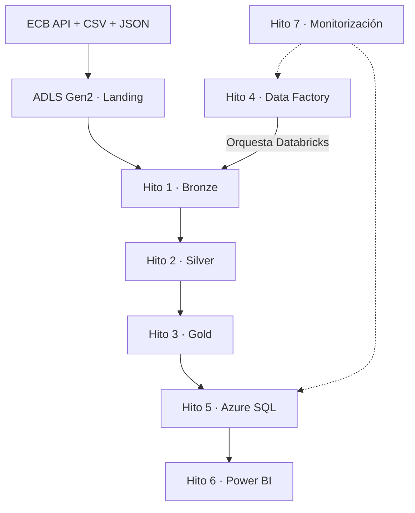

# 23 — Pipeline End-to-End en Azure

> **Pipeline bancario multimoneda end-to-end: Databricks procesa la arquitectura Medallion y Azure Data Factory orquesta el flujo.**

Este proyecto integra datos CSV, JSON y tasas de cambio para construir información confiable y lista para análisis. El resultado conecta ingeniería de datos, serving y visualización en una misma solución Azure.

## Arquitectura end-to-end

**Flujo principal:** Fuentes → ADLS Landing → Bronze → Silver → Gold → Azure SQL → Power BI.

## 1. Hito 1 — Ingesta: Landing → Bronze

| Subhito | Qué se hizo | Resultado |
|---|---|---|
| **1.1 Fuentes** | Ingesta de transacciones CSV, clientes y cuentas JSON, y tasas históricas del ECB | Fuentes heterogéneas centralizadas |
| **1.2 Bronze** | Lectura con schemas explícitos, metadata y almacenamiento Delta | Datos trazables y reproducibles |
| **1.3 Validación** | Controles estructurales y de calidad antes de persistir | Capa Bronze validada |

## 2. Hito 2 — Calidad: Bronze → Silver

| Subhito | Qué se hizo | Resultado |
|---|---|---|
| **2.1 Estandarización** | Limpieza, tipificación, fechas y dominios | Datos consistentes |
| **2.2 Calidad** | Deduplicación, relaciones entre entidades y cuarentena | Registros válidos separados de los rechazados |
| **2.3 Idempotencia** | Delta `MERGE` por claves y checksum | Reejecuciones sin duplicados |

## 3. Hito 3 — Modelo analítico: Silver → Gold

| Subhito | Qué se hizo | Resultado |
|---|---|---|
| **3.1 Conversión FX** | Conversión de EUR, USD y GBP a EUR según fecha | Métricas comparables |
| **3.2 Modelo estrella** | Seis dimensiones y una tabla de hechos | Capa Gold lista para BI |
| **3.3 Quality gates** | Validación de grano, claves, huérfanos y reconciliación | Modelo analítico confiable |

**Tablas Gold:** `dim_date`, `dim_customer`, `dim_account`, `dim_merchant`, `dim_channel`, `dim_currency` y `fact_transaction`.

## 4. Hito 4 — Orquestación con Azure Data Factory

| Subhito | Qué se hizo | Resultado |
|---|---|---|
| **4.1 Integración** | Linked Service entre ADF y Databricks | Conexión validada |
| **4.2 Pipeline** | Ejecución secuencial de los tres notebooks Medallion | Dependencias controladas |
| **4.3 Monitorización** | Validación de cada actividad en ADF Monitor | Pipeline completo en **10 min 17 s** |

Pipeline: `pl_project23_medallion_orchestration`.

## 5. Hito 5 — Serving en Azure SQL

| Subhito | Qué se hizo | Resultado |
|---|---|---|
| **5.1 Seguridad** | Credenciales administradas con Key Vault y Secret Scope | Secretos fuera del código |
| **5.2 Publicación** | Carga JDBC de Gold al esquema `serving` | **7 tablas y 953 filas** |
| **5.3 Validación** | PK/FK 7/7, 0 huérfanos y reconciliación | Quality Gate `PASSED` |
| **5.4 Reejecución** | Segunda publicación con el mismo contenido | `NO_OP`: 953 → 953 y 0 escrituras |

## 6. Hito 6 — Consumo en Power BI

| Subhito | Qué se hizo | Resultado |
|---|---|---|
| **6.1 Conexión** | Consumo de las siete tablas desde Azure SQL | Fuente de BI habilitada |
| **6.2 Modelo** | Seis relaciones activas entre dimensiones y hechos | Modelo estrella funcional |
| **6.3 Dashboard** | KPI y distribución por canal | 8 transacciones, 4 clientes y 6 cuentas |

## 7. Hito 7 — Monitorización y costos

| Subhito | Qué se hizo | Resultado |
|---|---|---|
| **7.1 Operación** | Revisión de ADF, Databricks y Azure SQL | Ejecución cerrada sin procesos pendientes |
| **7.2 Apagado** | Compute terminado y Azure SQL pausado | Consumo variable controlado |
| **7.3 Presupuesto** | Presupuesto mensual de USD 2 y alerta al 50 % | Control preventivo habilitado |
| **7.4 Resultado** | Revisión de costo y proyección | USD 0,04 observado y USD 0,29 proyectado |

## 8. Documentación complementaria y anexos

La documentación sigue el mismo orden de Hitos 1–7:

1. [Arquitectura por hitos](docs/architecture.md) — cómo fluye la solución y por qué se tomaron sus decisiones técnicas.
2. [Implementación por hitos](docs/implementation_by_milestone.md) — qué se construyó y validó desde el Hito 1 hasta el 7.
3. [Runbook operativo y de costos](docs/operations_and_cost_runbook.md) — cómo ejecutar, validar y cerrar los recursos.
4. [Catálogo de evidencias](docs/evidence_catalog.md) — qué resultado respalda cada evidencia disponible.
5. [Nombres, regiones y convenciones](docs/naming_and_tagging.md) — inventario confirmado y reglas del proyecto.
6. [Guía para entrevistas](docs/interview_guide.md) — relato breve, preguntas técnicas y respuestas.

Los datos son sintéticos. El repositorio no contiene credenciales ni capturas de Azure o Power BI. Las pruebas automatizadas corresponden al código versionado; las validaciones cloud se documentan por separado.
