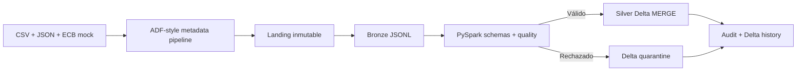

# Proyecto 23 — Azure Banking Multicurrency Data Platform

## Valor del proyecto

Una plataforma bancaria multimoneda necesita integrar archivos y APIs heterogéneos, conservar trazabilidad regulatoria y publicar datos confiables aun cuando los lotes se repitan o contengan errores. Este proyecto demuestra esas capacidades mediante contratos, ingesta metadata-driven, Landing inmutable, Bronze auditable y tablas Silver Delta con calidad, referencias e idempotencia.

Para un rol Data Engineer, el proyecto aporta evidencia ejecutable de Python modular, PySpark con esquemas explícitos, Delta Lake `MERGE`, arquitectura Medallion, cuarentena, auditoría y traducción de un flujo local probado hacia Azure Data Factory y Databricks.

## Resumen ejecutivo

La arquitectura objetivo integra una API histórica del ECB, CSV de transacciones y JSON de clientes/cuentas. ADF aterrizará las fuentes en ADLS Gen2; un driver Databricks coordinará Bronze, Silver, Gold, calidad y snapshots; Azure SQL servirá un modelo estrella para Power BI.

Los Hitos 1–3 implementan localmente el recorrido hasta Silver. Dos microlotes producen 22 filas Bronze. PySpark las lee con `StructType` explícito, normaliza tipos, valida dominios e integridad referencial y materializa cuatro tablas Delta. Una segunda corrida omite las 22 filas sin duplicarlas. Un caso de prueba adicional ejecuta un `MERGE` real y verifica su historial Delta.

## Estado actual

**Hitos 1, 2 y 3 implementados y verificados localmente.** Existen contratos, fixtures sintéticos, configuración metadata-driven, artefactos ADF Azure-style, Landing/Bronze, PySpark Bronze→Silver, tablas Delta, cuarentena, auditoría y pruebas automatizadas.

No se han creado ni ejecutado recursos Azure o Databricks. Los notebooks son drivers preparados para una validación posterior en **Databricks Free Edition**. La evidencia actual corresponde exclusivamente a **PySpark 4.0.1 y Delta Lake 4.0.1 locales**.

## Fuentes y caso bancario

| Fuente | Formato | Entidad | Resultado de los fixtures |
|---|---|---|---:|
| Transacciones sintéticas | CSV | `transactions` | 8 válidas en dos microlotes |
| Replay del microlote 1 | CSV | `transactions` | 4 filas omitidas en Bronze |
| Clientes sintéticos | JSON | `customers` | 5 |
| Cuentas sintéticas | JSON | `accounts` | 7 |
| ECB API mock | JSON | `fx_rates` | 2 fechas |
| Casos inválidos Hito 2 | CSV | `transactions` | 3 en cuarentena Bronze |

Los datos son completamente sintéticos y no contienen nombres, correos, documentos, credenciales ni identificadores Azure.

## Arquitectura implementada



Los artefactos ADF permanecen como diseño versionado, marcado `DESIGN_ONLY` y `NOT_DEPLOYED`. La ejecución local equivalente genera Landing y Bronze sin afirmar que ADF o ADLS hayan sido utilizados.

La arquitectura detallada está en [docs/architecture.md](docs/architecture.md).

## Transformaciones Silver

| Entidad | Transformaciones | Clave de negocio | Tabla Delta |
|---|---|---|---|
| Clientes | IDs y dominios en mayúsculas, fecha de alta tipada | `customer_id` | `silver_customers` |
| Cuentas | IDs, tipo, moneda, estado y fecha tipados; FK a cliente | `account_id` | `silver_accounts` |
| FX | Fecha tipada y tasas anidadas convertidas a `rate_eur`, `rate_usd`, `rate_gbp` | `effective_date` | `silver_fx_rates` |
| Transacciones | Timestamp, decimal(18,2), IDs, moneda, canal, estado y dominios; FK a cuenta | `transaction_id` | `silver_transactions` |

Silver conserva la metadata Bronze y agrega `_silver_processed_at`, `_silver_run_id`, `_quality_status` y `_source_bronze_path`. No calcula todavía importes EUR ni construye dimensiones Gold.

## Quality gates

- claves obligatorias no nulas;
- formatos `CUS-NNN`, `ACC-NNN`, `TXN-NNNN` y `MER-NNN`;
- fechas y timestamps parseables;
- importes positivos con dos decimales;
- monedas EUR, USD y GBP;
- dominios contractuales de estados, tipos, segmentos, canales y categorías;
- integridad cuenta → cliente y transacción → cuenta;
- tasas FX positivas y EUR igual a `1.0`;
- duplicados por clave de negocio con ganadora determinística;
- checksum Bronze obligatorio y detección de JSON corrupto.

La cuarentena Delta guarda una fila por regla incumplida con registro original, entidad, clave, regla, motivo, run ID, timestamp y ruta Bronze. Su `_quarantine_id` evita repetir la misma evidencia.

## Delta Lake e idempotencia

Las tablas Silver son path-based y no se particionan en este volumen pequeño para evitar archivos innecesarios. El `MERGE` compara clave de negocio y `_record_checksum`:

- nueva clave: inserción;
- checksum cambiado: actualización;
- checksum idéntico: omisión;
- clave duplicada dentro del input: cuarentena.

Si no existen inserciones ni actualizaciones, el pipeline devuelve `SKIPPED` y evita ejecutar un `MERGE` físico. La suite prueba además una actualización controlada y confirma `numTargetRowsUpdated=1` en el historial Delta.

## Auditoría

`data/output/audit/silver_audit.jsonl` registra por entidad:

- paths Bronze y Silver;
- filas fuente, válidas, rechazadas y duplicadas;
- filas insertadas, actualizadas y omitidas;
- timestamps, duración, estado y error;
- versión, operación y métricas del historial Delta.

Los estados posibles son `SUCCESS`, `PARTIAL`, `SKIPPED` y `FAILED`.

## Ejecución local reproducible

Requisitos comprobados para este hito:

- Python 3.10 o superior;
- OpenJDK 17;
- PySpark 4.0.1;
- Delta Lake 4.0.1.

Preparación aislada:

```bash
brew install openjdk@17
python3 -m venv .venv
.venv/bin/pip install -r requirements-spark.txt
```

El script detecta las rutas Homebrew habituales de Java en macOS. En otros sistemas se debe definir `JAVA_HOME`.

Ejecución completa desde la carpeta del proyecto:

```bash
python3 scripts/clean_outputs.py
python3 scripts/run_ingestion.py --run-id demo-h3-bronze --ingestion-date 2026-07-22
.venv/bin/python scripts/run_silver.py --run-id demo-h3-silver-001
.venv/bin/python scripts/run_silver.py --run-id demo-h3-silver-002
.venv/bin/python scripts/show_silver_audit.py
.venv/bin/python scripts/validate_silver.py
```

La primera inicialización local de Delta puede descargar sus JAR oficiales desde Maven Central. No se consulta ningún servicio Azure.

Pruebas completas:

```bash
python3 scripts/validate_fixtures.py
.venv/bin/python -m unittest discover -s tests -v
```

## Resultados locales verificados

| Evidencia | Resultado |
|---|---:|
| Controles Hito 1 | 42/42 `PASSED` |
| Pruebas Hitos 1–3 | 28/28 `PASSED` |
| Bronze leído por PySpark | 22 filas |
| `silver_customers` | 5 |
| `silver_accounts` | 7 |
| `silver_fx_rates` | 2 |
| `silver_transactions` | 8 |
| Primera corrida Silver | 22 insertadas, 0 rechazadas |
| Segunda corrida Silver | 22 omitidas, 0 insertadas, 0 actualizadas |
| Prueba de cuarentena Silver | 1 registro rechazado, 2 reglas explicadas |
| Prueba de duplicado | 1 ganador, 1 rechazo determinístico |
| Prueba Delta `MERGE` | 1 actualización, historial `MERGE` verificado |

Los tres registros inválidos del Hito 2 no llegan a Bronze; por eso la corrida Silver principal no los vuelve a rechazar. Las pruebas Silver inyectan datos inválidos únicamente en directorios temporales y validan la cuarentena sin alterar los resultados del Hito 2.

## Databricks Free Edition

Los notebooks parametrizados cubren configuración, driver Bronze→Silver, quality checks y validación de conteos. Usan paths `/Volumes/...` configurables y delegan toda la lógica a `src/bankfx_silver/`.

El procedimiento está en [docs/databricks_free_edition.md](docs/databricks_free_edition.md). Todavía no se ha ejecutado; cualquier evidencia futura deberá identificarse explícitamente como **Databricks Free Edition**, no Azure Databricks.

## Seguridad y costos

- Solo datos sintéticos.
- Sin secretos, tokens, correos, tenant IDs o subscription IDs.
- Ningún trigger ADF activo.
- Sin recursos cloud creados durante este hito.
- La ejecución local de Spark y Delta no genera consumo Azure.

## Limitaciones

- ADF y los notebooks no se han importado ni ejecutado en servicios reales.
- Bronze sigue siendo JSONL local; la validación Delta comienza en Silver.
- Las tablas locales son path-based, no están registradas en Unity Catalog.
- No se consulta todavía la API ECB real.
- Los volúmenes son pequeños y no prueban rendimiento distribuido.
- El catálogo y schema están parametrizados para Databricks, pero el registro de tablas se reserva para esa validación.

## Próximo hito

El siguiente hito construirá Gold: conversión monetaria a EUR, `fact_transactions`, seis dimensiones, reconciliación y snapshots de consumo. Azure SQL, Power BI y la ventana temporal de Azure Databricks permanecen fuera del alcance actual.
