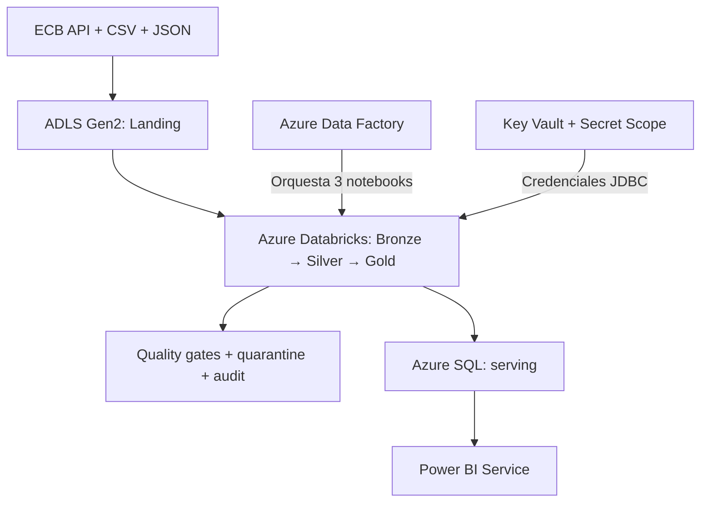

# Proyecto 23 — Azure Banking Multicurrency Data Platform

## Resultado

Plataforma bancaria multimoneda implementada de extremo a extremo en Azure. Integra una API histórica del Banco Central Europeo, transacciones CSV y clientes/cuentas JSON; conserva trazabilidad en ADLS Gen2; procesa capas Bronze, Silver y Gold con Azure Databricks; orquesta el flujo con Azure Data Factory; publica un modelo estrella en Azure SQL; y lo consume desde Power BI Service.

El proyecto demuestra ingeniería de datos más allá del procesamiento: contratos, calidad explicable, cuarentena, reconciliación, idempotencia, secretos fuera del código, serving analítico, monitorización y controles de costos.

## Arquitectura implementada



Componentes confirmados:

- ADLS Gen2 con contenedores `landing`, `bronze`, `silver` y `gold`.
- Azure Databricks con catálogo `dbw_project23_dev_2026` y esquemas Bronze, Silver y Gold.
- ADF con el pipeline `pl_project23_medallion_orchestration`.
- Key Vault y Databricks Secret Scope para la conexión JDBC.
- Azure SQL con siete tablas en el esquema `serving`.
- Power BI con siete tablas, seis relaciones activas y una página ejecutiva.
- Cost Management, presupuesto y revisión del estado final de los recursos.

La explicación detallada está en [docs/architecture.md](docs/architecture.md) y la implementación cloud en [docs/cloud_implementation.md](docs/cloud_implementation.md).

## Alcance por fases

La numeración histórica de los PR locales y la numeración del cierre cloud se superponen en el Hito 4. Se preserva esa trazabilidad en vez de reescribir el historial.

### Fase local versionada — PR #26 a #29

| Hito histórico | Entrega | Estado |
|---:|---|---|
| 1 | Contratos, schemas, fixtures determinísticos y configuración | Completado |
| 2 | Ingesta metadata-driven, Landing/Bronze, auditoría e idempotencia | Completado |
| 3 | PySpark Bronze → Silver, Delta `MERGE`, calidad y cuarentena | Completado |
| 4 local | Modelo estrella Gold, FX, reconciliación e idempotencia | Completado |

### Fase cloud — numeración definitiva del cierre

| Hito | Entrega | Resultado confirmado |
|---:|---|---|
| 4 | Orquestación con Azure Data Factory | Pipeline publicado; 3/3 notebooks correctos en 10 min 17 s |
| 5 | Serving en Azure SQL | 7 tablas, 953 filas, PK/FK 7/7, cero huérfanos y segunda ejecución `NO_OP` |
| 6 | Power BI | Modelo estrella, KPI 8/4/6, distribución 3/2/2/1 y publicación en Service |
| 7 | Monitorización y costos | Compute detenido, SQL pausado, costo USD 0,04 y presupuesto mensual USD 2 |

## Fuentes y datos

Los datos de clientes, cuentas y transacciones son completamente sintéticos. No contienen nombres, correos, documentos, credenciales ni identificadores personales.

| Fuente | Formato | Contenido validado |
|---|---|---:|
| Transacciones sintéticas | CSV | 8 válidas en dos microlotes |
| Replay del microlote 1 | CSV | 4 filas omitidas por idempotencia |
| Clientes sintéticos | JSON | 5 |
| Cuentas sintéticas | JSON | 7 |
| Tasas ECB | API/JSON | EUR, USD y GBP por fecha |
| Casos inválidos locales | CSV | 3 rechazados en Bronze |

Las tasas ECB expresan unidades de moneda cotizada por `1 EUR`:

```text
amount_eur = amount_original / fx_rate_to_eur
```

Los importes usan tipos decimales; una tasa ausente o no positiva envía el registro a cuarentena y evita publicar un hecho incompleto.

## Modelo estrella

La implementación local conserva `fact_transactions` como nombre histórico de la tabla Delta. La capa Azure SQL/Power BI utiliza `serving.fact_transaction` en singular. La diferencia se documenta como un mapeo de serving; no se renombra la implementación local para no romper contratos, pruebas ni el historial fusionado.

| Tabla serving | Filas Azure SQL | Propósito |
|---|---:|---|
| `dim_date` | 919 | Calendario analítico expandido |
| `dim_customer` | 5 | Clientes sintéticos |
| `dim_account` | 7 | Cuentas sintéticas |
| `dim_merchant` | 7 | Comercios |
| `dim_channel` | 4 | Canales |
| `dim_currency` | 3 | Monedas y cobertura FX |
| `fact_transaction` | 8 | Una fila por transacción |
| **Total** | **953** | Modelo publicado |

## Calidad, reconciliación e idempotencia

Los controles principales cubren:

- esquemas explícitos y contratos de dominio;
- claves obligatorias, fechas, timestamps y decimales válidos;
- referencias cuenta → cliente y transacción → cuenta;
- cobertura FX por fecha y moneda;
- claves naturales y sustitutas únicas;
- seis claves foráneas no nulas y sin huérfanos;
- conteos Silver = hechos Gold + rechazados;
- reconciliación de importes aceptados;
- checksums de contenido para distinguir replays de cambios reales.

La primera carga local materializa las tablas Delta. Una reejecución idéntica evita el `MERGE` físico y la reescritura del snapshot. En Azure SQL, la segunda publicación fue `NO_OP`: 953 filas antes, 953 después y cero escrituras.

## Resultados verificados

### Pruebas automatizadas locales

| Validación | Resultado |
|---|---:|
| Controles de fixtures | 42/42 `PASSED` |
| Suite local | 37/37 `PASSED` |
| Bronze leído por PySpark | 22 filas |
| Silver | 5 clientes, 7 cuentas, 2 fechas FX y 8 transacciones |
| Segunda ejecución Silver | 22 omitidas; 0 insertadas; 0 actualizadas |
| Gold local | 36 filas entre seis dimensiones y el hecho |
| Segunda ejecución Gold | 36 omitidas; 0 insertadas; 0 actualizadas |
| Reconciliación local | 8 hechos; 1.230,75 original; 1.202,05 EUR |

### Validaciones cloud manuales

| Servicio | Validación | Resultado |
|---|---|---|
| ADF | Pipeline completo | `Correcto`; 10 min 17 s |
| ADF | Notebooks secuenciales | 2 min 37 s, 3 min 6 s y 4 min 22 s |
| Azure SQL | Publicación | 7 tablas; 953 filas; `LOADED` |
| Azure SQL | Integridad | PK/FK 7/7; 0 huérfanos; reconciliación `PASSED` |
| Azure SQL | Idempotencia | `NO_OP`; 953 → 953; 0 escrituras |
| Power BI | Modelo | 7 tablas; 6 relaciones activas |
| Power BI | Dashboard | 8 transacciones; 4 clientes; 6 cuentas |
| Power BI | Canales | Card 3; Mobile 2; Online 2; ATM 1 |
| Operación | Cierre | Databricks detenido y Azure SQL `Paused` |
| Costos | Observación | USD 0,04; proyección USD 0,29 |

Las validaciones cloud son comprobaciones operativas verificadas; no se presentan como parte de la suite automatizada local. Su inventario, alcance y limitaciones están en [docs/evidence_catalog.md](docs/evidence_catalog.md). Las capturas originales y sanitizadas se conservan fuera del repositorio público.

## Reproducción local

Requisitos comprobados para la base local:

- Python 3.10 o superior;
- OpenJDK 17;
- PySpark 4.0.1;
- Delta Lake 4.0.1.

```bash
python3 -m venv .venv
.venv/bin/pip install -r requirements-spark.txt
python3 scripts/validate_fixtures.py
.venv/bin/python -m unittest discover -s tests -v
```

La ejecución local completa y sus scripts siguen disponibles para Landing, Bronze, Silver y Gold. No necesita una suscripción Azure y no reproduce por sí sola las validaciones cloud.

## Seguridad y costos

- Datos de negocio sintéticos.
- Credenciales SQL fuera del código mediante Key Vault y Secret Scope.
- Sin tokens, contraseñas, correos, tenant IDs, subscription IDs ni endpoints completos en el repositorio.
- Compute Databricks con autoapagado de 10 minutos y estado final detenido.
- Azure SQL serverless gratuito, estado final `Paused` y cobro por exceso deshabilitado.
- Presupuesto mensual de USD 2 y alerta al 50 %.
- Trigger de ejemplo versionado como desactivado; el estado cloud actual no se infiere desde el JSON local.

El procedimiento de apertura, ejecución y cierre está en [docs/operations_and_cost_runbook.md](docs/operations_and_cost_runbook.md).

## Estructura relevante

```text
23-azure-adf-databricks-bank-fx/
├── adf/                         # Diseño ADF local versionado; no equivale a la exportación cloud final
├── config/                      # Configuración Silver y Gold
├── contracts/                   # Contratos de datos
├── data/fixtures/               # Datos sintéticos válidos e inválidos
├── databricks/notebooks/        # Drivers locales/portables versionados
├── docs/
│   ├── architecture.md
│   ├── cloud_implementation.md
│   ├── evidence_catalog.md
│   ├── naming_and_tagging.md
│   └── operations_and_cost_runbook.md
├── scripts/                     # Ejecución, auditoría y validación local
├── sql/                         # Consultas analíticas portables sobre Gold
├── src/                         # Paquetes de ingesta, Silver y Gold
└── tests/                       # Suite automatizada local
```

## Límites conocidos

- Los JSON bajo `adf/` pertenecen al diseño local inicial y conservan `DESIGN_ONLY`/`NOT_DEPLOYED`; no son la exportación del pipeline cloud ejecutado.
- El notebook cloud `04_gold_to_azure_sql` no fue exportado al repositorio y no se reconstruye por inferencia.
- No están disponibles el PBIX original, las fórmulas DAX exactas ni la exportación del modelo semántico.
- DirectQuery fue probado, pero el modo final del modelo publicado no quedó demostrado por una evidencia recuperable.
- PK/FK, cero huérfanos, reconciliación y `NO_OP` están confirmados en el historial, pero sus capturas específicas no fueron recuperadas.
- Los volúmenes son pequeños y demuestran corrección, no rendimiento a escala.

## Presentación de 1 minuto

“Construí una plataforma bancaria multimoneda end-to-end en Azure. Integré una API histórica del ECB, CSV de transacciones y JSON de clientes y cuentas en ADLS Gen2. Azure Databricks procesa Bronze, Silver y Gold con PySpark, Delta Lake, quality gates, cuarentena, reconciliación e idempotencia. ADF orquesta tres notebooks secuenciales y la ejecución final terminó correctamente en 10 minutos 17 segundos. Después publiqué siete tablas y 953 filas en Azure SQL, validé integridad sin huérfanos y una segunda carga `NO_OP`. Power BI consume el modelo estrella y muestra ocho transacciones en cuatro canales. Finalmente dejé Databricks detenido, SQL pausado y controles de presupuesto; el costo observado fue USD 0,04.”
