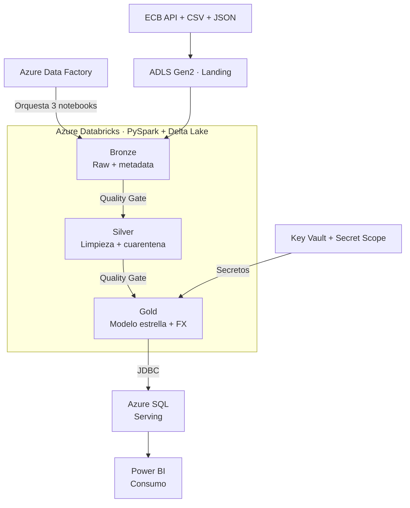

# 23 — Azure Banking Medallion Data Platform

> **Plataforma bancaria multimoneda end-to-end en Azure, orquestada con Data Factory y procesada en Databricks bajo arquitectura Medallion.**

## 1. Valor del proyecto

Este proyecto demuestra cómo convertir fuentes heterogéneas en datos confiables para analítica. Integra una API histórica del Banco Central Europeo, transacciones CSV y clientes/cuentas JSON; conserva los datos en ADLS Gen2; procesa capas Bronze, Silver y Gold con PySpark y Delta Lake; orquesta el pipeline con Azure Data Factory; y publica un modelo estrella en Azure SQL para consumo desde Power BI.

El foco no está solo en mover datos: incluye contratos, quality gates, cuarentena, reconciliación, idempotencia, secretos fuera del código, monitorización y control de costos.

## 2. Arquitectura implementada



Flujo ejecutado:

1. **Landing:** recibe CSV, JSON y tasas de cambio del ECB en ADLS Gen2.
2. **Bronze:** conserva el dato original con metadata técnica y trazabilidad.
3. **Silver:** tipifica, normaliza, deduplica y separa registros inválidos en cuarentena.
4. **Gold:** aplica conversión multimoneda y construye dimensiones más tabla de hechos.
5. **Orquestación:** ADF ejecuta los tres notebooks en orden y controla sus dependencias.
6. **Serving:** Databricks publica siete tablas en Azure SQL mediante JDBC seguro.
7. **Consumo:** Power BI utiliza el modelo estrella para métricas de clientes, cuentas, transacciones y canales.

## 3. Problema

Los datos bancarios llegaban en formatos y estructuras diferentes, con riesgo de duplicados, relaciones inválidas, tasas FX ausentes y reejecuciones que podían volver a escribir la misma información. El desafío era construir un flujo único, trazable y reejecutable que protegiera la calidad antes de exponer datos al consumo analítico.

## 4. Objetivo

Diseñar e implementar una plataforma de datos que:

- integre fuentes CSV, JSON y API en Azure;
- separe responsabilidades mediante arquitectura Medallion;
- aplique controles de calidad antes de avanzar entre capas;
- garantice reconciliación e idempotencia;
- publique un modelo estrella en Azure SQL;
- entregue información consumible desde Power BI;
- mantenga credenciales y costos bajo control.

## 5. Implementación

| Etapa | Implementación | Decisión técnica |
|---|---|---|
| Ingesta | ECB API, transacciones CSV y clientes/cuentas JSON hacia ADLS | Separar origen y procesamiento para conservar trazabilidad |
| Bronze | Datos raw, schemas explícitos y metadata de auditoría | Preservar fidelidad del origen antes de transformar |
| Silver | Limpieza, tipificación, deduplicación, dominios y cuarentena | Evitar que datos inválidos lleguen al modelo analítico |
| Gold | Conversión a EUR, reconciliación y modelo estrella | Centralizar reglas de negocio y facilitar consumo |
| ADF | Pipeline `pl_project23_medallion_orchestration` con tres notebooks secuenciales | Separar orquestación de transformación distribuida |
| Azure SQL | Siete tablas en el esquema `serving` | Entregar una capa estable para herramientas BI |
| Seguridad | Azure Key Vault y Databricks Secret Scope | Mantener credenciales JDBC fuera del código |
| Operación | Autoapagado, SQL pausado, presupuesto y alerta | Controlar explícitamente el costo cloud |

Modelo de serving:

`dim_date` · `dim_customer` · `dim_account` · `dim_merchant` · `dim_channel` · `dim_currency` · `fact_transaction`

## 6. Resultados verificados

| Métrica | Resultado |
|---|---:|
| Ejecución ADF | 3/3 notebooks correctos en 10 min 17 s |
| Publicación Azure SQL | 7 tablas y 953 filas |
| Integridad | PK/FK 7/7 y 0 registros huérfanos |
| Reconciliación | `PASSED` |
| Segunda publicación | `NO_OP`: 953 → 953 y 0 escrituras |
| Modelo Power BI | 7 tablas y 6 relaciones activas |
| KPI validados | 8 transacciones, 4 clientes y 6 cuentas |
| Distribución por canal | Card 3, Mobile 2, Online 2 y ATM 1 |
| Pruebas locales | 42/42 controles de fixtures y 37/37 pruebas |
| Costo observado | USD 0,04; proyección USD 0,29 |
| Control presupuestario | USD 2 mensuales y alerta al 50 % |

Los volúmenes son controlados y buscan demostrar diseño, calidad e idempotencia; no representan una prueba de rendimiento a escala.

## 7. Estructura del proyecto

```text
23-azure-adf-databricks-bank-fx/
├── adf/                         # Diseño ADF local versionado
├── config/                      # Configuración Silver y Gold
├── contracts/                   # Contratos de datos
├── data/fixtures/               # Datos sintéticos válidos e inválidos
├── databricks/notebooks/        # Notebooks portables por capa
├── docs/                        # Arquitectura, cloud, evidencias y operación
├── scripts/                     # Ejecución, auditoría y validación local
├── sql/                         # Consultas analíticas sobre Gold
├── src/                         # Ingesta, transformaciones Silver y Gold
├── tests/                       # Suite automatizada local
└── README.md
```

Los datos son sintéticos y el repositorio no contiene credenciales, correos, endpoints completos ni identificadores sensibles.

## 8. Documentación complementaria y anexos

- [Arquitectura y decisiones técnicas](docs/architecture.md)
- [Implementación cloud por hito](docs/cloud_implementation.md)
- [Runbook operativo y de costos](docs/operations_and_cost_runbook.md)
- [Catálogo y alcance de evidencias](docs/evidence_catalog.md)
- [Convenciones de nombres y regiones](docs/naming_and_tagging.md)
- [Anexo — Cómo contar este proyecto en una entrevista](docs/interview_guide.md)

Las pruebas automatizadas corresponden a la implementación local versionada. Las validaciones de ADF, Azure SQL, Power BI y costos fueron comprobaciones manuales cloud. Las capturas se mantienen fuera del repositorio público.
