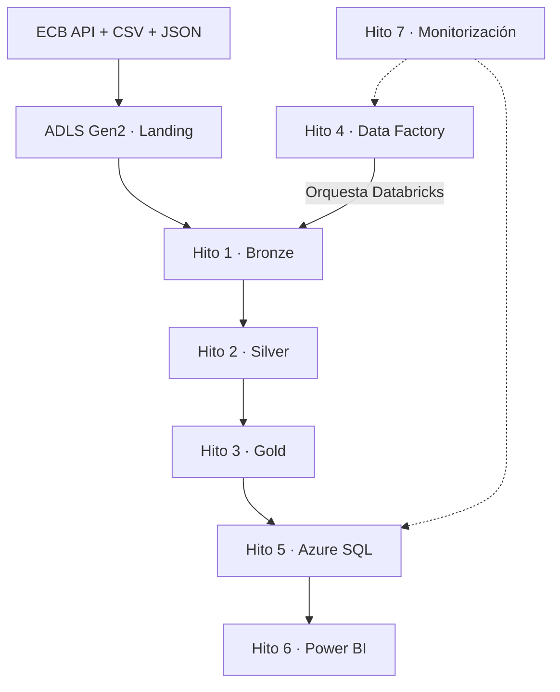
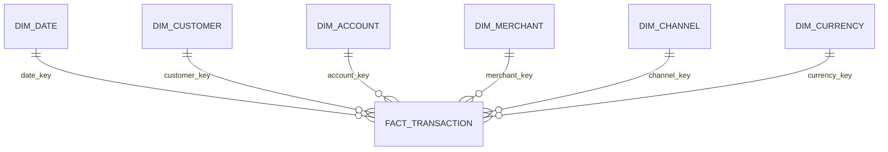
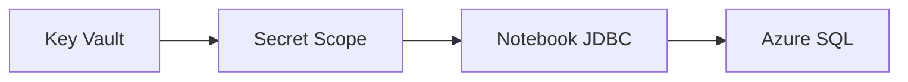

# Arquitectura por hitos

Este documento explica **cómo fluye la solución y por qué está diseñada así**. La construcción y sus validaciones están en [implementation_by_milestone.md](implementation_by_milestone.md), y la operación diaria en [operations_and_cost_runbook.md](operations_and_cost_runbook.md).

## Vista end-to-end

| Hito | Componente principal | Responsabilidad |
|---:|---|---|
| 1 | ADLS Gen2 + Databricks | Ingestar y conservar datos trazables en Bronze |
| 2 | Databricks + Delta Lake | Limpiar, validar y estandarizar en Silver |
| 3 | Databricks + Unity Catalog | Construir Gold y el modelo estrella |
| 4 | Azure Data Factory | Orquestar los notebooks Medallion |
| 5 | Azure SQL + Key Vault | Publicar una capa relacional segura |
| 6 | Power BI | Consumir y presentar métricas de negocio |
| 7 | Azure Monitor + Cost Management | Cerrar recursos y controlar costos |

## Hito 1 — Landing → Bronze

### 1.1 Fuentes

- transacciones en CSV;
- clientes y cuentas en JSON anidado;
- tasas históricas de EUR, USD y GBP desde la API del ECB.

### 1.2 Ingesta

ADLS Gen2 conserva los archivos en `landing`. Databricks los lee con schemas explícitos, agrega metadata de ingesta y persiste tablas Delta en `bronze`.

### 1.3 Decisión técnica

Bronze mantiene los campos originales y la trazabilidad. Así, los errores de negocio se corrigen en capas posteriores sin perder la fuente recibida.

## Hito 2 — Bronze → Silver

### 2.1 Estandarización

PySpark normaliza IDs, dominios, fechas, timestamps y decimales para clientes, cuentas, transacciones y tasas FX.

### 2.2 Calidad

Se validan las relaciones cuenta → cliente y transacción → cuenta. Los registros válidos avanzan; los rechazados quedan en cuarentena con una causa explicable.

### 2.3 Idempotencia

Delta `MERGE`, las claves de negocio y los checksums evitan duplicar datos durante una reejecución.

## Hito 3 — Silver → Gold

### 3.1 Conversión multimoneda

Los importes en EUR, USD y GBP se convierten a EUR usando la tasa correspondiente a la fecha de cada transacción.

### 3.2 Modelo estrella

El grano es una fila por `transaction_id`. Gold contiene seis dimensiones Type 1 y una tabla de hechos con claves sustitutas determinísticas.

### 3.3 Contrato de nombres

La implementación local conserva `fact_transactions`; Azure SQL y Power BI utilizan `serving.fact_transaction`. Las seis dimensiones mantienen el mismo nombre en ambas capas.

### 3.4 Quality gates

Se validan grano, claves, registros huérfanos, conteos, importes, reconciliación e idempotencia antes de publicar.

## Hito 4 — Orquestación con Azure Data Factory

### 4.1 Integración

Azure Data Factory se conecta con el workspace de Databricks mediante un Linked Service validado.

### 4.2 Dependencias

El pipeline `pl_project23_medallion_orchestration` ejecuta en orden:

1. `nb_01_landing_to_bronze`;
2. `nb_02_bronze_to_silver`;
3. `nb_03_silver_to_gold`.

Cada notebook comienza solo cuando el anterior termina correctamente.

### 4.3 Decisión técnica

ADF controla la orquestación y Databricks concentra la lógica de transformación. Esta separación simplifica la monitorización y evita duplicar reglas de negocio.

## Hito 5 — Serving en Azure SQL

### 5.1 Seguridad

Dos secretos almacenan el usuario y la contraseña SQL. Sus valores no aparecen en notebooks ni en el repositorio.

### 5.2 Capa serving

| Tabla | Filas |
|---|---:|
| `dim_date` | 919 |
| `dim_customer` | 5 |
| `dim_account` | 7 |
| `dim_merchant` | 7 |
| `dim_channel` | 4 |
| `dim_currency` | 3 |
| `fact_transaction` | 8 |
| **Total** | **953** |

La dimensión fecha usa un calendario analítico expandido; por eso contiene más filas que las fechas presentes en el fixture transaccional.

### 5.3 Decisión técnica

Azure SQL desacopla el procesamiento Lakehouse del consumo BI y entrega un contrato relacional simple para Power BI.

## Hito 6 — Consumo en Power BI

### 6.1 Modelo

Power BI consume las siete tablas de `serving` y mantiene seis relaciones activas, una desde cada dimensión hacia `fact_transaction`.

### 6.2 Alcance

El dashboard se mantuvo mínimo: KPI de transacciones, clientes y cuentas, más distribución por canal. El objetivo es demostrar el flujo end-to-end, no construir una solución completa de analítica visual.

### 6.3 Límite verificable

DirectQuery fue probado, pero el modo final publicado no se afirma porque el PBIX y la exportación del modelo semántico no están versionados.

## Hito 7 — Monitorización y costos

### 7.1 Observabilidad

ADF Monitor valida el pipeline y sus actividades. Databricks y Azure SQL se revisan después de cada ejecución.

### 7.2 Apagado

El compute tiene autoapagado de 10 minutos y debe quedar detenido. Azure SQL usa serverless gratuito y debe volver a `Paused`.

### 7.3 Control de costos

| Control | Estado confirmado |
|---|---|
| Costo observado | USD 0,04 |
| Proyección observada | USD 0,29 |
| Presupuesto mensual | USD 2 |
| Umbral de alerta | 50 % / USD 1 |
| Facturación SQL sobre el límite | Deshabilitada |

## Límites de reproducibilidad

| Elemento versionado | Alcance real |
|---|---|
| `src/`, `scripts/`, `tests/` | Implementación y pruebas automatizadas locales |
| `adf/` | Diseño inicial; no es la exportación del pipeline cloud ejecutado |
| `databricks/notebooks/` | Drivers portables; no son la exportación final del workspace |
| `sql/gold_analytics.sql` | Consultas sobre el modelo Gold local |

No están exportados el pipeline ADF definitivo, el notebook cloud `04_gold_to_azure_sql`, el PBIX, las fórmulas DAX ni el modelo semántico. Las 37 pruebas automatizadas cubren la base local; Azure se respalda mediante validaciones cloud separadas. Los resultados prueban corrección funcional, no rendimiento a escala.
