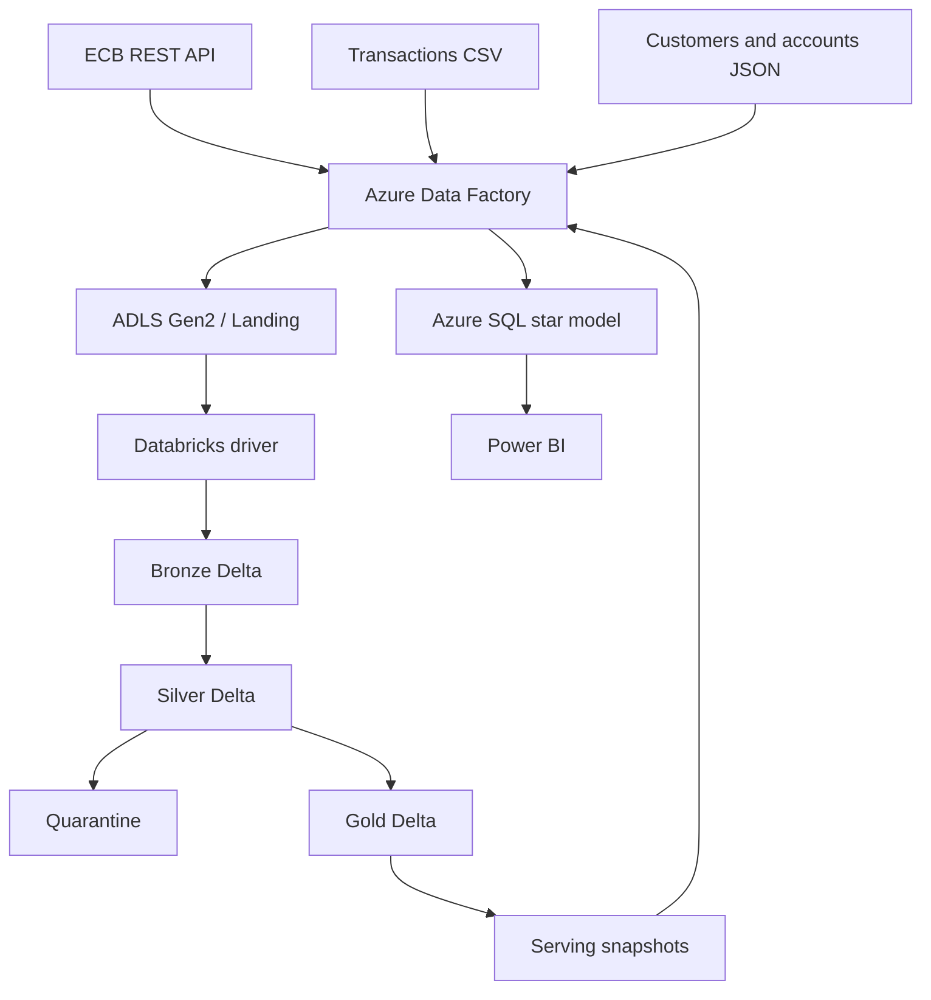

# Arquitectura objetivo

## Estado de implementación

El Hito 1 implementa contratos, esquemas, fixtures y validaciones locales. Los servicios descritos en este documento son objetivos para hitos posteriores y no constituyen evidencia de recursos desplegados.

## Flujo end-to-end



## Responsabilidad por componente

| Componente | Responsabilidad prevista |
|---|---|
| Azure Data Factory | Ingerir las tres fuentes, propagar parámetros, ejecutar un único driver Databricks y publicar snapshots en SQL |
| ADLS Gen2 | Conservar Landing y las zonas persistentes del lakehouse |
| Databricks | Ejecutar PySpark, Delta `MERGE`, reglas de calidad, cuarentena y modelo Gold |
| Azure SQL | Servir el modelo estrella mediante staging y publicación transaccional |
| Power BI | Consumir el modelo en modo Import desde My Workspace |

## Responsabilidad por capa

### Landing

- Copia inmutable del origen.
- Sin correcciones ni descartes.
- Partición futura por fuente, fecha lógica y ejecución.
- Checksum SHA-256 para trazabilidad e idempotencia.

### Bronze

- Normalización técnica por fuente.
- Conservación de valores originales cuando sea útil para auditoría.
- Metadata: `pipeline_run_id`, `source_batch_id`, `source_file`, `file_checksum` e `ingested_at_utc`.
- Escritura Delta append-only en la primera versión.

### Silver

- Tipado y estandarización.
- Deduplicación por claves de negocio.
- Integridad cuenta-cliente y transacción-cuenta.
- Validación de dominios, montos y fechas.
- Enriquecimiento con tasas de cambio.
- Separación explícita entre registros aceptados y cuarentena.

### Gold

- Construcción de `fact_transactions` y seis dimensiones.
- Claves sustitutas estables.
- Métricas en EUR y columnas de reconciliación.
- Snapshots Parquet separados de los archivos internos Delta para la carga ADF → Azure SQL.

## Estrategia Databricks en dos etapas

### Databricks Free Edition

Primero se validarán sin costo Bronze, Silver, Gold, calidad, `MERGE` e idempotencia. Los parámetros `environment`, `catalog`, schemas y paths evitarán acoplar el código al almacenamiento predeterminado de Free Edition. Toda evidencia se identificará expresamente como **Databricks Free Edition**, no Azure Databricks.

### Azure Databricks

Durante una ventana temporal, ADF invocará un único notebook driver o job por corrida. El driver reutilizará Job Compute para todas las etapas y producirá snapshots de serving. Solo se ejecutarán el lote inicial, el segundo microlote y el replay idempotente antes del cleanup.

## Incrementalidad e idempotencia

La clave técnica combinará identificadores de negocio y de archivo:

```text
transaction_id + source_batch_id + file_checksum + logical_processing_date
```

La tabla Delta de control registrará cada archivo. Un checksum ya completado no volverá a producir inserciones. `transaction_id` será la clave de negocio del `MERGE`; cambios incompatibles se enviarán a revisión en lugar de sobrescribirse silenciosamente.

## Modelo estrella objetivo

`fact_transactions` tendrá una fila por transacción y referencias a:

- `dim_date` por fecha de operación;
- `dim_customer` por titular de la cuenta;
- `dim_account` por cuenta operada;
- `dim_merchant` por comercio;
- `dim_channel` por canal;
- `dim_currency` por moneda original.

Las dimensiones se cargarán antes del hecho. Azure SQL utilizará schemas `stg`, `mart` y `etl` para separar recepción, consumo y control.

## Quality gates

1. Landing valida presencia, legibilidad y checksum.
2. Bronze reconcilia conteos y metadata.
3. Silver valida reglas y porcentaje de cuarentena.
4. Gold valida claves, relaciones y totales.
5. Azure SQL compara conteos Gold/SQL antes de habilitar el consumo.

Un incumplimiento crítico detendrá la publicación. Los rechazos esperados deberán conservar código de regla, valor original, lote y timestamp.
