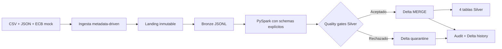
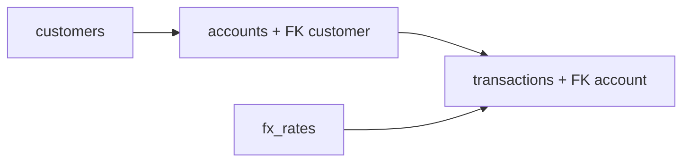
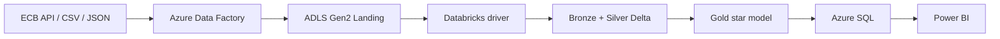

# Arquitectura del Proyecto 23

## Estado verificable

Los Hitos 1, 2 y 3 están implementados localmente. La ejecución real comprobada llega hasta cuatro tablas Silver Delta mediante PySpark. Los artefactos ADF y notebooks Databricks están versionados, pero no se han importado ni ejecutado en Azure Data Factory, Databricks Free Edition o Azure Databricks.

## Flujo actual



ADF está representado por artefactos Azure-style parametrizados. Localmente, `scripts/run_ingestion.py` cumple el mismo límite Landing/Bronze sin afirmar una ejecución cloud.

## Capas implementadas

### Landing

- copia byte a byte del archivo recibido;
- partición por fuente, entidad, fecha y run;
- SHA-256 y metadata adyacente;
- sin correcciones de negocio.

### Bronze

- JSONL por entidad y checksum del archivo;
- campos originales válidos;
- metadata de origen, archivo, fecha, ejecución, registro y Landing;
- idempotencia de archivo antes de Silver.

### Silver

- lectura recursiva de Bronze con `StructType` explícito;
- normalización PySpark de strings, fechas, timestamps y decimales;
- reglas contractuales y referencias cuenta-cliente/transacción-cuenta;
- deduplicación determinística por clave de negocio;
- tablas Delta path-based sin particionamiento para el volumen pequeño actual;
- `MERGE` por clave y `_record_checksum`;
- cuarentena Delta idempotente y auditoría JSONL.

Las rutas locales son:

```text
data/output/silver/silver_customers
data/output/silver/silver_accounts
data/output/silver/silver_fx_rates
data/output/silver/silver_transactions
data/output/silver_quarantine
data/output/audit/silver_audit.jsonl
```

No se particionan las tablas Silver porque solo contienen 22 filas y una partición física añadiría archivos pequeños sin beneficio. El diseño permite cambiar las rutas a Unity Catalog Volumes antes de aumentar el volumen.

## Calidad y dependencias

El driver procesa en este orden:



`fx_rates` se procesa antes de transacciones para dejar disponible el conjunto completo de Silver, aunque la conversión monetaria se reserva para Gold. Los registros con reglas incumplidas se separan antes del `MERGE`; una fila puede aportar varias evidencias de regla en cuarentena.

## Idempotencia Delta

Cada entidad declara su clave de negocio en `config/silver_pipeline.json`. La comparación con la tabla existente utiliza `_record_checksum`:

1. una clave nueva se inserta;
2. una clave con contenido cambiado se actualiza;
3. una clave con el mismo checksum se omite;
4. duplicados dentro del input conservan una ganadora ordenada por timestamp, checksum y ruta Bronze.

Cuando todas las filas coinciden, el pipeline devuelve `SKIPPED` y evita un `MERGE` físico. Una prueba específica modifica un checksum, ejecuta un `MERGE` Delta real y verifica `numTargetRowsUpdated=1` en el historial.

## Diseño para Databricks Free Edition

Los notebooks en `databricks/notebooks/` exponen widgets para entorno, run ID, proyecto, Bronze, Silver, cuarentena, auditoría, catálogo y schema. El notebook driver importa los módulos del repositorio; las reglas no están duplicadas en celdas.

En Free Edition se usarán rutas `/Volumes/...` y el runtime proporcionará Spark/Delta. Esa fase sigue pendiente: la evidencia actual debe llamarse **PySpark/Delta local**, no Databricks Free Edition ni Azure Databricks.

## Arquitectura objetivo posterior



Gold, conversión EUR, dimensiones, serving, Azure SQL y Power BI no forman parte del Hito 3.
