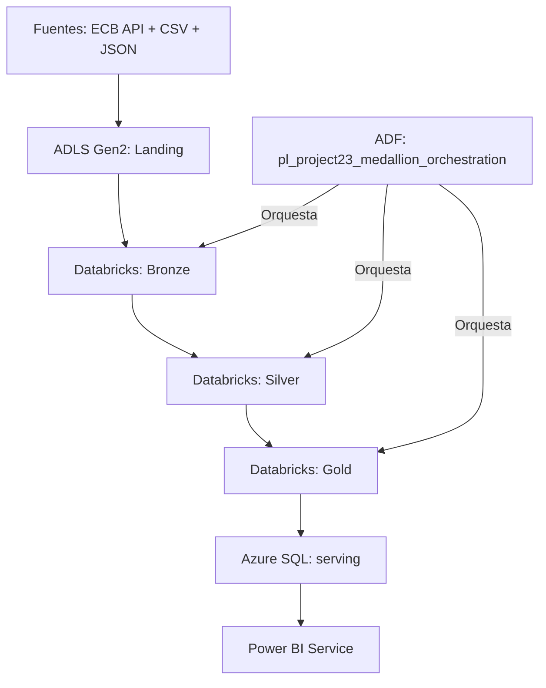
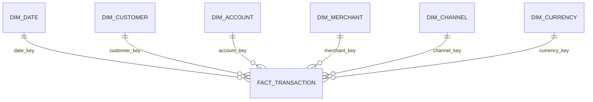
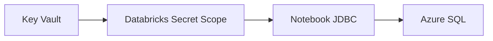

# Arquitectura del Proyecto 23

## Estado verificable

La arquitectura cloud fue implementada y validada. La ejecución comprobable cubre fuentes, ADLS Gen2, Azure Data Factory, Azure Databricks, Azure SQL y Power BI. La suite local y las validaciones cloud se mantienen separadas porque no comparten el mismo mecanismo de prueba.

## Flujo end-to-end

El pipeline ADF ejecuta secuencialmente:

1. `nb_01_landing_to_bronze`;
2. `nb_02_bronze_to_silver`;
3. `nb_03_silver_to_gold`.

Cada actividad depende del éxito de la anterior. La ejecución final terminó `Correcto` en 10 min 17 s; las actividades duraron 2 min 37 s, 3 min 6 s y 4 min 22 s.

## Componentes desplegados

| Capa | Recurso confirmado | Responsabilidad |
|---|---|---|
| Grupo de recursos | `rg-project23-dev` | Límite operativo y de costos del proyecto |
| Almacenamiento | `stproject23dev2026` | Contenedores `landing`, `bronze`, `silver` y `gold` |
| Orquestación | `adf-project23-dev-2026` | Ejecución secuencial de notebooks |
| Procesamiento | `dbw-project23-dev-2026` | PySpark, Delta, calidad y modelo dimensional |
| Compute | `compute-project23-dev-2026` | Single node, Runtime 17.3 LTS, autoapagado de 10 min |
| Gobierno | `dbw_project23_dev_2026` | Catálogo con esquemas Bronze, Silver y Gold |
| Secretos | `kv-project23-dev-2026` | Custodia de credenciales de Azure SQL |
| Secret Scope | `project23-serving-dev` | Lectura segura de dos secretos desde Databricks |
| SQL Server | `sqlsrv-project23-serving-dev-2026` | Servidor lógico de la capa serving |
| Base de datos | `sqldb-project23-serving-dev-2026` | Siete tablas analíticas en el esquema `serving` |
| Consumo | `My Workspace` | Informe y modelo semántico de Power BI |

El nombre del Access Connector no quedó disponible en la evidencia recuperada y no se completa por inferencia.

## Capas de datos

### Landing

- conserva el archivo recibido sin transformaciones de negocio;
- registra fuente, entidad, fecha, ejecución y checksum;
- permite rastrear cada registro hasta el archivo de entrada;
- separa CSV, JSON y la respuesta histórica del ECB.

### Bronze

- conserva campos originales y metadata de ingesta;
- aplica validaciones estructurales mínimas;
- evita reprocesar un archivo ya completado mediante checksum;
- mantiene registros rechazados explicables.

### Silver

- usa `StructType` explícitos en PySpark;
- normaliza IDs, dominios, fechas, timestamps y decimales;
- valida cuenta → cliente y transacción → cuenta;
- materializa clientes, cuentas, tasas FX y transacciones;
- aplica Delta `MERGE` por clave de negocio y checksum;
- registra cuarentena y auditoría idempotentes.

### Gold

- construye seis dimensiones Type 1 y una tabla de hechos;
- genera claves sustitutas determinísticas;
- convierte EUR, USD y GBP a EUR según fecha;
- valida grano, claves, huérfanos, conteos e importes;
- evita `MERGE` y snapshot físico cuando no cambia el contenido.

## Modelo estrella y serving

El grano es una fila por `transaction_id`. La base local usa `fact_transactions`; el destino cloud usa `serving.fact_transaction`. Las seis dimensiones conservan sus nombres. Este mapeo mantiene el historial local y hace explícito el contrato de serving.

La capa Azure SQL contiene:

| Tabla | Filas |
|---|---:|
| `dim_date` | 919 |
| `dim_customer` | 5 |
| `dim_account` | 7 |
| `dim_merchant` | 7 |
| `dim_channel` | 4 |
| `dim_currency` | 3 |
| `fact_transaction` | 8 |
| **Total** | **953** |

La dimensión fecha de serving tiene 919 filas, frente a las dos fechas transaccionales del fixture local, porque el destino cloud utiliza un calendario analítico expandido.

## Seguridad

- Dos secretos almacenan usuario y contraseña SQL; sus valores no se versionan.
- Los notebooks y documentos no contienen credenciales, tokens, correos, IDs de suscripción ni endpoints completos.
- Los datos de negocio son sintéticos.
- Las capturas originales y sanitizadas se mantienen fuera del repositorio público; su inventario y tratamiento están documentados en [evidence_catalog.md](evidence_catalog.md).

## Observabilidad y control de costos

| Control | Estado final confirmado |
|---|---|
| ADF Monitor | Pipeline correcto; 3/3 actividades correctas |
| Databricks compute | Detenido; sin memoria, núcleos ni DBU activos |
| Autoapagado | 10 minutos |
| Azure SQL | `Paused` |
| Plan SQL | Serverless gratuito; exceso deshabilitado |
| Costo observado | USD 0,04 |
| Proyección observada | USD 0,29 |
| Presupuesto | USD 2 mensual; alerta al 50 % |

El [runbook operativo](operations_and_cost_runbook.md) define las comprobaciones antes y después de cada ejecución.

## Frontera entre artefactos locales y cloud

| Elemento | Qué representa |
|---|---|
| `src/`, `scripts/`, `tests/` | Implementación reproducible y pruebas automatizadas locales |
| `adf/` | Diseño de ingesta del Hito local 2; conserva `DESIGN_ONLY` y `NOT_DEPLOYED` |
| `databricks/notebooks/` | Drivers portables de la fase local, no exportación de los notebooks cloud finales |
| `sql/gold_analytics.sql` | Consultas portables sobre el modelo Gold local |
| `docs/evidence_catalog.md` | Inventario de evidencias cloud conservadas fuera del repositorio público |

No se modifica el significado de los JSON ADF existentes. El pipeline cloud de tres notebooks fue ejecutado, pero su exportación definitiva no está versionada. Tampoco se reconstruye el notebook cloud `04_gold_to_azure_sql` sin su fuente original.

## Decisiones y límites

- Las tablas Delta no se particionan por el volumen reducido para evitar archivos pequeños.
- Las dimensiones son Type 1; no se conserva historia SCD2.
- DirectQuery fue probado en Power BI, pero el modo final publicado no se afirma sin el PBIX o la configuración del modelo semántico.
- Las fórmulas DAX exactas y el PBIX original no están disponibles.
- Las 37 pruebas automatizadas validan la base local; ADF, Azure SQL, Power BI y costos se documentan como validaciones cloud manuales.
- Los resultados demuestran corrección funcional, reconciliación y operación; no constituyen una prueba de rendimiento a escala.
