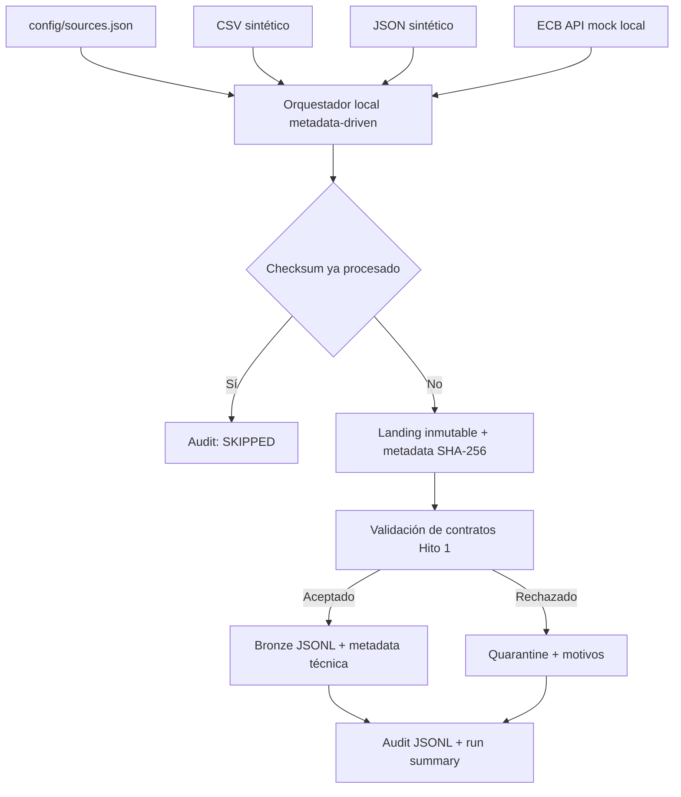
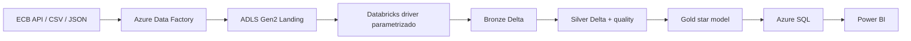

# Arquitectura del Proyecto 23

## Estado de implementación

Los Hitos 1 y 2 están implementados y verificados localmente. El repositorio contiene contratos, datos sintéticos, configuración metadata-driven, artefactos JSON Azure-style de ADF y una ejecución Python equivalente que materializa Landing, Bronze, cuarentena y auditoría.

Los artefactos de `adf/` son diseño versionado: no se han desplegado ni ejecutado en Azure Data Factory. Tampoco existen todavía ADLS Gen2, Azure Databricks, Azure SQL ni Power BI asociados a este proyecto.

## Flujo implementado localmente



La configuración central permite incorporar otra fuente CSV o JSON sin duplicar el bucle de orquestación. Cada entrada controla origen, entidad, formato, esquema, habilitación, tipo de carga, destino y clave de negocio.

## Equivalencia ADF diseñada

| Artefacto | Responsabilidad representada | Estado |
|---|---|---|
| Linked Services parametrizados | HTTP anónimo, ADLS Gen2 y referencia conceptual opcional a Key Vault | Diseño, no desplegado |
| Datasets parametrizados | Metadata, CSV, JSON y sink binario Landing | Diseño, no desplegado |
| `pl_master_metadata_ingestion` | `Lookup` de metadata, `ForEach` y ejecución del flujo reutilizable | Diseño, no ejecutado en ADF |
| `pl_ingest_source` | Selección por formato, `Copy` a Landing y control de error | Diseño, no ejecutado en ADF |
| Trigger de ejemplo | Agenda detenida y documentada para uso manual en el MVP | Desactivado |

Los parámetros principales son `environment`, `run_id`, `source_name`, `entity_name` e `ingestion_date`. URLs, containers y paths se suministrarán por entorno; los JSON no incluyen secretos, credenciales ni identificadores de una suscripción.

## Landing y Bronze

Landing conserva el archivo original bajo fuente, entidad, fecha y ejecución. El checksum completo se guarda en metadata adyacente. Si una ruta inmutable ya existe con otros bytes, el pipeline falla de forma explícita.

Bronze es JSONL determinístico dentro de una partición por fecha y checksum del archivo. Mantiene todos los campos válidos de cada registro y agrega metadata técnica. La capa no realiza conversión EUR, tipado analítico, lógica dimensional ni reglas Silver.

```text
data/output/landing/{source}/{entity}/ingestion_date={date}/run_id={run_id}/
data/output/bronze/{entity}/ingestion_date={date}/source_checksum={prefix}/records.jsonl
data/output/quarantine/{source}/{entity}/ingestion_date={date}/run_id={run_id}/
data/output/audit/ingestion_audit.jsonl
data/output/control/processed_files.json
```

## Calidad, errores e idempotencia

El validador local implementa el subconjunto JSON Schema usado por el Hito 1 y comprueba las referencias cuenta-cliente y transacción-cuenta. Un rechazo de datos produce `PARTIAL`, conserva el registro y sus motivos en cuarentena y no elimina outputs válidos. Un problema de archivo, JSON o filesystem produce `FAILED` con `error_type=TECHNICAL`.

La clave de archivo procesado combina:

```text
source_name + entity_name + SHA-256 del archivo
```

Esto omite el replay exacto incluso si cambia el nombre físico. Bronze añade además un checksum canónico por registro. El estado se persiste solo después de una fuente `SUCCESS` o `PARTIAL`; un fallo técnico puede reintentarse.

## Arquitectura objetivo posterior



El próximo hito migrará la lógica de transformación a PySpark/Delta y construirá Silver en Databricks Free Edition con paths, catálogo, schema y entorno parametrizados. Solo una fase posterior validará el flujo central en recursos Azure temporales.

## Responsabilidades futuras por capa

- **Silver:** tipado, deduplicación de negocio, calidad completa, estandarización y conversión monetaria.
- **Gold:** `fact_transactions`, seis dimensiones, métricas EUR y reconciliación.
- **Serving:** snapshots para Azure SQL y consumo Power BI.

La evidencia futura distinguirá de forma explícita ejecución local, **Databricks Free Edition** y servicios realmente ejecutados en Azure.
