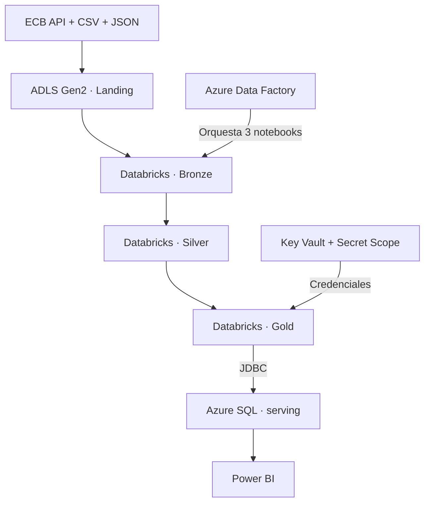
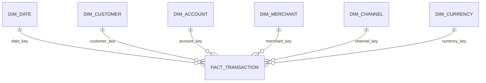

# Arquitectura y decisiones técnicas

## Propósito

Este documento explica cómo se distribuyen las responsabilidades del Proyecto 23. La secuencia completa de construcción y validación está en [Implementación end-to-end](cloud_implementation.md).

## Vista end-to-end

## Responsabilidades por etapa

| # | Etapa | Tecnología principal | Responsabilidad | Salida |
|---:|---|---|---|---|
| 1 | Landing → Bronze | ADLS Gen2, Databricks y Delta Lake | Ingerir y conservar el dato original con trazabilidad | Tablas Bronze |
| 2 | Bronze → Silver | PySpark y Delta Lake | Limpiar, tipificar, deduplicar y aislar errores | Tablas Silver y cuarentena |
| 3 | Silver → Gold | PySpark, Delta Lake y FX | Aplicar reglas de negocio y construir el modelo estrella | Seis dimensiones y una tabla de hechos |
| 4 | Orquestación | Azure Data Factory | Ejecutar los tres notebooks en orden y monitorizar dependencias | Pipeline controlado |
| 5 | Serving | Azure SQL, JDBC, Key Vault | Publicar una capa relacional segura y estable | Esquema `serving` |
| 6 | Consumo | Power BI | Modelar relaciones y exponer indicadores | Informe ejecutivo |
| 7 | Operación | Azure Monitor y Cost Management | Verificar estados, detener cómputo y controlar gasto | Cierre operativo |

## Decisiones principales

| Decisión | Motivo | Resultado |
|---|---|---|
| Arquitectura Medallion | Separar fidelidad, calidad y reglas de negocio | Los errores se detectan antes de llegar a Gold |
| ADF para orquestar | Centralizar orden, dependencias y monitorización | Databricks queda enfocado en procesamiento |
| PySpark + Delta Lake | Trabajar con schemas explícitos, `MERGE` y transacciones ACID | Pipeline reejecutable e idempotente |
| Cuarentena en Silver | No descartar ni mezclar registros inválidos | Errores explicables y trazables |
| Modelo estrella en Gold | Simplificar consultas y consumo analítico | Seis dimensiones y una tabla de hechos |
| Azure SQL como serving | Desacoplar el Lakehouse de la herramienta BI | Contrato estable para Power BI |
| Key Vault + Secret Scope | Mantener credenciales fuera del código | Conexión JDBC sin secretos versionados |
| Cómputo bajo demanda | Reducir consumo fuera de las ventanas de trabajo | Autoapagado, SQL pausado y presupuesto activo |

## Capas Medallion

### Bronze: conservar

- Mantiene el dato recibido y su metadata técnica.
- Registra fuente, archivo, fecha de ingesta y checksum.
- Conserva CSV, JSON y tasas históricas del ECB sin aplicar reglas de negocio.

### Silver: validar

- Usa `StructType` explícitos para evitar inferencias ambiguas.
- Normaliza IDs, dominios, fechas, timestamps y decimales.
- Valida relaciones cuenta → cliente y transacción → cuenta.
- Separa registros inválidos en cuarentena y aplica `MERGE` por clave de negocio.

### Gold: publicar

- Convierte EUR, USD y GBP a EUR según la fecha de la transacción.
- Genera claves sustitutas determinísticas.
- Construye seis dimensiones Type 1 y una tabla de hechos.
- Valida grano, claves, huérfanos, conteos, importes e idempotencia.

## Modelo estrella

El grano es una fila por `transaction_id`. El modelo contiene:

`dim_date` · `dim_customer` · `dim_account` · `dim_merchant` · `dim_channel` · `dim_currency` · `fact_transaction`

La implementación local usa `fact_transactions`; Azure SQL y Power BI usan `fact_transaction`. El cambio de nombre está documentado y no altera el grano.

## Seguridad y operación

- Los datos son sintéticos.
- Las credenciales de Azure SQL se almacenan en Key Vault y se leen mediante Secret Scope.
- El repositorio no contiene contraseñas, tokens, correos, IDs de suscripción ni endpoints completos.
- Las capturas se conservan fuera del repositorio público.
- Databricks usa autoapagado de 10 minutos y se detiene manualmente al finalizar.
- Azure SQL utiliza serverless y se comprueba en estado `Paused` después del uso.

## Frontera entre repositorio y cloud

| Artefacto | Alcance verificable |
|---|---|
| `src/`, `scripts/`, `tests/` | Implementación reproducible y pruebas automatizadas locales |
| `databricks/notebooks/` | Drivers portables de Silver y Gold |
| `adf/` | Diseño inicial marcado `DESIGN_ONLY` / `NOT_DEPLOYED` |
| Azure Databricks y ADF | Ejecución cloud validada manualmente |
| `docs/evidence_catalog.md` | Inventario de evidencias cloud mantenidas fuera del repositorio |

El pipeline ADF definitivo, el notebook `04_gold_to_azure_sql` y el PBIX no fueron exportados. No se reconstruyen ni se presentan como artefactos versionados.

## Límites del diseño

- Las tablas no se particionan por el volumen reducido, evitando archivos pequeños.
- Las dimensiones son Type 1; no se conserva historia SCD2.
- DirectQuery fue probado, pero el modo final publicado no se afirma sin el PBIX.
- Los resultados demuestran corrección funcional, calidad e idempotencia; no rendimiento a escala.
