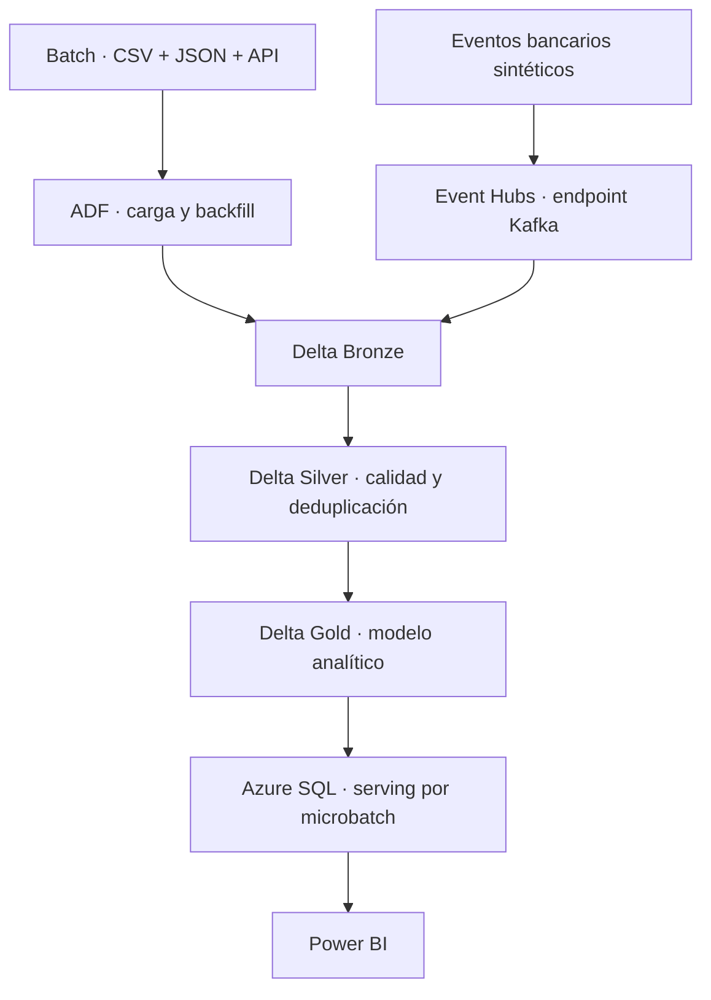

# 24 — Plataforma bancaria Batch + Streaming en Azure

> Evolución del pipeline bancario batch del Proyecto 23 hacia una plataforma híbrida con ingesta de eventos, procesamiento incremental, CI/CD seguro y observabilidad.

## Estado

**Hito 0 — Baseline y arquitectura: en revisión.**

Este hito solo define el contrato técnico del proyecto. Todavía no despliega recursos en Azure, no crea costos y no presenta componentes futuros como implementados.

## Problema

El [Proyecto 23](../23-azure-adf-databricks-bank-fx) resolvió el procesamiento batch end-to-end de datos bancarios multimoneda. La siguiente necesidad es incorporar transacciones en movimiento sin perder la capacidad de reprocesar archivos históricos, aplicar controles de calidad ni publicar un modelo analítico consistente.

## Objetivo

Construir un MVP verificable que combine:

- ADF para cargas batch y backfills;
- Azure Event Hubs para recibir eventos bancarios sintéticos;
- Azure Databricks y Structured Streaming para procesarlos;
- Delta Lake para Bronze, Silver y Gold;
- Azure SQL como serving analítico por microbatch;
- GitHub Actions, Bicep y OIDC para CI/CD;
- Key Vault y secretos fuera del código;
- métricas operativas, calidad, recuperación y costos controlados.

## Arquitectura objetivo

El camino streaming utilizará entrega al menos una vez y neutralizará reintentos mediante claves de evento, checkpoints y escrituras idempotentes. No se afirmará semántica exactly-once end-to-end sin evidencia que la demuestre.

## Alcance del MVP

| Incluido | Fuera de alcance |
|---|---|
| Un ambiente efímero `dev` | Producción y múltiples ambientes |
| Eventos y entidades completamente sintéticos | PII y datos bancarios reales |
| CI local sin acceso a Azure | Despliegue automático desde cada push |
| CD manual con OIDC | Secretos persistentes de service principal |
| Structured Streaming y Delta Lake | ML de fraude y scoring en línea |
| Calidad, cuarentena, replay e idempotencia | SLA productivo y alta disponibilidad multirregión |
| Serving analítico por microbatch | Escritura de cada evento directamente en Azure SQL |
| Evidencia sanitizada y teardown | Red corporativa y conectividad privada empresarial |

## Roadmap

| Hito | Foco | Entregable principal |
|---:|---|---|
| 0 | Baseline y arquitectura | Contrato, decisiones, riesgos y criterios de aceptación |
| 1 | Integración continua | Tests, lint y validaciones reproducibles en GitHub Actions |
| 2 | Infraestructura como código | Bicep modular, parámetros `dev` y validación estática |
| 3 | Despliegue seguro | OIDC, `what-if`, CD manual y Key Vault |
| 4 | Ingesta de eventos | Contrato v1, productor sintético y Event Hubs |
| 5 | Procesamiento streaming | Bronze/Silver, checkpoint, watermark, deduplicación y cuarentena |
| 6 | Gold y serving | Agregados incrementales y publicación idempotente por microbatch |
| 7 | Observabilidad | Métricas de latencia, calidad, fallos, consumo y alertas |
| 8 | Validación y cierre | Prueba end-to-end, replay, evidencia, documentación y teardown |

El detalle y los criterios de salida se encuentran en [Plan de hitos](docs/milestones.md).

## Forma de trabajo con Codex y Astra

Cada hito seguirá el mismo ciclo:

1. aprobar objetivo, alcance, exclusiones y criterios de aceptación;
2. trabajar desde `origin/main` en una rama exclusiva;
3. implementar, probar, documentar y autorrevisar localmente;
4. presentar diff, resultados, riesgos y evidencia;
5. crear commit, push y pull request solo después de aprobación;
6. mantener el PR en borrador y sin merge automático.

Convención de ramas: `feature/p24-hNN-descripcion`.

## Documentación

- [Contrato del Hito 0](docs/hito_0_contract.md)
- [Arquitectura y decisiones](docs/architecture.md)
- [Plan de hitos y criterios de salida](docs/milestones.md)

## Restricciones de seguridad y costos

- No almacenar tokens, contraseñas, connection strings ni valores de secretos.
- Usar identidades administradas o federadas y mínimo privilegio cuando el servicio lo permita.
- No desplegar Azure hasta aprobar estimación, recursos exactos y procedimiento de teardown.
- Configurar autoapagado y eliminar o detener recursos variables después de cada validación.
- Separar siempre pruebas automatizadas, validaciones cloud y evidencia manual.
