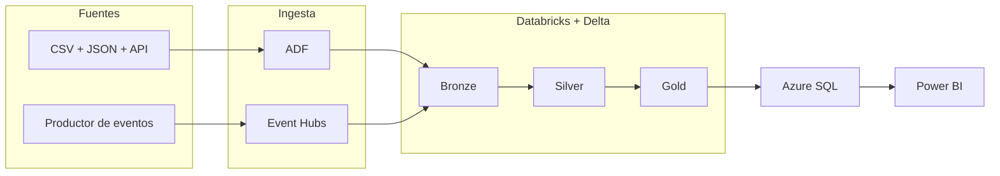

# Arquitectura objetivo y decisiones técnicas

## Vista general

La plataforma combina dos velocidades de procesamiento sobre un lakehouse común:

- **Batch:** ADF ingiere archivos y ejecuta backfills controlados.
- **Streaming:** Event Hubs recibe eventos sintéticos y Databricks los consume de forma incremental.
- **Lakehouse:** Delta Lake conserva Bronze, Silver y Gold como fuente auditable.
- **Serving:** Azure SQL recibe lotes incrementales listos para Power BI.

## Responsabilidades por componente

| Componente | Responsabilidad | No es responsable de |
|---|---|---|
| ADF | Ingesta batch, backfills y coordinación de cargas históricas | Mantener una sesión streaming continua |
| Event Hubs | Recepción, particionamiento y retención temporal de eventos | Aplicar reglas de negocio o servir BI |
| Structured Streaming | Consumir offsets, validar, transformar y mantener checkpoints | Almacenar secretos o reemplazar el serving |
| Delta Bronze | Payload original y metadata de ingesta | Entregar datos certificados a negocio |
| Delta Silver | Tipificación, deduplicación, dominios y cuarentena | Agregados analíticos finales |
| Delta Gold | Métricas y entidades analíticas incrementales | Recibir eventos sin validar |
| Azure SQL | Capa estable para consumo analítico | Procesar cada mensaje del Event Hub |
| Power BI | Modelo semántico y visualización | Resolver calidad o idempotencia upstream |

## Flujo del evento

1. Un productor genera una transacción sintética con `event_id`, `event_time`, versión y claves de negocio.
2. La clave de partición conserva juntos los eventos de la misma cuenta cuando el caso lo requiere.
3. Event Hubs recibe el mensaje y expone el stream mediante su endpoint compatible con Kafka.
4. Structured Streaming escribe el payload y metadata técnica en Bronze.
5. Silver valida el contrato, tipifica, aplica watermark y deduplica por `event_id`.
6. Los registros inválidos se escriben en cuarentena con motivo y trazabilidad.
7. Gold calcula resultados incrementales y conserva el estado analítico en Delta.
8. Un microbatch publica cambios idempotentes en Azure SQL.

El Hito 4 fija el contrato JSON v1 y usa `account_id` como clave de partición. El productor emite
JSON canónico y el consumidor vuelve a validar cada mensaje. La tolerancia de eventos tardíos se
cerrará en el Hito 5 junto con watermark y deduplicación.

La ruta local emplea un Event Hub simulado en memoria para comprobar serialización, partición y
conteos sin red. La evidencia contra Azure Event Hubs solo podrá obtenerse después de un despliegue
aprobado.

## Semántica de procesamiento

La frontera del sistema se diseña para **entrega al menos una vez**. Los reintentos son esperables y se controlan mediante:

- `event_id` único;
- checkpoint independiente por stream y ambiente;
- watermark para acotar estado y gestionar eventos tardíos;
- deduplicación antes de Silver;
- MERGE o upsert idempotente en las salidas;
- auditoría de aceptados, rechazados y repetidos;
- replay desde Bronze sin volver a publicar duplicados.

## Batch y streaming sobre el mismo modelo

Los dos caminos convergen en contratos compatibles, pero no escriben simultáneamente sin coordinación sobre la misma tabla objetivo. El diseño final debe definir un único propietario por tabla y operación, o serializar escrituras mediante jobs separados.

Los backfills reutilizarán Bronze como frontera de replay. La carga histórica no se reenviará artificialmente a Event Hubs salvo que una prueba de recuperación lo requiera.

## Serving

Azure SQL se actualizará mediante lotes incrementales. Esta decisión:

- reduce conexiones y transacciones pequeñas;
- separa latencia operacional de latencia analítica;
- permite reconciliar Delta Gold contra SQL;
- conserva la posibilidad de una segunda ejecución `NO_OP`.

El modelo dimensional del Proyecto 23 sirve como referencia, no como dependencia mutable. Cualquier cambio de schema se versionará explícitamente.

## CI/CD y seguridad

### CI

La integración continua deberá ejecutarse sin iniciar sesión en Azure e incluir, como mínimo:

- validación de contratos y fixtures;
- pruebas unitarias de transformaciones;
- pruebas locales de idempotencia y replay;
- lint de Python, JSON, YAML y Bicep;
- detección de secretos y validación de enlaces.

### CD

El despliegue será manual y utilizará OIDC con una identidad federada de Microsoft Entra. Los identificadores de cliente, tenant y suscripción se administrarán mediante variables o secretos de GitHub; no son credenciales reutilizables. Los secretos de workload permanecerán en Key Vault y se otorgará solo el acceso necesario.

El productor y el consumidor de Event Hubs tendrán permisos separados de envío y lectura. Si el MVP requiere SAS, cada clave se limitará a su función y se almacenará fuera del código; se preferirá autenticación basada en identidad cuando la combinación de servicio y runtime utilizada la soporte.

La creación inicial de la identidad federada es un bootstrap administrativo y requiere aprobación explícita.

## Costos y operación

Antes del primer despliegue se debe registrar:

- SKU y región de cada recurso;
- costo estimado por una sesión de prueba;
- servicios que no se detienen automáticamente;
- comando o procedimiento de teardown;
- presupuesto y alertas aplicables;
- responsable de verificar saldo cero o recursos detenidos.

El MVP favorece ejecuciones breves y recursos efímeros. Ningún recurso cloud se considera cerrado hasta comprobar su estado final.

## Alternativas no seleccionadas para el MVP

| Alternativa | Motivo de exclusión inicial |
|---|---|
| Reemplazar todo el batch por streaming | Elimina un camino simple de backfill y no aporta valor al MVP |
| Escribir cada evento en Azure SQL | Acopla el stream al serving y aumenta presión transaccional |
| Desplegar desde cada push | Introduce costo y riesgo sin aprobación humana |
| Credencial con client secret | OIDC reduce secretos de larga duración en GitHub |
| Lakeflow como implementación principal | Oculta parte del aprendizaje de Structured Streaming; se conserva como evolución |
| Exactly-once end-to-end como promesa | Requiere demostrar garantías en cada frontera y sistema externo |

## Evolución posterior

Después del MVP se podrá evaluar Lakeflow Declarative Pipelines, Unity Catalog más profundo, varios ambientes, conectividad privada, SLO operativos y CDC. Ningún elemento de esta lista forma parte de la definición de terminado del Proyecto 24.

## Referencias técnicas

- [Azure Event Hubs como fuente para Azure Databricks](https://learn.microsoft.com/en-us/azure/databricks/ldp/event-hubs)
- [Streaming tables, checkpoints y watermarks](https://learn.microsoft.com/en-us/azure/databricks/ldp/concepts/streaming-tables)
- [Desplegar Bicep mediante GitHub Actions y OIDC](https://learn.microsoft.com/en-us/azure/azure-resource-manager/bicep/deploy-github-actions)
- [Integrar Key Vault con GitHub Actions mediante OIDC](https://learn.microsoft.com/en-us/azure/developer/github/github-actions-key-vault)
