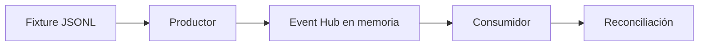

# Ingesta local de eventos

## Flujo probado



El transporte en memoria reemplaza temporalmente a Azure Event Hubs. Permite probar el contrato y
los conteos, pero no demuestra conectividad, permisos ni comportamiento del servicio Azure.

## Contrato v1

Cada evento contiene:

| Campo | Uso |
|---|---|
| `event_id` | Identificador para trazabilidad y deduplicación futura |
| `event_time` | Fecha y hora con zona horaria |
| `event_version` | Versión fija del contrato, actualmente `1` |
| `transaction_id` | Identificador sintético de la transacción |
| `account_id` | Cuenta sintética y clave de partición |
| `amount` | Monto positivo con máximo dos decimales |
| `currency` | `CLP`, `EUR` o `USD` |
| `transaction_type` | `CREDIT` o `DEBIT` |
| `channel` | `ATM`, `CARD`, `MOBILE` u `ONLINE` |

El esquema completo está en
[`transaction-event-v1.schema.json`](../contracts/transaction-event-v1.schema.json).

## Ejecutar localmente

Desde la carpeta del Proyecto 24:

```bash
python scripts/run_local_ingestion.py data/fixtures/events/transactions_batch_001.jsonl
```

Resultado esperado:

```json
{"accepted": 3, "attempted": 3, "consumer_rejected": 0, "producer_rejected": 0, "published": 3, "received": 3, "reconciled": true}
```

Los fixtures inválidos se rechazan antes de publicar y la evidencia conserva únicamente posición,
`event_id` cuando existe y motivos de validación. El payload completo no se guarda.

## Límite de la evidencia

La prueba local confirma lógica determinista y reconciliación. La ruta real con Azure Event Hubs
queda pendiente hasta aprobar despliegue, identidades y costo. La deduplicación, watermark,
checkpoint y eventos tardíos pertenecen al Hito 5.
