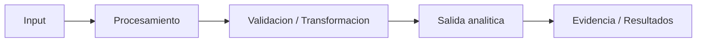

# Codex Project Prompt Template

Plantilla reutilizable para crear nuevos proyectos del portfolio `data-engineering-portfolio` usando Codex.

Esta plantilla debe completarse antes de iniciar un nuevo proyecto. El objetivo es mantener consistencia entre proyectos, evitar cambios accidentales en proyectos anteriores y asegurar que cada entrega tenga código reproducible, README profesional, outputs ignorados y aprendizajes técnicos documentados.

---

## Prompt base

```text
Quiero crear el Proyecto [NÚMERO] de mi portfolio de Ingeniería de Datos.

Repositorio:
data-engineering-portfolio

Crear una nueva rama desde main actualizado:
codex/[numero-nombre-del-proyecto]

Nombre del proyecto:
[numero-nombre-del-proyecto]

Card / ejercicio asociado:
[Pegar aquí la card completa o descripción del ejercicio]

Objetivo:
Construir un proyecto práctico de Ingeniería de Datos alineado con la card entregada, manteniendo una estructura profesional, reproducible y defendible técnicamente.

Contexto del portfolio:
Este proyecto debe seguir el estándar aplicado en proyectos anteriores:
- README ejecutivo, concreto y orientado a entrevista.
- Código modular.
- Pipeline reproducible.
- Outputs ignorados por Git.
- Notas técnicas extensas fuera del README principal, en `docs/` cuando aporte.
- Sin métricas falsas.
- Sin afirmar uso de herramientas reales si solo se simulan.
- Sin subir CSV, Parquet, JSON generados ni archivos pesados.

Restricciones:
- No usar servicios cloud reales salvo que la card lo pida explícitamente y se confirme.
- No usar credenciales.
- No subir datos generados.
- No modificar proyectos anteriores.
- No modificar README principal salvo agregar una línea breve del nuevo proyecto si corresponde.
- No hacer merge.

Estructura esperada del proyecto:
Definir una estructura adecuada según la card, usando este patrón como base:

[numero-nombre-del-proyecto]/
├── app/
├── data/
│   ├── raw/.gitkeep
│   ├── processed/.gitkeep
│   └── analytics/.gitkeep
├── queries/            # si aplica
├── docs/               # si aplica
├── output/.gitkeep
├── README.md
├── requirements.txt
└── .gitignore

Requisitos del README:
Debe seguir esta estructura ejecutiva, adaptada al proyecto:

# [NÚMERO] - [Nombre de la card]

No agregar subtítulo redundante debajo del título.

## 1. Valor del proyecto

Debe ser un solo párrafo, corto, concreto y atractivo.
Debe funcionar como hook y explicar:
- qué se construyó;
- con qué tecnología;
- qué se midió o validó;
- cuál fue el resultado principal;
- por qué tiene valor para Data Engineering.

Formato esperado:

Este proyecto muestra cómo pasar de [problema técnico] a [solución medible] usando [tecnologías principales]. El pipeline [acción principal], procesa [volumen o input], aplica [técnica principal] y genera [resultado medible]. El valor está en demostrar una habilidad clave de Data Engineering: [capacidad técnica defendible], validando el impacto con evidencia y no con supuestos.

## 2. Arquitectura del proyecto y flujo del pipeline

Debe explicar brevemente el flujo del proyecto.
Debe incluir Mermaid cuando aplique.
Debe incluir una tabla corta de etapas si ayuda, sin convertir el README en documentación extensa.

Formato recomendado:

La arquitectura separa el proceso en etapas simples: [etapa 1], [etapa 2], [etapa 3], [etapa 4] y [resultado final]. Todo el flujo queda orquestado desde [herramienta/script] y genera evidencia reproducible.

Diagrama Mermaid genérico:



## 3. Problema

Debe explicar el problema técnico de forma concreta y fácil de defender.
Debe evitar narrativas largas.
Debe explicar por qué importa medir, validar o estructurar bien el pipeline.

## 4. Objetivo

Debe declarar el objetivo principal en una frase.
Luego usar punteo corto para los objetivos concretos.

Ejemplo:

Analizar y optimizar [proceso/datos/sistema] para [resultado esperado], manteniendo trazabilidad completa del antes y después.

El objetivo concreto fue:

- ejecutar [proceso base];
- construir [componente o versión mejorada];
- medir o validar [criterio];
- generar evidencia reproducible en [formato].

## 5. Implementacion

Debe resumir cómo se implementó el proyecto.
Preferir una tabla compacta si hay varias etapas.

Ejemplo:

| Etapa | Acción realizada | Evidencia |
| --- | --- | --- |
| Ingesta / generación | [Qué se generó o cargó] | `[ruta]` |
| Transformación | [Qué se limpió, validó o modeló] | `[ruta]` |
| Validación | [Qué regla o métrica se comprobó] | `[ruta]` |
| Resultado | [Qué salida se generó] | `[ruta]` |

## 6. Resultados

Debe mostrar solo resultados reales generados o validados por el pipeline.
No inventar métricas.
No prometer mejoras no medidas.
Usar 1 o 2 tablas como máximo.

Ejemplo:

| Métrica | Resultado |
| --- | ---: |
| Estado final | PASSED |
| Registros procesados | [valor real] |
| Validaciones ejecutadas | [valor real] |
| Outputs generados | [valor real] |

Agregar 2 o 3 bullets de interpretación, enfocados en qué demuestra el resultado.

No incluir en el README principal:
- subtítulo redundante debajo del título;
- una sección “Estructura del proyecto” o un árbol de carpetas;
- secciones largas de conceptos técnicos;
- aprendizajes técnicos extensos;
- instrucciones de ejecución como sección del README principal;
- material de estudio como sección del README principal;
- listados extensos de evidencia generada si no aportan valor ejecutivo;
- documentación larga que corresponda a `docs/`.

Notas técnicas:
Si el proyecto necesita conceptos técnicos, aprendizajes, preguntas de entrevista o explicación extendida, crear un documento aparte en `docs/`, por ejemplo:

- `docs/technical_notes.md`
- `docs/interview_guide.md`
- `docs/explain_reading_guide.md`

Puede usarse como base la plantilla:
templates/project_readme_learning_section.md

No copiar ese contenido completo dentro del README principal.

Código:
- Crear scripts modulares.
- Incluir función main() cuando corresponda.
- Usar logging.
- Generar output/pipeline_summary.json o equivalente.
- Manejar errores si aplica.
- Separar lógica de generación, transformación, validación y ejecución.

Validaciones:
Ejecutar:
python3 -m py_compile [scripts principales]

Crear entorno:
python3 -m venv .venv
source .venv/bin/activate
pip install --upgrade pip
pip install -r requirements.txt

Ejecutar pipeline o script principal:
python3 app/run_pipeline.py

Validar:
cat output/pipeline_summary.json
git status --short

Criterios de aceptación:
- Pipeline ejecuta correctamente.
- README ejecutivo, claro y profesional.
- README usa la estructura estándar de 6 secciones.
- README no incluye subtítulo redundante.
- README no incluye secciones largas de conceptos técnicos o aprendizajes.
- README no incluye instrucciones de ejecución, material de estudio ni documentación extensa como secciones principales.
- Outputs generados ignorados por Git.
- No datos pesados versionados.
- No métricas falsas.
- Notas técnicas en `docs/` si el proyecto lo requiere.
- Proyecto alineado con la card.
- PR draft creado.
- No hacer merge.

Commit:
Add project [NÚMERO]: [nombre del proyecto]

Crear PR draft.
No hacer merge.
```
